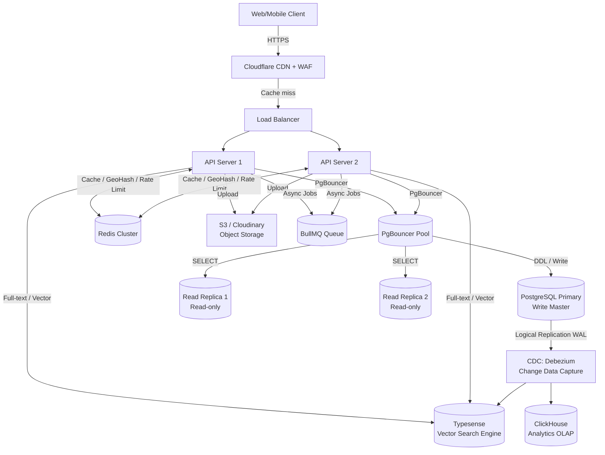

# TÀI LIỆU THIẾT KẾ CƠ SỞ DỮ LIỆU (DATABASE ARCHITECTURE & SCHEMA DESIGN) - PHIÊN BẢN V5 (ENTERPRISE)
## DỰ ÁN: CỔNG THÔNG TIN DU LỊCH HOÀNG SU PHÌ → TOÀN QUỐC
---
**Vai trò thiết kế:** Principal Database Architect, Solution Architect & Senior Backend Engineer (15+ năm).
**Chuẩn mục tiêu:** Enterprise Production — hàng chục triệu bản ghi, hàng triệu lượt truy cập/tháng, khả năng mở rộng địa lý không giới hạn, sẵn sàng cho AI/Vector Search.

---

## 1. CÁC THAY ĐỔI KIẾN TRÚC LỚN (V5 BREAKING CHANGES)

Phiên bản V5 thực hiện 5 thay đổi mang tính kiến trúc so với V4:

| Thay đổi | V4 | V5 | Lý do |
| :--- | :--- | :--- | :--- |
| Phân loại `businesses.type` | `VARCHAR` hardcode | Bảng tham chiếu `business_types` | Mở rộng không giới hạn (EV charging, Pharmacy...) |
| Phân loại `attractions.category` | `VARCHAR` hardcode | Bảng tham chiếu `attraction_categories` | Dễ thêm danh mục mới mà không sửa code |
| Quan hệ Media | `thumbnail_id + N join tables` | Bảng `media_links` polymorphic | Tất cả entity dùng chung 1 bảng |
| `reviews` & `favorites` | 2-3 nullable FK + CHECK | Polymorphic `entity_type + entity_id` | Mở rộng sang festival, article, route... không cần sửa schema |
| `regions` path query | Chỉ `parent_id` | Thêm `path` kiểu `ltree` | Truy vấn cây nhanh hơn 10-100x |

---

## 2. KIẾN TRÚC HẠ TẦNG TỔNG THỂ (INFRASTRUCTURE ARCHITECTURE)



### Ghi chú kiến trúc quan trọng:
- **PgBouncer:** Connection Pooling bắt buộc. Tránh PostgreSQL cạn kiệt connection khi traffic đột biến mùa lúa chín.
- **CDC (Debezium):** Lắng nghe WAL log của PostgreSQL, tự động đồng bộ dữ liệu sang Typesense (search) và ClickHouse (analytics) mà không cần code đồng bộ thủ công.
- **Typesense Vector Search:** Phase 2 tích hợp AI Semantic Search. Phase 1 dùng Full-Text Search tích hợp sẵn trong Typesense.
- **ClickHouse OLAP:** Lưu trữ và phân tích `page_views`, `search_logs`, `analytics_events` — Tách biệt hoàn toàn khỏi PostgreSQL OLTP.

---

## 3. DANH SÁCH TOÀN BỘ BẢNG (COMPLETE TABLE INVENTORY)

### 3.1. Core Domain Tables (16 bảng)
| Bảng | Mục đích |
| :--- | :--- |
| `regions` | Cây địa giới hành chính (ltree) |
| `business_types` | Danh mục loại hình kinh doanh (Reference Table) |
| `businesses` | Hộ kinh doanh du lịch |
| `attraction_categories` | Danh mục điểm tham quan (Reference Table) |
| `attractions` | Điểm tham quan & tiện ích |
| `trekking_routes` | Cung đường leo núi, đi rừng |
| `article_categories` | Chuyên mục bài viết |
| `authors` | Tác giả biên tập |
| `articles` | Bài viết cẩm nang du lịch |
| `article_versions` | Lịch sử phiên bản bài viết |
| `global_faqs` | Hỏi đáp tổng quát |
| `top_lists` | Bảng xếp hạng Top |
| `top_list_items` | Chi tiết từng mục xếp hạng |
| `itineraries` | Lịch trình du lịch mẫu |
| `itinerary_steps` | Các bước trong lịch trình |
| `weather_snapshots` | Cache thời tiết địa phương |

### 3.2. Media & Asset Tables (2 bảng)
| Bảng | Mục đích |
| :--- | :--- |
| `media` | Thư viện ảnh/video với đầy đủ EXIF metadata |
| `media_links` | Quan hệ Polymorphic: Media ↔ Mọi thực thể |

### 3.3. User & Engagement Tables (6 bảng)
| Bảng | Mục đích |
| :--- | :--- |
| `users` | Tài khoản người dùng |
| `user_sessions` | Phiên đăng nhập theo thiết bị |
| `reviews` | Đánh giá du khách (Polymorphic) |
| `favorites` | Wishlist (Polymorphic) |
| `notifications` | Hộp thư thông báo |
| `report_abuse` | Báo cáo vi phạm nội dung |

### 3.4. Business Feature Tables (5 bảng)
| Bảng | Mục đích |
| :--- | :--- |
| `amenities` | Danh mục tiện nghi chuẩn hóa |
| `business_amenities` | Tiện nghi của từng cơ sở kinh doanh |
| `operating_exceptions` | Lịch đóng cửa/nghỉ lễ đặc biệt |
| `price_history` | Lịch sử thay đổi giá |
| `business_claim_requests` | Yêu cầu chủ hộ nhận quyền quản lý |

### 3.5. SEO & Discovery Tables (7 bảng)
| Bảng | Mục đích |
| :--- | :--- |
| `seo_metadata` | Siêu dữ liệu SEO tập trung |
| `redirects` | Chuyển hướng URL SEO |
| `sitemap_entries` | Quản lý sitemap động |
| `tags` | Thẻ phân loại |
| `business_tags` | Liên kết Business ↔ Tag |
| `attraction_tags` | Liên kết Attraction ↔ Tag |
| `article_tags` | Liên kết Article ↔ Tag |

### 3.6. Access Control Tables (5 bảng)
| Bảng | Mục đích |
| :--- | :--- |
| `roles` | Nhóm quyền RBAC |
| `permissions` | Quyền hạn chi tiết |
| `user_roles` | Liên kết User ↔ Role |
| `role_permissions` | Liên kết Role ↔ Permission |
| `api_keys` | Khoá API cho đối tác tích hợp |

### 3.7. Operational Tables (7 bảng)
| Bảng | Mục đích |
| :--- | :--- |
| `audit_logs` | Nhật ký thao tác hệ thống |
| `translations` | Đa ngôn ngữ (i18n) |
| `change_requests` | Yêu cầu chỉnh sửa thông tin |
| `scheduled_jobs` | Quản lý tác vụ nền |
| `feature_flags` | Bật/tắt tính năng không cần deploy |
| `system_settings` | Cấu hình hệ thống |
| `search_logs` | Lịch sử tìm kiếm (→ ClickHouse) |

---

## 4. THIẾT KẾ CHI TIẾT CÁC BẢNG QUAN TRỌNG

### 4.1. Bảng `regions` — nâng cấp với `ltree`

**Lý do thêm `ltree`:** Với cấu trúc `parent_id` đơn thuần, để lấy toàn bộ cây con (Ví dụ: tất cả xã thuộc Hà Giang) cần truy vấn đệ quy `WITH RECURSIVE` tốn kém. Extension `ltree` của PostgreSQL biểu diễn đường dẫn phân cấp dưới dạng chuỗi có thể index và truy vấn với các toán tử đặc biệt cực nhanh.

| Tên Cột | Kiểu Dữ Liệu | Ràng Buộc | Mô Tả |
| :--- | :--- | :--- | :--- |
| `id` | `UUID` | `PRIMARY KEY` | UUIDv7 |
| `parent_id` | `UUID` | `FK, NULL` | Tham chiếu `regions(id)` ON DELETE RESTRICT |
| `name` | `VARCHAR(100)` | `NOT NULL` | Tên địa danh |
| `slug` | `VARCHAR(120)` | `NOT NULL, UNIQUE` | Slug SEO |
| `level` | `SMALLINT` | `NOT NULL, CHECK (0..5)` | `0`=Quốc gia, `1`=Tỉnh, `2`=Huyện, `3`=Xã, `4`=Bản, `5`=Điểm |
| **`path`** | **`ltree`** | **`NOT NULL`** | **Đường dẫn phân cấp. Ví dụ: `vn.ha_giang.hoang_su_phi.ban_phung`** |
| `description` | `TEXT` | `NULL` | Giới thiệu |
| `thumbnail_id` | `UUID` | `FK, NULL` | Ảnh đại diện |
| `seo_metadata_id` | `UUID` | `FK, UNIQUE, NULL` | SEO Metadata |
| `latitude` | `DECIMAL(9,6)` | `NOT NULL` | Vĩ độ |
| `longitude` | `DECIMAL(9,6)` | `NOT NULL` | Kinh độ |
| `geom` | `GEOGRAPHY(Point,4326)` | `NOT NULL` | PostGIS spatial |
| `created_at` | `TIMESTAMPTZ` | `NOT NULL` | Thời gian tạo |
| `updated_at` | `TIMESTAMPTZ` | `NOT NULL` | Thời gian cập nhật |

**Ví dụ truy vấn ltree:**
```sql
-- Lấy toàn bộ node con của Hà Giang (tất cả huyện, xã, bản)
SELECT * FROM regions WHERE path <@ 'vn.ha_giang';

-- Lấy toàn bộ tổ tiên của Bản Phùng
SELECT * FROM regions WHERE path @> 'vn.ha_giang.hoang_su_phi.ban_phung';

-- Tìm tất cả huyện trực tiếp dưới tỉnh Hà Giang
SELECT * FROM regions WHERE path ~ 'vn.ha_giang.*{1}';
```

**Index cho `ltree`:**
```sql
CREATE EXTENSION IF NOT EXISTS ltree;
CREATE INDEX idx_regions_path_gist ON regions USING GIST(path);
CREATE INDEX idx_regions_path_btree ON regions USING BTREE(path);
```

---

### 4.2. Bảng `business_types` (Reference Table)

| Tên Cột | Kiểu Dữ Liệu | Ràng Buộc | Mô Tả |
| :--- | :--- | :--- | :--- |
| `id` | `UUID` | `PRIMARY KEY` | UUIDv7 |
| `code` | `VARCHAR(30)` | `NOT NULL, UNIQUE` | Mã kỹ thuật (`homestay`, `camping`, `ev_charging`) |
| `name` | `VARCHAR(100)` | `NOT NULL` | Tên hiển thị Tiếng Việt |
| `icon` | `VARCHAR(50)` | `NULL` | Tên icon hiển thị trên bản đồ |
| `map_color` | `VARCHAR(7)` | `NULL` | Màu hex marker bản đồ |
| `sort_order` | `SMALLINT` | `NOT NULL, DEFAULT 0` | Thứ tự hiển thị |
| `is_active` | `BOOLEAN` | `NOT NULL, DEFAULT TRUE` | Bật/tắt loại hình |

**Seed Data:** `homestay`, `bungalow`, `resort`, `guesthouse`, `restaurant`, `cafe`, `coffee_farm`, `motorbike_rental`, `car_rental`, `guide_service`, `camping_site`, `motorbike_repair`, `pharmacy`, `shuttle_service`, `ev_charging`

---

### 4.3. Bảng `attraction_categories` (Reference Table)

| Tên Cột | Kiểu Dữ Liệu | Ràng Buộc | Mô Tả |
| :--- | :--- | :--- | :--- |
| `id` | `UUID` | `PRIMARY KEY` | UUIDv7 |
| `code` | `VARCHAR(30)` | `NOT NULL, UNIQUE` | Mã kỹ thuật (`natural`, `gas_station`, `atm`) |
| `name` | `VARCHAR(100)` | `NOT NULL` | Tên hiển thị |
| `map_icon` | `VARCHAR(50)` | `NULL` | Icon trên bản đồ |
| `map_color` | `VARCHAR(7)` | `NULL` | Màu marker bản đồ |
| `is_utility` | `BOOLEAN` | `NOT NULL, DEFAULT FALSE` | Phân biệt tiện ích công cộng vs địa điểm du lịch |

---

### 4.4. Bảng `media` — đầy đủ EXIF metadata

| Tên Cột | Kiểu Dữ Liệu | Ràng Buộc | Mô Tả |
| :--- | :--- | :--- | :--- |
| `id` | `UUID` | `PRIMARY KEY` | UUIDv7 |
| `url` | `VARCHAR(512)` | `NOT NULL` | URL gốc |
| `thumbnail_url` | `VARCHAR(512)` | `NOT NULL` | URL thumbnail |
| `type` | `VARCHAR(20)` | `NOT NULL` | `image`, `video`, `panorama_360`, `drone_footage` |
| `width` | `INTEGER` | `NOT NULL` | Chiều rộng (px) |
| `height` | `INTEGER` | `NOT NULL` | Chiều cao (px) |
| `mime_type` | `VARCHAR(50)` | `NOT NULL` | Ví dụ: `image/webp` |
| `size_bytes` | `BIGINT` | `NOT NULL` | Dung lượng (bytes) |
| `duration_seconds` | `DECIMAL(6,2)` | `NULL` | Thời lượng video |
| `checksum` | `VARCHAR(64)` | `NOT NULL, UNIQUE` | SHA256 — chống upload trùng |
| `dominant_color` | `VARCHAR(7)` | `NULL` | Màu chủ đạo HEX |
| `blurhash` | `VARCHAR(150)` | `NULL` | Placeholder blur khi tải ảnh |
| `alt` | `VARCHAR(255)` | `NOT NULL` | Thẻ Alt SEO |
| `caption` | `VARCHAR(512)` | `NULL` | Chú thích |
| `copyright` | `VARCHAR(150)` | `NOT NULL, DEFAULT 'Ban biên tập'` | Bản quyền |
| `latitude` | `DECIMAL(9,6)` | `NULL` | GPS Vĩ độ |
| `longitude` | `DECIMAL(9,6)` | `NULL` | GPS Kinh độ |
| `geom` | `GEOGRAPHY(Point,4326)` | `NULL` | PostGIS spatial cho ảnh |
| **`taken_at`** | **`TIMESTAMPTZ`** | **`NULL`** | **Thời điểm chụp (EXIF DateTimeOriginal)** |
| `camera_model` | `VARCHAR(100)` | `NULL` | Model máy ảnh |
| `lens` | `VARCHAR(100)` | `NULL` | Ống kính |
| `iso` | `SMALLINT` | `NULL` | ISO |
| `shutter_speed` | `VARCHAR(20)` | `NULL` | Tốc độ màn trập |
| `focal_length` | `SMALLINT` | `NULL` | Tiêu cự (mm) |
| `orientation` | `SMALLINT` | `NULL` | EXIF Orientation (1-8) |
| `created_at` | `TIMESTAMPTZ` | `NOT NULL` | Thời gian upload |

---

### 4.5. Bảng `media_links` — Polymorphic (thay thế tất cả join tables cũ)

**Vấn đề cũ:** V4 có `business_media`, `attraction_media`, `article_media`, `trekking_media`, `review_media`. Mỗi thực thể mới lại cần thêm 1 join table.

**Giải pháp V5:** Một bảng duy nhất với cặp `(entity_type, entity_id)`.

| Tên Cột | Kiểu Dữ Liệu | Ràng Buộc | Mô Tả |
| :--- | :--- | :--- | :--- |
| `id` | `UUID` | `PRIMARY KEY` | UUIDv7 |
| `media_id` | `UUID` | `FK NOT NULL` | Tham chiếu `media(id)` ON DELETE CASCADE |
| `entity_type` | `VARCHAR(30)` | `NOT NULL` | `business`, `attraction`, `article`, `trekking_route`, `review`, `itinerary` |
| `entity_id` | `UUID` | `NOT NULL` | UUID của thực thể |
| `sort_order` | `SMALLINT` | `NOT NULL, DEFAULT 0` | Thứ tự trong album |
| `is_cover` | `BOOLEAN` | `NOT NULL, DEFAULT FALSE` | Ảnh bìa chính |

```sql
CREATE UNIQUE INDEX idx_media_links_entity ON media_links (entity_type, entity_id, media_id);
CREATE INDEX idx_media_links_cover ON media_links (entity_type, entity_id) WHERE is_cover = TRUE;
CREATE INDEX idx_media_links_sorted ON media_links (entity_type, entity_id, sort_order);
```

---

### 4.6. Bảng `reviews` — Polymorphic Entity (thiết kế lại)

| Tên Cột | Kiểu Dữ Liệu | Ràng Buộc | Mô Tả |
| :--- | :--- | :--- | :--- |
| `id` | `UUID` | `PRIMARY KEY` | UUIDv7 |
| `user_id` | `UUID` | `FK, NULL` | ON DELETE SET NULL |
| `guest_name` | `VARCHAR(100)` | `NULL` | Tên khách ẩn danh |
| **`entity_type`** | **`VARCHAR(30)`** | **`NOT NULL`** | **`business`, `attraction`, `trekking_route`** |
| **`entity_id`** | **`UUID`** | **`NOT NULL`** | **UUID thực thể được đánh giá** |
| `rating` | `SMALLINT` | `NOT NULL, CHECK (1..5)` | Số sao |
| `comment` | `TEXT` | `NOT NULL` | Nội dung bình luận |
| **`visit_date`** | **`DATE`** | **`NULL`** | **Ngày ghé thăm thực tế** |
| **`trip_type`** | **`VARCHAR(20)`** | **`NULL`** | **`solo`, `couple`, `family`, `group`** |
| **`travel_with`** | **`VARCHAR(100)`** | **`NULL`** | **Ví dụ: "2 người lớn, 1 trẻ em"** |
| `reply_comment` | `TEXT` | `NULL` | Phản hồi chủ cơ sở/Admin |
| `reply_created_at` | `TIMESTAMPTZ` | `NULL` | Thời điểm phản hồi |
| `likes_count` | `INTEGER` | `NOT NULL, DEFAULT 0` | Số lượt thích |
| `status` | `VARCHAR(20)` | `NOT NULL, DEFAULT 'pending'` | `pending`, `approved`, `spam` |
| `edited_at` | `TIMESTAMPTZ` | `NULL` | Lần chỉnh sửa gần nhất |
| `created_at` | `TIMESTAMPTZ` | `NOT NULL` | Thời điểm đánh giá |

```sql
CREATE INDEX idx_reviews_entity ON reviews (entity_type, entity_id, created_at DESC)
  WHERE status = 'approved';
CREATE INDEX idx_reviews_pending ON reviews (created_at ASC) WHERE status = 'pending';
```

---

### 4.7. Bảng `favorites` — Polymorphic Entity

| Tên Cột | Kiểu Dữ Liệu | Ràng Buộc | Mô Tả |
| :--- | :--- | :--- | :--- |
| `id` | `UUID` | `PRIMARY KEY` | UUIDv7 |
| `user_id` | `UUID` | `FK NOT NULL` | ON DELETE CASCADE |
| **`entity_type`** | **`VARCHAR(30)`** | **`NOT NULL`** | **`business`, `attraction`, `trekking_route`, `itinerary`, `article`** |
| **`entity_id`** | **`UUID`** | **`NOT NULL`** | **UUID thực thể được lưu** |
| `created_at` | `TIMESTAMPTZ` | `NOT NULL` | Thời điểm lưu |

```sql
CREATE UNIQUE INDEX idx_favorites_unique ON favorites (user_id, entity_type, entity_id);
```

---

### 4.8. Bảng `amenities` & `business_amenities`

#### Bảng `amenities` (Danh mục tiện nghi chuẩn hóa)
| Tên Cột | Kiểu Dữ Liệu | Ràng Buộc | Mô Tả |
| :--- | :--- | :--- | :--- |
| `id` | `UUID` | `PRIMARY KEY` | UUIDv7 |
| `code` | `VARCHAR(30)` | `NOT NULL, UNIQUE` | Mã kỹ thuật (`wifi`, `parking_car`) |
| `name` | `VARCHAR(100)` | `NOT NULL` | Tên hiển thị |
| `icon` | `VARCHAR(50)` | `NULL` | Tên icon |
| `category` | `VARCHAR(30)` | `NOT NULL` | Nhóm: `connectivity`, `transport`, `service`, `food`, `comfort`, `safety` |

**Seed Data:** `wifi`, `parking_car`, `parking_motorbike`, `ev_charging`, `breakfast`, `full_meal_service`, `air_conditioner`, `hot_water`, `pet_friendly`, `bbq_area`, `mountain_view`, `rice_terrace_view`, `24h_reception`

#### Bảng `business_amenities`
```sql
CREATE TABLE business_amenities (
    business_id UUID REFERENCES businesses(id) ON DELETE CASCADE,
    amenity_id  UUID REFERENCES amenities(id) ON DELETE CASCADE,
    note        VARCHAR(100), -- "Wifi chỉ ở sảnh chính"
    PRIMARY KEY (business_id, amenity_id)
);
```

---

### 4.9. Bảng `operating_exceptions` (Lịch nghỉ đặc biệt)

| Tên Cột | Kiểu Dữ Liệu | Ràng Buộc | Mô Tả |
| :--- | :--- | :--- | :--- |
| `id` | `UUID` | `PRIMARY KEY` | UUIDv7 |
| `entity_type` | `VARCHAR(30)` | `NOT NULL` | `business` hoặc `attraction` |
| `entity_id` | `UUID` | `NOT NULL` | UUID thực thể |
| `exception_date` | `DATE` | `NOT NULL` | Ngày nghỉ đặc biệt |
| `is_closed` | `BOOLEAN` | `NOT NULL, DEFAULT TRUE` | Đóng cửa hay chỉ đổi giờ |
| `open_from` | `TIME` | `NULL` | Giờ mở cửa thay thế |
| `open_to` | `TIME` | `NULL` | Giờ đóng cửa thay thế |
| `reason` | `VARCHAR(200)` | `NULL` | Lý do (Ví dụ: "Nghỉ tết Nguyên Đán") |

---

### 4.10. Bảng `price_history` (Lịch sử giá)

| Tên Cột | Kiểu Dữ Liệu | Ràng Buộc | Mô Tả |
| :--- | :--- | :--- | :--- |
| `id` | `UUID` | `PRIMARY KEY` | UUIDv7 |
| `business_id` | `UUID` | `FK NOT NULL` | ON DELETE CASCADE |
| `price_min` | `NUMERIC(12,2)` | `NOT NULL` | Giá tối thiểu |
| `price_max` | `NUMERIC(12,2)` | `NOT NULL` | Giá tối đa |
| `effective_from` | `DATE` | `NOT NULL` | Ngày bắt đầu |
| `effective_to` | `DATE` | `NULL` | Ngày kết thúc (NULL = hiện tại) |
| `changed_by` | `UUID` | `FK, NULL` | Admin/Editor |
| `note` | `VARCHAR(200)` | `NULL` | Lý do thay đổi |
| `created_at` | `TIMESTAMPTZ` | `NOT NULL` | Thời điểm ghi nhận |

---

### 4.11. Bảng `business_claim_requests`

| Tên Cột | Kiểu Dữ Liệu | Ràng Buộc | Mô Tả |
| :--- | :--- | :--- | :--- |
| `id` | `UUID` | `PRIMARY KEY` | UUIDv7 |
| `business_id` | `UUID` | `FK NOT NULL` | Homestay muốn nhận quyền |
| `user_id` | `UUID` | `FK NOT NULL` | Người gửi yêu cầu |
| `status` | `VARCHAR(20)` | `NOT NULL, DEFAULT 'pending'` | `pending`, `approved`, `rejected` |
| `verification_doc` | `VARCHAR(512)` | `NULL` | URL ảnh giấy tờ chứng minh |
| `note` | `TEXT` | `NULL` | Ghi chú người gửi |
| `reviewed_by` | `UUID` | `FK, NULL` | Admin xử lý |
| `reviewed_at` | `TIMESTAMPTZ` | `NULL` | Thời điểm xử lý |
| `created_at` | `TIMESTAMPTZ` | `NOT NULL` | Thời gian gửi |

---

### 4.12. Bảng `user_sessions`

| Tên Cột | Kiểu Dữ Liệu | Ràng Buộc | Mô Tả |
| :--- | :--- | :--- | :--- |
| `id` | `UUID` | `PRIMARY KEY` | UUIDv7 |
| `user_id` | `UUID` | `FK NOT NULL` | ON DELETE CASCADE |
| `token_hash` | `VARCHAR(64)` | `NOT NULL, UNIQUE` | SHA256 của Refresh Token |
| `device_name` | `VARCHAR(100)` | `NULL` | Tên thiết bị |
| `ip_address` | `INET` | `NOT NULL` | IP đăng nhập |
| `user_agent` | `VARCHAR(255)` | `NULL` | Browser/App |
| `expires_at` | `TIMESTAMPTZ` | `NOT NULL` | Hạn sử dụng |
| `revoked_at` | `TIMESTAMPTZ` | `NULL` | Thời điểm thu hồi |
| `created_at` | `TIMESTAMPTZ` | `NOT NULL` | Thời điểm tạo |

---

### 4.13. Bảng `api_keys`

| Tên Cột | Kiểu Dữ Liệu | Ràng Buộc | Mô Tả |
| :--- | :--- | :--- | :--- |
| `id` | `UUID` | `PRIMARY KEY` | UUIDv7 |
| `name` | `VARCHAR(100)` | `NOT NULL` | Tên đối tác/ứng dụng |
| `key_hash` | `VARCHAR(64)` | `NOT NULL, UNIQUE` | SHA256 hash của API key |
| `permissions` | `TEXT[]` | `NOT NULL` | Mảng quyền hạn (`{'read:business', 'read:attraction'}`) |
| `rate_limit_per_minute` | `INTEGER` | `NOT NULL, DEFAULT 60` | Giới hạn tốc độ |
| `is_active` | `BOOLEAN` | `NOT NULL, DEFAULT TRUE` | Trạng thái |
| `expires_at` | `TIMESTAMPTZ` | `NULL` | Ngày hết hạn |
| `created_at` | `TIMESTAMPTZ` | `NOT NULL` | Thời gian tạo |

---

### 4.14. Bảng `translations` (Đa ngôn ngữ i18n)

| Tên Cột | Kiểu Dữ Liệu | Ràng Buộc | Mô Tả |
| :--- | :--- | :--- | :--- |
| `id` | `UUID` | `PRIMARY KEY` | UUIDv7 |
| `entity_type` | `VARCHAR(30)` | `NOT NULL` | Loại thực thể |
| `entity_id` | `UUID` | `NOT NULL` | UUID thực thể |
| `locale` | `VARCHAR(10)` | `NOT NULL` | `vi`, `en`, `zh`, `ko`, `ja` |
| `field_name` | `VARCHAR(50)` | `NOT NULL` | `name`, `description`, `excerpt` |
| `translated_value` | `TEXT` | `NOT NULL` | Nội dung đã dịch |
| `created_at` | `TIMESTAMPTZ` | `NOT NULL` | Thời gian tạo |

```sql
CREATE UNIQUE INDEX idx_translations_unique ON translations (entity_type, entity_id, locale, field_name);
```

---

### 4.15. Bảng `feature_flags`

| Tên Cột | Kiểu Dữ Liệu | Ràng Buộc | Mô Tả |
| :--- | :--- | :--- | :--- |
| `key` | `VARCHAR(100)` | `PRIMARY KEY` | Ví dụ: `enable_ai_chatbot`, `enable_booking` |
| `is_enabled` | `BOOLEAN` | `NOT NULL, DEFAULT FALSE` | Bật/tắt |
| `rollout_percent` | `SMALLINT` | `NOT NULL, DEFAULT 0, CHECK (0..100)` | Tỷ lệ % người dùng nhận tính năng |
| `description` | `VARCHAR(255)` | `NULL` | Mô tả mục đích |
| `updated_at` | `TIMESTAMPTZ` | `NOT NULL` | Thời gian cập nhật |

---

### 4.16. Bảng `report_abuse`

| Tên Cột | Kiểu Dữ Liệu | Ràng Buộc | Mô Tả |
| :--- | :--- | :--- | :--- |
| `id` | `UUID` | `PRIMARY KEY` | UUIDv7 |
| `reporter_id` | `UUID` | `FK, NULL` | Người báo cáo (ON DELETE SET NULL) |
| `entity_type` | `VARCHAR(30)` | `NOT NULL` | Loại nội dung bị báo cáo |
| `entity_id` | `UUID` | `NOT NULL` | UUID nội dung vi phạm |
| `reason` | `VARCHAR(50)` | `NOT NULL` | `spam`, `fake_info`, `inappropriate`, `copyright` |
| `description` | `TEXT` | `NULL` | Mô tả chi tiết |
| `status` | `VARCHAR(20)` | `NOT NULL, DEFAULT 'open'` | `open`, `investigating`, `resolved`, `dismissed` |
| `resolved_by` | `UUID` | `FK, NULL` | Moderator xử lý |
| `created_at` | `TIMESTAMPTZ` | `NOT NULL` | Thời gian báo cáo |

---

## 5. CHIẾN LƯỢC INDEX NÂNG CAO

### 5.1. Partial Index (chỉ index rows thỏa điều kiện)

```sql
-- Chỉ index bài viết đang public
CREATE INDEX idx_articles_published_partial
ON articles (published_at DESC, is_featured)
WHERE deleted_at IS NULL AND status = 'published';

-- Chỉ index homestay đang hoạt động
CREATE INDEX idx_businesses_active_partial
ON businesses (rating_average DESC, region_id)
WHERE deleted_at IS NULL;

-- Queue kiểm duyệt review
CREATE INDEX idx_reviews_pending_partial
ON reviews (created_at ASC)
WHERE status = 'pending';

-- Bản đồ tiện ích đang mở
CREATE INDEX idx_attractions_open_partial
ON attractions (category_id, geom)
WHERE deleted_at IS NULL AND is_open = TRUE;
```

### 5.2. Covering Index (INCLUDE — trả kết quả từ index, không đọc heap)

```sql
-- Trang danh sách bài viết: cover đủ các cột cần thiết
CREATE INDEX idx_articles_list_covering
ON articles (status, published_at DESC)
INCLUDE (title, thumbnail_id, excerpt, slug)
WHERE deleted_at IS NULL;

-- Trang danh sách homestay nổi bật
CREATE INDEX idx_businesses_featured_covering
ON businesses (is_featured, rating_average DESC)
INCLUDE (name, slug, thumbnail_id, price_min, price_max, region_id)
WHERE deleted_at IS NULL;
```

### 5.3. Composite Index bổ sung

```sql
-- Bộ lọc homestay: type + region + giá
CREATE INDEX idx_businesses_filter
ON businesses (business_type_id, region_id, price_min)
WHERE deleted_at IS NULL;

-- Danh sách bài viết mới nhất theo danh mục
CREATE INDEX idx_articles_category_date
ON articles (category_id, status, published_at DESC)
WHERE deleted_at IS NULL;

-- Reviews theo entity (polymorphic)
CREATE INDEX idx_reviews_entity
ON reviews (entity_type, entity_id, created_at DESC)
WHERE status = 'approved';
```

---

## 6. CHIẾN LƯỢC PHÂN VÙNG CỤ THỂ (PARTITIONING PLAN)

| Bảng | Chiến lược | Partition Key | Lý do |
| :--- | :--- | :--- | :--- |
| `audit_logs` | RANGE theo năm | `created_at` | Chỉ append, cần rotate/drop partition cũ |
| `reviews` | RANGE theo năm | `created_at` | Dữ liệu lớn khi toàn quốc |
| `article_versions` | RANGE theo năm | `created_at` | Tăng liên tục |
| `notifications` | RANGE theo tháng | `created_at` | Xoá thông báo cũ thường xuyên |
| `weather_snapshots` | RANGE theo tháng | `fetched_at` | Dữ liệu cũ ít giá trị |
| `media_links` | LIST theo `entity_type` | `entity_type` | Cô lập truy vấn theo loại |
| `businesses` | LIST theo Region Level 1 | `region_level1_id` | Khi mở rộng toàn quốc |
| `attractions` | LIST theo Region Level 1 | `region_level1_id` | Tương tự |

---

## 7. ROW LEVEL SECURITY (RLS)

```sql
ALTER TABLE favorites         ENABLE ROW LEVEL SECURITY;
ALTER TABLE notifications     ENABLE ROW LEVEL SECURITY;
ALTER TABLE user_sessions     ENABLE ROW LEVEL SECURITY;
ALTER TABLE reviews           ENABLE ROW LEVEL SECURITY;
ALTER TABLE audit_logs        ENABLE ROW LEVEL SECURITY;

-- User chỉ thấy favorites của chính mình
CREATE POLICY favorites_owner ON favorites FOR ALL TO app_writer
  USING (user_id = current_setting('app.current_user_id')::uuid);

-- User chỉ thấy notifications của chính mình
CREATE POLICY notifications_owner ON notifications FOR ALL TO app_writer
  USING (user_id = current_setting('app.current_user_id')::uuid);

-- User_sessions chỉ Admin hoặc owner
CREATE POLICY sessions_owner ON user_sessions FOR ALL TO app_writer
  USING (user_id = current_setting('app.current_user_id')::uuid);
```

---

## 8. MATERIALIZED VIEWS

```sql
-- Top homestay — refresh mỗi 1 giờ
CREATE MATERIALIZED VIEW mv_top_businesses AS
  SELECT b.id, b.name, b.slug, b.rating_average, b.review_count,
         b.price_min, b.thumbnail_id, bt.code as type_code,
         r.name as region_name, r.slug as region_slug
  FROM businesses b
  JOIN business_types bt ON b.business_type_id = bt.id
  JOIN regions r ON b.region_id = r.id
  WHERE b.deleted_at IS NULL AND b.rating_average > 0
  ORDER BY b.rating_average DESC, b.review_count DESC;

CREATE UNIQUE INDEX ON mv_top_businesses(id);

-- Thống kê số lượng theo khu vực
CREATE MATERIALIZED VIEW mv_region_stats AS
  SELECT r.id, r.name, r.path, r.level,
         COUNT(DISTINCT b.id) FILTER (WHERE b.deleted_at IS NULL) as business_count,
         COUNT(DISTINCT a.id) FILTER (WHERE a.deleted_at IS NULL) as attraction_count,
         ROUND(AVG(b.rating_average) FILTER (WHERE b.deleted_at IS NULL), 1) as avg_rating
  FROM regions r
  LEFT JOIN businesses b ON b.region_id = r.id
  LEFT JOIN attractions a ON a.region_id = r.id
  GROUP BY r.id, r.name, r.path, r.level;

-- Refresh không khóa bảng
REFRESH MATERIALIZED VIEW CONCURRENTLY mv_top_businesses;
REFRESH MATERIALIZED VIEW CONCURRENTLY mv_region_stats;
```

---

## 9. KẾ HOẠCH MIGRATION AN TOÀN (ZERO-DOWNTIME)

Quy trình bắt buộc khi thay đổi schema trên Production:

```
1. [Deploy Code cũ vẫn chạy] → Thêm cột/bảng mới NULLABLE (không phá vỡ code cũ).
           ↓
2. [Backfill] → UPDATE dữ liệu cũ vào cột mới theo batch nhỏ (1000 rows/100ms).
           ↓
3. [Validate] → Kiểm tra 100% dữ liệu đã migrate chính xác.
           ↓
4. [Deploy Code mới] → Code đọc cột mới.
           ↓
5. [Add Constraint] → Thêm NOT NULL / FK sau khi code mới đã chạy.
           ↓
6. [Cleanup] → DROP cột/bảng cũ.
```

**Ví dụ: Migrate `businesses.type VARCHAR` → `business_type_id UUID FK`**
```sql
-- Bước 1: Thêm cột mới nullable
ALTER TABLE businesses ADD COLUMN business_type_id UUID;

-- Bước 2: Backfill từng batch
UPDATE businesses SET business_type_id = bt.id
FROM business_types bt WHERE bt.code = businesses.type AND businesses.business_type_id IS NULL
LIMIT 1000;  -- Chạy nhiều lần cho đến hết

-- Bước 3: Validate
SELECT COUNT(*) FROM businesses WHERE business_type_id IS NULL; -- Phải = 0

-- Bước 4: Thêm constraint
ALTER TABLE businesses ALTER COLUMN business_type_id SET NOT NULL;
ALTER TABLE businesses ADD CONSTRAINT fk_business_type
  FOREIGN KEY (business_type_id) REFERENCES business_types(id);

-- Bước 6: Xóa cột cũ
ALTER TABLE businesses DROP COLUMN type;
```

---

## 10. TỔNG KẾT KIẾN TRÚC V5

```mermaid
graph TD
    subgraph Reference Tables
        BT[business_types]
        AC_CAT[attraction_categories]
        AM[amenities]
    end

    subgraph Core Entities
        R[regions\npath ltree]
        B[businesses] -->|FK| BT
        B -->|FK| R
        ATR[attractions] -->|FK| AC_CAT
        ATR -->|FK| R
        ART[articles]
        ITN[itineraries]
        TK[trekking_routes]
    end

    subgraph Polymorphic
        ML[media_links\nentity_type+id]
        REV[reviews\nentity_type+id]
        FAV[favorites\nentity_type+id]
        TR[translations\nentity_type+id]
    end

    subgraph Media
        M[media\nEXIF full]
        ML -->|FK| M
    end

    subgraph SEO
        SEO[seo_metadata]
        RD[redirects]
        SM[sitemap_entries]
    end

    subgraph Ops
        AL[audit_logs]
        FF[feature_flags]
        US[user_sessions]
        AK[api_keys]
        BA[business_amenities]
        PH[price_history]
        OE[operating_exceptions]
    end
```

Thiết kế V5 đạt chuẩn **Enterprise Production**, sẵn sàng mở rộng từ Hoàng Su Phì → Hà Giang → Toàn quốc Việt Nam mà không cần thay đổi kiến trúc.
