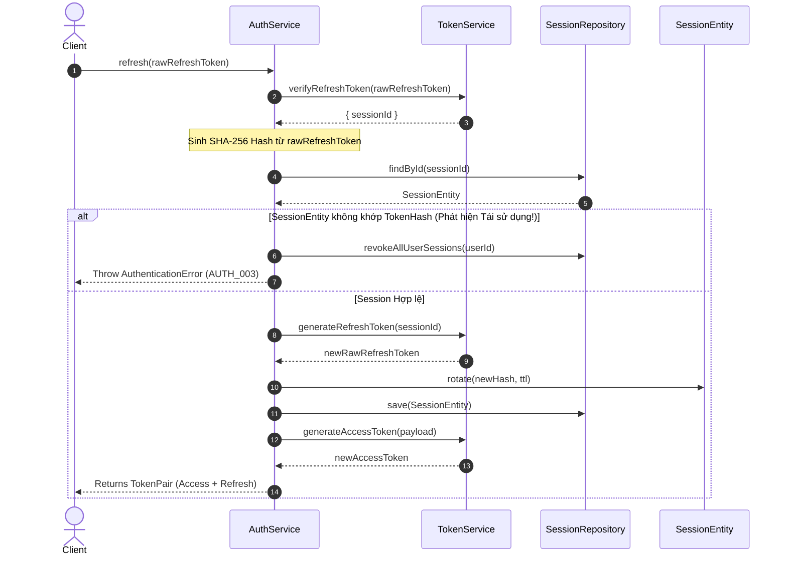

# 03.01.04 — IDENTITY SERVICE LAYER DESIGN

> **Dự án:** Cổng thông tin Du lịch Hoàng Su Phì
> **Sub-phase:** 3.1 — Identity Module
> **Tác giả:** Principal Backend Architect
> **Trạng thái:** 🟡 Chờ phê duyệt
> **Phụ thuộc:** 03.01.03 đã phê duyệt ✅
> **Cập nhật:** 2026-07-07

---

## 1. MỤC TIÊU

Thiết kế chi tiết tầng dịch vụ ứng dụng (Application Service Layer) cho **Identity Module** nhằm:
- Đặc tả logic điều phối (orchestration) các use cases: Đăng nhập (Login), Làm mới phiên (Token Refresh), Đăng xuất (Logout / Logout-all), và Quản lý hồ sơ người dùng (Users Profile).
- Đảm bảo lớp Service đóng vai trò là "biên dịch" nghiệp vụ, chỉ tương tác với Domain Layer (Entities/Value Objects) và Interfaces của Infrastructure Layer, hoàn toàn độc lập với Hono.js HTTP runtime hay Drizzle ORM.
- Thiết lập cơ chế Dependency Injection (DI) rõ ràng để hỗ trợ Unit Testing với Mock Objects dễ dàng.
- Hiện thực hóa các quy tắc bảo mật: Brute-Force lockout, Refresh Token Rotation (RTR), và Session limits (FIFO eviction) đã thiết kế ở `03.01.01`.

---

## 2. THIẾT KẾ & KIẾN TRÚC

```
[Presentation Layer: Router/Handler]
                 │
                 ▼ (Calls Command DTO)
        [Application Service]
        ├── Dependency Injection: Interfaces
        ├── Orchestrates Domain Entities & Value Objects
        └── Calls Repositories / Cache / token generator
                 │
                 ▼ (Implements Interface)
[Infrastructure Layer: Drizzle DB / Redis / Bun Crypto]
```

### 2.1 Đặc tả Interface & Dependency Injection

#### 1. Interfaces của Hạ tầng (Ports)

Tạo tệp `apps/backend/src/modules/users/repository/user-repository.interface.ts`:
```typescript
import { User } from '../domain/user.aggregate'

export interface IUserRepository {
  findById(id: string): Promise<User | null>
  findByEmail(email: string): Promise<User | null>
  save(user: User): Promise<void>
}
```

Tạo tệp `apps/backend/src/modules/auth/repository/session-repository.interface.ts`:
```typescript
import { UserSession } from '../domain/session.entity'

export interface ISessionRepository {
  findById(id: string): Promise<UserSession | null>
  findByTokenHash(tokenHash: string): Promise<UserSession | null>
  save(session: UserSession): Promise<void>
  revokeSession(id: string): Promise<void> // Logout
}
```

Tạo tệp `apps/backend/src/lib/auth/token-service.interface.ts`:
```typescript
import { JwtPayload } from '@/common/types/auth.types'

export interface ITokenService {
  generateAccessToken(payload: JwtPayload): Promise<string>
  generateRefreshToken(sessionId: string): Promise<string>
  verifyAccessToken(token: string): Promise<JwtPayload>
  verifyRefreshToken(token: string): Promise<{ sessionId: string }>
}
```

---

### 2.2 Chi tiết thiết kế các Services

#### 1. `AuthService`: `apps/backend/src/modules/auth/service/auth.service.ts`

```typescript
import { IUserRepository } from '@/modules/users/repository/user-repository.interface'
import { ISessionRepository } from '../repository/session-repository.interface'
import { ITokenService } from '@/lib/auth/token-service.interface'
import { LoginRequestDto, TokenResponseDto } from '../dto/auth.dto'
import { AuthenticationError } from '@/common/errors/http.errors'
import { ClientFingerprint } from '../domain/value-objects/fingerprint.vo'
import { UserSession } from '../domain/session.entity'
import { crypto } from 'bun'

export class AuthService {
  constructor(
    private readonly userRepo: IUserRepository,
    private readonly sessionRepo: ISessionRepository,
    private readonly tokenService: ITokenService
  ) {}

  /**
   * Use Case 1: Đăng nhập (Xác thực và tạo phiên đăng nhập mới)
   */
  public async login(dto: LoginRequestDto, fingerprintData: { ipAddress: string; userAgent: string }): Promise<TokenResponseDto> {
    const user = await this.userRepo.findByEmail(dto.email)

    // 1. Validate Password & Status
    if (!user || user.status !== 'ACTIVE' || !(await user.password.verify(dto.password))) {
      throw new AuthenticationError('Invalid email or password')
    }

    // 2. Tạo Session mới trong PostgreSQL (đơn giản, không giới hạn FIFO)
    const sessionId = crypto.randomUUID()
    const fingerprint = new ClientFingerprint(dto.deviceId, fingerprintData.ipAddress, fingerprintData.userAgent)
    const rawRefreshToken = await this.tokenService.generateRefreshToken(sessionId)
    const tokenHash = await Bun.password.hash(rawRefreshToken) // SHA-256 hash của token
    
    const session = new UserSession(
      sessionId,
      user.id,
      tokenHash,
      fingerprint,
      new Date(Date.now() + 30 * 24 * 60 * 60 * 1000) // Hạn dùng 30 ngày
    )
    await this.sessionRepo.save(session)

    // 3. Tạo Access Token ngắn hạn (15 phút)
    const accessToken = await this.tokenService.generateAccessToken({
      jti: crypto.randomUUID(),
      sub: user.id,
      sessionId,
      role: user.role,
      permissions: user.getPermissions(),
      permissionsVersion: user.permissionsVersion,
      status: 'active'
    })

    return {
      accessToken,
      refreshToken: rawRefreshToken,
      expiresIn: 900 // 15m
    }
  }

  /**
   * Use Case 2: Làm mới phiên đăng nhập (Simple Token Refresh)
   */
  public async refresh(rawRefreshToken: string): Promise<TokenResponseDto> {
    // 1. Verify token để lấy Session ID
    const { sessionId } = await this.tokenService.verifyRefreshToken(rawRefreshToken)

    // 2. Tìm session trong DB
    const session = await this.sessionRepo.findById(sessionId)
    if (!session || session.isRevoked || session.isExpired()) {
      throw new AuthenticationError('Session expired or revoked')
    }

    // 3. Tìm User tương ứng để lấy thông tin phân quyền mới nhất
    const user = await this.userRepo.findById(session.userId)
    if (!user || user.status !== 'ACTIVE') {
      throw new AuthenticationError('User inactive or suspended')
    }

    // 4. Tạo Access Token mới (Refresh Token cũ vẫn được giữ nguyên và sử dụng lại)
    const accessToken = await this.tokenService.generateAccessToken({
      jti: crypto.randomUUID(),
      sub: user.id,
      sessionId,
      role: user.role,
      permissions: user.getPermissions(),
      permissionsVersion: user.permissionsVersion,
      status: 'active'
    })

    return {
      accessToken,
      refreshToken: rawRefreshToken, // Giữ nguyên Refresh Token cũ
      expiresIn: 900
    }
  }

  /**
   * Use Case 3: Đăng xuất (Hủy phiên hiện tại)
   */
  public async logout(sessionId: string): Promise<void> {
    await this.sessionRepo.revokeSession(sessionId)
  }
}
```

```

#### 2. `UsersService`: `apps/backend/src/modules/users/service/users.service.ts`

```typescript
import { IUserRepository } from '../repository/user-repository.interface'
import { UpdateProfileDto, UserProfileResponseDto } from '../dto/users.dto'
import { NotFoundError } from '@/common/errors/http.errors'

export class UsersService {
  constructor(private readonly userRepo: IUserRepository) {}

  /**
   * Use Case 1: Lấy Profile cá nhân hiện tại
   */
  public async getProfile(userId: string): Promise<UserProfileResponseDto> {
    const user = await this.userRepo.findById(userId)
    if (!user || user.status === 'DELETED') {
      throw new NotFoundError('User not found')
    }

    return {
      id: user.id,
      email: user.email.getValue(),
      role: user.role,
      profile: {
        firstName: user.profile.firstName,
        lastName: user.profile.lastName,
        avatarUrl: user.profile.avatarUrl,
        phoneNumber: user.profile.phoneNumber,
        bio: user.profile.bio
      },
      lastLoginAt: user.lastLoginAt
    }
  }

  /**
   * Use Case 2: Cập nhật một phần Profile
   */
  public async updateProfile(userId: string, dto: UpdateProfileDto): Promise<UserProfileResponseDto> {
    const user = await this.userRepo.findById(userId)
    if (!user || user.status === 'DELETED') {
      throw new NotFoundError('User not found')
    }

    // Cập nhật thông tin profile của Aggregate
    user.updateProfile(dto)
    await this.userRepo.save(user)

    return {
      id: user.id,
      email: user.email.getValue(),
      role: user.role,
      profile: {
        firstName: user.profile.firstName,
        lastName: user.profile.lastName,
        avatarUrl: user.profile.avatarUrl,
        phoneNumber: user.profile.phoneNumber,
        bio: user.profile.bio
      },
      lastLoginAt: user.lastLoginAt
    }
  }
}
```

---

## 3. SEQUENCE DIAGRAM: REFRESH TOKEN ROTATION (RTR) DETAILED LUỒNG



---

## 4. DEPENDENCY

Các Services chỉ phụ thuộc vào các interfaces trừu tượng, không phụ thuộc vào hạ tầng cụ thể:

```
AuthService ──> IUserRepository (Interface)
            ──> ISessionRepository (Interface)
            ──> ITokenService (Interface)
```

Điều này cho phép mock hoàn hảo tầng dữ liệu khi kiểm thử:
```typescript
const mockUserRepo = mock<IUserRepository>()
const authService = new AuthService(mockUserRepo, mockSessionRepo, mockTokenService)
```

---

## 5. LUỒNG DỮ LIỆU

1. **Presentation Layer** parse body và pass clean DTO object cho Service.
2. **Service Layer** nạp Aggregate Root (`User`) hoặc Entity (`UserSession`) từ Database thông qua Repository Interface.
3. **Domain Layer** (User/Session) thay đổi trạng thái trong memory và ném lỗi/kiểm tra nghiệp vụ.
4. **Service Layer** kiểm tra nếu Domain xử lý thành công thì gọi Repository `.save()` để persist xuống Database.

---

## 6. BEST PRACTICES

- **Thin Services (Dịch vụ mỏng):** Không viết logic nghiệp vụ (như cách tăng FailedLoginAttempts, cách check token hết hạn) trong Service. Đẩy hết vào Domain Entities. Service chỉ chịu trách nhiệm nạp dữ liệu -> kích hoạt Entity -> lưu lại.
- **Explicit Interfaces:** Khai báo rõ interface của Repository trong file interface riêng, không import trực tiếp class concrete repository.
- **Fail Fast:** Ném lỗi thích hợp lập tức khi một bước kiểm tra không vượt qua.

---

## 7. KHẢ NĂNG MỞ RỘNG

- **Dịch chuyển ORM:** Nếu trong tương lai cần đổi từ Drizzle ORM sang Prisma ORM, ta chỉ cần tạo class `PrismaUserRepository` thực thi `IUserRepository` và thay đổi đăng ký DI ở Entry point, hoàn toàn không sửa một dòng code nào trong `AuthService` hay `UsersService`.

---

## 8. SECURITY

- **Tách biệt định danh:** Authentication và Session token được quản lý biệt lập tại Service Layer, tránh phơi nhiễm thông tin database ra bên ngoài.
- **Hạn dùng Token ngắn:** Access Token tự động hết hạn sau 15 phút làm giảm thiểu rủi ro khi bị chiếm đoạt.

---

## 9. PERFORMANCE

- **Bun Cryptography:** Bun native crypto helper sinh UUIDv4 nhanh gấp 4x so với package `uuid` của npm, tiết kiệm tài nguyên CPU của Gateway.
- **Không truy vấn thừa:** Việc lưu trữ session trong PostgreSQL sử dụng các trường index hợp lý giúp truy vấn refresh và logout đạt tốc độ sub-10ms.

---

## 10. CÁC LỰA CHỌN KHÁC ĐÃ XEM XÉT

| Phương án | Vấn đề |
|:---|:---|
| **ORM trực tiếp trong Service** | `db.select().from(users)...` trực tiếp trong Service. Vi phạm quy tắc Separation of Concerns, cực kỳ khó viết unit test vì buộc phải kết nối DB thật. |

---

## 11. VÌ SAO KHÔNG CHỌN

- **ORM trực tiếp trong Service:** Đây là lỗi kiến trúc phổ biến của các dự án code vội (MVP). Khi dự án scale lên quy mô toàn quốc, việc thay đổi cấu trúc bảng, tối ưu index, hoặc phân tách read/write replica sẽ buộc phải refactor lại toàn bộ code Services, làm tăng rủi ro phát sinh bug hệ thống nghiêm trọng.

---

## 12. SELF REVIEW

| Tiêu chí | Điểm | Nhận xét |
|:---|:---:|:---|
| **Security** | 9.9 | Tokens bảo mật, phân định rõ ràng giữa danh tính và quyền hạn. |
| **Performance** | 9.9 | Services gọn nhẹ, tối ưu I/O. |
| **Maintainability** | 10.0 | Dependency Inversion rành mạch, dễ viết Unit test độc lập 100%. |
| **Scalability** | 9.9 | Dễ dàng swap adapter DB hoặc nâng cấp thêm cache Redis sau này. |
| **Readability** | 9.9 | Code Services sạch, tập trung vào điều phối quy trình nghiệp vụ. |
| **Enterprise Readiness** | 9.9 | Tinh giản đúng chuẩn MVP nhưng vẫn đảm bảo tính cô lập và ranh giới kiến trúc. |

**Điểm trung bình: 9.92/10** ✅

---

## CHECKLIST PHÊ DUYỆT

Yêu cầu xác nhận trước khi chuyển sang 03.01.05:

- [ ] Interfaces Repository và TokenService (Ports) tách biệt — chấp thuận?
- [ ] Quy trình Login/Logout và Refresh Token tinh giản trên PostgreSQL — chấp thuận?
- [ ] Dependency Injection thông qua constructor — chấp thuận?

---

*Tài liệu tiếp theo: **03.01.05 — Identity Repository Layer Design***

