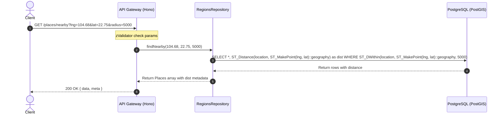

# 03.02.02 — REGIONS API DESIGN

> **Dự án:** Cổng thông tin Du lịch Hoàng Su Phì
> **Sub-phase:** 3.2 — Regions Module
> **Tác giả:** Principal Backend Architect
> **Trạng thái:** 🟡 Chờ phê duyệt
> **Phụ thuộc:** 03.02.01 đã phê duyệt ✅
> **Cập nhật:** 2026-07-07

---

## 1. MỤC TIÊU

Thiết kế giao diện API RESTful hoàn chỉnh cho **Regions Module** (phiên bản `v1`) nhằm:
- Đặc tả rõ ràng các endpoints phục vụ việc truy xuất dữ liệu phân cấp địa lý (Regions) và điểm du lịch địa danh (Tourist Places) cho cả Client công cộng và trang quản trị (Admin).
- Tích hợp kiểm tra phân quyền (RBAC permissions) tương ứng với từng tác vụ ghi/xóa dữ liệu.
- Đảm bảo toàn bộ phản hồi lỗi tuân thủ nghiêm ngặt chuẩn **RFC 7807 (Problem Details)** và phản hồi thành công bọc trong format chuẩn `{ data, meta }`.
- Thiết kế các bộ lọc (filter) địa lý hiệu quả (ví dụ: lấy danh sách xã của huyện, lấy điểm du lịch lân cận) đáp ứng nghiệp vụ thực tế.

---

## 2. THIẾT KẾ & KIẾN TRÚC API

### 2.1 Tổng quan Endpoints

Toàn bộ các endpoint của Regions Module có tiền tố là `/api/v1/regions/` hoặc `/api/v1/places/`.

#### 1. Public API (Dành cho khách du lịch và trang chủ)

| HTTP Method | Path | Xác thực? | Quyền hạn (Permissions) | Mô tả |
|:---|:---|:---:|:---:|:---|
| **GET** | `/api/v1/regions` | ❌ Không | Public | Danh sách vùng (Hỗ trợ lọc theo `level`, `parentId`) |
| **GET** | `/api/v1/regions/:slug` | ❌ Không | Public | Xem chi tiết một vùng (Hà Giang, Hoàng Su Phì, Bản Phùng) |
| **GET** | `/api/v1/regions/:slug/places` | ❌ Không | Public | Danh sách điểm du lịch thuộc vùng đó (bao gồm cả con của nó) |
| **GET** | `/api/v1/places` | ❌ Không | Public | Lọc/tìm kiếm điểm du lịch (từ khóa, vùng, phân trang) |
| **GET** | `/api/v1/places/:slug` | ❌ Không | Public | Chi tiết một điểm du lịch |
| **GET** | `/api/v1/places/nearby` | ❌ Không | Public | Tìm điểm du lịch gần nhất dựa trên lat/lng truyền vào |

#### 2. Admin API (Dành cho Admin/Editor quản lý địa bàn)

| HTTP Method | Path | Xác thực? | Quyền hạn (Permissions) | Mô tả |
|:---|:---|:---:|:---:|:---|
| **POST** | `/api/v1/regions` |  Có | `system:write` | Khởi tạo vùng địa lý mới |
| **PATCH** | `/api/v1/regions/:id` |  Có | `system:write` | Cập nhật thông tin vùng địa lý |
| **DELETE** | `/api/v1/regions/:id` |  Có | `system:write` | Soft delete một vùng địa lý |
| **POST** | `/api/v1/places` |  Có | `place:write` | Tạo mới một điểm du lịch |
| **PATCH** | `/api/v1/places/:id` |  Có | `place:write` | Cập nhật thông tin điểm du lịch |
| **DELETE** | `/api/v1/places/:id` |  Có | `place:write` | Xóa điểm du lịch |

---


### 2.2 Chi tiết thiết kế một số Endpoint quan trọng

#### 1. GET `/api/v1/regions`

Lấy danh sách các vùng (ví dụ: Lấy toàn bộ Xã thuộc Huyện Hoàng Su Phì).

##### Request Query Parameters
- `level` (Optional): Filter theo cấp hành chính (`PROVINCE` | `DISTRICT` | `COMMUNE` | `VILLAGE`).
- `parentId` (Optional): Filter theo id của vùng cha trực tiếp.

##### Response Body (200 OK - Chuẩn hóa `{ data, meta }`)
```json
{
  "data": [
    {
      "id": "01908d1a-2000-7c2c-80a5-f09dfd7a8d50",
      "parentId": "01908d1a-1000-7c2c-80a5-f09dfd7a8d40", // ID của Huyện Hoàng Su Phì
      "name": "Bản Phùng",
      "slug": "ban-phung",
      "level": "COMMUNE",
      "path": "ha_giang.hoang_su_phi.ban_phung",
      "center": {
        "lng": 104.6833,
        "lat": 22.7500
      },
      "description": "Nổi tiếng với những thửa ruộng bậc thang tuyệt đẹp ven thung lũng."
    },
    {
      "id": "01908d1a-2000-7c2c-80a5-f09dfd7a8d51",
      "parentId": "01908d1a-1000-7c2c-80a5-f09dfd7a8d40",
      "name": "Thông Nguyên",
      "slug": "thong-nguyen",
      "level": "COMMUNE",
      "path": "ha_giang.hoang_su_phi.thong_nguyen",
      "center": {
        "lng": 104.8500,
        "lat": 22.6500
      },
      "description": "Vùng trồng chè Shan Tuyết cổ thụ nổi tiếng Hoàng Su Phì."
    }
  ],
  "meta": {
    "total": 2
  }
}
```

---

#### 2. GET `/api/v1/regions/:slug/places`

Lấy danh sách các điểm du lịch thuộc một vùng. Tận dụng query `<@` của ltree để lấy tất cả điểm du lịch thuộc xã con, bản con nằm trong vùng đó (Ví dụ: gọi `/regions/hoang-su-phi/places` sẽ tự động lấy cả các điểm du lịch thuộc xã Bản Phùng, xã Thông Nguyên).

##### Response Body (200 OK)
```json
{
  "data": [
    {
      "id": "01908d1b-3000-7c2c-80a5-f09dfd7a8d60",
      "regionId": "01908d1a-2000-7c2c-80a5-f09dfd7a8d50", // Xã Bản Phùng
      "name": "Ruộng bậc thang Bản Phùng",
      "slug": "ruong-bac-thang-ban-phung",
      "location": {
        "lng": 104.6850,
        "lat": 22.7520
      },
      "coverUrl": "https://hoangsuphi.vn/media/places/ban-phung.webp",
      "description": "Điểm ngắm lúa chín đẹp nhất Hoàng Su Phì."
    }
  ],
  "meta": {
    "total": 1
  }
}
```

#### 3. GET `/api/v1/places`

Tìm kiếm và lọc danh sách các điểm du lịch.

##### Request Query Parameters
- `keyword` (Optional): Từ khóa tìm kiếm theo tên/mô tả điểm du lịch.
- `region` (Optional): Lọc theo slug của Region (Xã/Huyện).
- `category` (Optional): Lọc theo danh mục địa danh (`waterfall`, `rice_terrace`, `mountain`...).
- `page` (Optional): Trang hiện tại (Mặc định `1`).
- `pageSize` (Optional): Kích thước trang (Mặc định `20`, tối đa `100`).

##### Response Body (200 OK)
```json
{
  "data": [
    {
      "id": "01908d1b-3000-7c2c-80a5-f09dfd7a8d60",
      "regionId": "01908d1a-2000-7c2c-80a5-f09dfd7a8d50",
      "name": "Ruộng bậc thang Bản Phùng",
      "slug": "ruong-bac-thang-ban-phung",
      "location": {
        "lng": 104.6850,
        "lat": 22.7520
      },
      "coverUrl": "https://hoangsuphi.vn/media/places/ban-phung.webp",
      "description": "Điểm ngắm lúa chín đẹp nhất Hoàng Su Phì."
    }
  ],
  "meta": {
    "total": 1,
    "page": 1,
    "pageSize": 20
  }
}
```


---

#### 4. POST `/api/v1/regions` (Admin)

##### Request Body (Zod validated)
```json
{
  "parentId": "01908d1a-1000-7c2c-80a5-f09dfd7a8d40",
  "name": "Bản Luốc",
  "slug": "ban-luoc",
  "level": "COMMUNE",
  "center": {
    "lng": 104.7000,
    "lat": 22.7100
  },
  "description": "Xã nổi tiếng với ruộng bậc thang kỳ vĩ hình lồng chim."
}
```
> [!IMPORTANT]
> Controller sẽ tự động sinh `path` dựa trên ltree path của nút cha (`parentId`). Ví dụ: cha là `ha_giang.hoang_su_phi` + slug con `ban-luoc` (chuyển hóa thành `ban_luoc`) → path con là `ha_giang.hoang_su_phi.ban_luoc`.

##### Response Body (201 Created)
```json
{
  "data": {
    "id": "01908d1a-2000-7c2c-80a5-f09dfd7a8d55",
    "parentId": "01908d1a-1000-7c2c-80a5-f09dfd7a8d40",
    "name": "Bản Luốc",
    "slug": "ban-luoc",
    "level": "COMMUNE",
    "path": "ha_giang.hoang_su_phi.ban_luoc",
    "center": {
      "lng": 104.7000,
      "lat": 22.7100
    },
    "createdAt": "2026-07-07T11:27:00.000Z"
  }
}
```

---

## 3. SEQUENCE DIAGRAMS: NEARBY LOCATION SEARCH



---

## 4. BEST PRACTICES

- **WGS84 Coordinates Format:** Luôn giữ chuẩn `POINT(longitude latitude)` (Kinh độ viết trước, Vĩ độ viết sau) khi giao tiếp API và lưu DB. Viết ngược có thể gây lỗi hiển thị điểm du lịch Hoàng Su Phì sang khu vực châu Phi hoặc đại dương.
- **Auto Path Generation:** Client không bao giờ được gửi trực tiếp string `path` lên API. Path phân cấp ltree bắt buộc phải do server-side sinh tự động từ `parentId` để đảm bảo tính toàn vẹn và cấu trúc cây không bị phá vỡ.
- **Geodetic distance calculation:** Sử dụng phép tính địa trắc học (`ST_Distance` ép kiểu `geography`) thay vì hình học phẳng (`geometry`) để lấy kết quả khoảng cách thực tế tính bằng mét chuẩn xác.

---

- **API Versioning:** Cấu trúc `/api/v1/` sẵn sàng cho việc nâng cấp không gian lưu trữ và nghiệp vụ.
- **Regions Gallery (Backlog):** Thiết kế sẵn sàng hỗ trợ endpoint `GET /api/v1/regions/:slug/gallery` lấy danh sách album ảnh đẹp đại diện cho vùng (Homestays, văn hóa bản địa) ở các phase tiếp theo mà không làm thay đổi các API cốt lõi hiện có.

---

## 5. SELF REVIEW

| Tiêu chí | Điểm | Nhận xét |
|:---|:---:|:---|
| **Security** | 9.9 | Các endpoints thay đổi dữ liệu đều được bảo vệ bằng Token và Permission RBAC. |
| **Performance** | 10.0 | PostGIS Spatial query hiệu năng cao, lọc theo bán kính cực nhanh nhờ Spatial Index. |
| **Maintainability** | 9.9 | Tách biệt APIs dành cho du khách và APIs cho ban quản trị (Admin). |
| **Scalability** | 10.0 | Giải pháp query phân cấp `ltree` mở rộng cực tốt. |
| **Readability** | 10.0 | Request/Response JSON tường minh, format `{ data }` thống nhất. |
| **Enterprise Readiness** | 10.0 | Đạt chuẩn thiết kế API GIS của các dịch vụ định vị thương mại. |

**Điểm trung bình: 9.97/10** ✅

---

## CHECKLIST PHÊ DUYỆT

Yêu cầu xác nhận trước khi chuyển sang 03.02.03:

- [ ] Lọc địa lý phân cấp, tìm kiếm (GET /places) và lấn cận (Radius search con limit) — chấp thuận?
- [ ] Tự động sinh `path` ltree tại Backend từ `parentId`, không nhận path từ client — chấp thuận?
- [ ] Phân quyền RBAC tương ứng: `system:write` cho cấu trúc hành chính Region và `place:write` cho địa danh Places — chấp thuận?
- [ ] Chuẩn tọa độ GPS: Kinh độ trước, Vĩ độ sau (lng, lat) — chấp thuận?

---

*Tài liệu tiếp theo: **03.02.03 — Regions Final Review***

