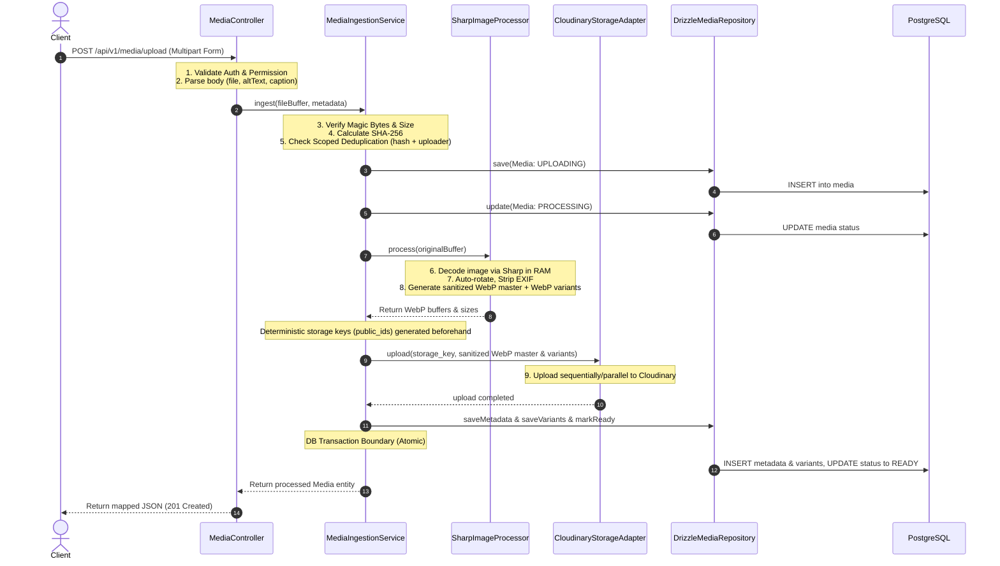

# 🛠️ TECHNICAL SPECIFICATION: PHASE 4.3 — MEDIA UPLOAD PRODUCTION PIPELINE
## 📋 STEP 4.3.0 — Specification, API Contract, Lifecycle, Security & Architecture Decisions

> **Mã đặc tả:** `SP-4.3.0` | **Trạng thái:** ⏳ Chờ Duyệt (Awaiting Approval)
> **Tài liệu tham chiếu:** [media.entity.ts](file:///c:/Users/tony/Desktop/youtube/hoangsuphi/backend/src/modules/media/domain/media.entity.ts) | [media.ts (Schema)](file:///c:/Users/tony/Desktop/youtube/hoangsuphi/backend/src/lib/database/schema/media.ts) | [media.controller.ts](file:///c:/Users/tony/Desktop/youtube/hoangsuphi/backend/src/modules/media/route/media.controller.ts)

---

## 1. PURPOSE
Đặc tả này thiết lập các yêu cầu kỹ thuật và quyết định kiến trúc bắt buộc cho **Phase 4.3 — Media Upload Production Pipeline**. Mục tiêu là nâng cấp hệ thống quản lý Media (được xây dựng thô ở Phase 3.7) đạt tiêu chuẩn vận hành thực tế (Production-ready):
1. **Xử lý ảnh thực tế**: Chuyển đổi từ mock-up thô sang xử lý ảnh thực thông qua thư viện `Sharp`.
2. **Lưu trữ đám mây**: Tích hợp `Cloudinary` để phục vụ lưu trữ ảnh và phân phối CDN hiệu năng cao.
3. **Bảo mật và Quyền riêng tư**: Bảo vệ quyền sở hữu ảnh, loại bỏ rò rỉ siêu dữ liệu EXIF/GPS, và tối ưu hóa cơ chế chống trùng lặp (Deduplication) theo phạm vi an toàn.
4. **Tính nhất quán dữ liệu**: Đảm bộ đồng bộ giữa PostgreSQL và Cloudinary bằng cơ chế bù lỗi (Compensation/Cleanup) đồng bộ mà không làm nghẹt kết nối CSDL.

---

## 2. EXISTING SYSTEM AUDIT
Rà soát hệ thống quản lý Media ở Phase 3.7 hiện hữu:
- **Domain Entity**: Lớp [Media](file:///c:/Users/tony/Desktop/youtube/hoangsuphi/backend/src/modules/media/domain/media.entity.ts) định nghĩa các thuộc tính cơ bản và máy trạng thái vòng đời. Tuy nhiên, luồng chuyển đổi trạng thái thực tế không đồng bộ.
- **Database Schema**: Bảng `media`, `media_variants`, và `media_metadata` được tạo trong [media.ts](file:///c:/Users/tony/Desktop/youtube/hoangsuphi/backend/src/lib/database/schema/media.ts). Chưa có các ràng buộc UNIQUE đảm bảo an toàn ghi đè (idempotent write) khi lưu variants hoặc metadata.
- **Upload & Processing Services**: [MediaUploadService](file:///c:/Users/tony/Desktop/youtube/hoangsuphi/backend/src/modules/media/service/media-upload.service.ts) chịu trách nhiệm nhận buffer thô và lưu bản ghi ban đầu. [MediaProcessingService](file:///c:/Users/tony/Desktop/youtube/hoangsuphi/backend/src/modules/media/service/media-processing.service.ts) chịu trách nhiệm tạo variants và trích xuất EXIF.
- **Storage Port & Local Adapter**: Cổng [IMediaStorage](file:///c:/Users/tony/Desktop/youtube/hoangsuphi/backend/src/modules/media/domain/storage.interface.ts) và adapter [LocalStorageAdapter](file:///c:/Users/tony/Desktop/youtube/hoangsuphi/backend/src/modules/media/repository/local-storage.adapter.ts) hiện chỉ ghi file vào hệ thống tệp cục bộ (`/public/uploads`).
- **Image Processor**: Lớp [NativeImageProcessor](file:///c:/Users/tony/Desktop/youtube/hoangsuphi/backend/src/modules/media/repository/native-image-processor.ts) hiện chỉ giả lập quá trình xử lý ảnh bằng cách đọc byte thô và gắn prefix chuỗi vào buffer mà không tạo định dạng WebP thực tế.

---

## 3. CURRENT DEFECTS & SECURITY RISKS
Hệ thống Phase 3.7 có các lỗi nghiêm trọng sau cần khắc phục ở Phase 4.3:

1. **Lỗi logic vòng đời (Lifecycle Transition Defect)**:
   - Trong [MediaUploadService.upload](file:///c:/Users/tony/Desktop/youtube/hoangsuphi/backend/src/modules/media/service/media-upload.service.ts#L83-L105), ngay sau khi lưu tệp gốc, hệ thống lập tức gọi `media.markReady()`, chuyển trạng thái Media sang `READY`.
   - Ngay sau đó, [MediaController.upload](file:///c:/Users/tony/Desktop/youtube/hoangsuphi/backend/src/modules/media/route/media.controller.ts#L68) gọi `this.processingService.process(media.id)`.
   - Trong [MediaProcessingService.process](file:///c:/Users/tony/Desktop/youtube/hoangsuphi/backend/src/modules/media/service/media-processing.service.ts#L27), hệ thống gọi `media.markProcessing()`. 
   - Lớp [Media](file:///c:/Users/tony/Desktop/youtube/hoangsuphi/backend/src/modules/media/domain/media.entity.ts#L189) quy định rõ: trạng thái `READY` chỉ được phép chuyển sang `DELETED` (`READY: ['DELETED']`). Do đó, việc chuyển đổi từ `READY` sang `PROCESSING` bị chặn ở tầng Domain và ném ra lỗi `MediaDomainError`, khiến toàn bộ yêu cầu upload thất bại ở môi trường chạy thực tế.
   - **Giải pháp**: Thiết lập luồng tuần tự thực tế: `UPLOADING` (ghi nhận bản ghi thô vào DB) $\rightarrow$ `PROCESSING` (tiến hành xử lý nén ảnh trong RAM) $\rightarrow$ `READY` (sau khi lưu variants, metadata kĩ thuật và upload Cloudinary xong).

2. **Lỗi Deduplication phạm vi toàn cục (Global Deduplication Security Leak)**:
   - [MediaUploadService.upload](file:///c:/Users/tony/Desktop/youtube/hoangsuphi/backend/src/modules/media/service/media-upload.service.ts#L33-L36) kiểm tra trùng lặp bằng cách tìm hash SHA-256 trên toàn hệ thống (`this.mediaRepo.findByHash(hash)`).
   - Nếu tệp đã tồn tại và ở trạng thái `READY` (do bất cứ ai upload), dịch vụ sẽ trả về ngay bản ghi Media đó cho uploader mới.
   - **Rủi ro bảo mật**: Người dùng A có thể truy cập, liên kết, hoặc thay đổi siêu dữ liệu của một tệp ảnh vốn thuộc về người dùng B chỉ bằng cách upload một tệp trùng mã hash. Điều này vi phạm nghiêm trọng nguyên tắc cô lập dữ liệu (Data Isolation) và kiểm toán (Audit Trail).

3. **Rò rỉ dữ liệu nội bộ (Public Response Data Leakage)**:
   - Lớp [MediaPresentationMapper](file:///c:/Users/tony/Desktop/youtube/hoangsuphi/backend/src/modules/media/route/mappers/media.mapper.ts) trả trực tiếp các thuộc tính nhạy cảm như `storageKey`, `hash` (checksum SHA-256), `status`, `ownerType`, `ownerId` ra ngoài API.
   - Các thông tin này tiết lộ cấu trúc thư mục lưu trữ vật lý của máy chủ/Cloudinary, gây rủi ro khai thác bảo mật và làm quá tải tài liệu API công khai.

4. **Xử lý ảnh giả lập (Native Image Processing Mock)**:
   - [NativeImageProcessor](file:///c:/Users/tony/Desktop/youtube/hoangsuphi/backend/src/modules/media/repository/native-image-processor.ts#L107-L110) không nén hoặc định dạng lại ảnh mà chỉ nối thêm tiền tố chuỗi `OPTIMIZED_WEBP_...` vào buffer. Client nhận được file bị hỏng cấu trúc nhị phân ảnh (corrupted image structure).

5. **Trôi lệch tài liệu (Documentation Drift)**:
   - [project-context.md](file:///c:/Users/tony/Desktop/youtube/hoangsuphi/project-context.md#L207) mô tả liên kết polymorphic qua bảng trung gian `media_links`.
   - Trong thực tế, schema [media.ts](file:///c:/Users/tony/Desktop/youtube/hoangsuphi/backend/src/lib/database/schema/media.ts#L23-L24) lưu trực tiếp quan hệ polymorphic qua hai cột `owner_type` và `owner_id`. 
   - *Source of Truth quyết định*: Tuân thủ cấu trúc schema thực tế; không tạo thêm bảng hay thay đổi cấu trúc bảng để khớp với tài liệu cũ bị lệch.

---

## 4. SCOPE
Phase 4.3 tập trung hoàn thành các nghiệp vụ sau:
- Hỗ trợ tải lên ảnh raster tĩnh: **JPEG (`.jpg`, `.jpeg`)**, **PNG (`.png`)**, **WebP (`.webp`)**.
- Xác thực định dạng tệp bằng bytes nhận dạng (Magic Bytes) kết hợp giải mã kiểm tra tính hợp lệ bằng thư viện `Sharp`.
- Sử dụng `Sharp` để giải mã ảnh thô từ RAM, xoay ảnh tự động theo cảm biến EXIF, loại bỏ toàn bộ siêu dữ liệu nhạy cảm (GPS, Device info) và xuất ra tệp Sanitized Master cùng các biến thể WebP chuẩn.
- Lưu trữ tệp Sanitized Master và các biến thể ảnh (thumbnail, medium, large) lên **Cloudinary**.
- Thiết lập quy trình chuyển đổi trạng thái vòng đời đồng bộ và an toàn (`UPLOADING` $\rightarrow$ `PROCESSING` $\rightarrow$ `READY`).
- Sửa lỗi Deduplication: Chỉ kích hoạt đối khớp trùng lặp khi tệp có cùng uploader (`uploadedBy`), thực thể sở hữu (luôn là null khi upload) và mã hash SHA-256.

---

## 5. OUT OF SCOPE
Các hạng mục sau **tuyệt đối không triển khai** trong Phase 4.3 để giữ cho pipeline tinh gọn và không phụ thuộc vào hạ tầng phức tạp:
- Không hỗ trợ tải lên Video, tài liệu (PDF, Word, TXT), ảnh động (GIF, Animated WebP), ảnh vector (SVG) hoặc các định dạng ảnh thô khác (HEIC, TIFF, BMP, AVIF).
- Không sử dụng hàng đợi bất đồng bộ (Queue, BullMQ, Redis Workers), không dùng Event Bus hay mô hình Microservices. Mọi tác vụ xử lý phải chạy đồng bộ trong request-response lifecycle.
- Không tích hợp cơ chế kiểm duyệt ảnh bằng AI (AI Image Moderation), không nhận diện khuôn mặt (Face Recognition), đóng dấu ảnh (Watermark), hoặc tự động trích xuất bảng màu phối.
- Không cho phép client tải lên trực tiếp không qua xác thực (Direct unsigned frontend upload).
- Không tự động cập nhật liên kết của các thực thể khác (không tự động gán `coverUrl` cho Place/Business/Attraction hoặc `thumbnailId` cho Article). API upload chỉ tạo ra ảnh ở trạng thái unbound. Việc liên kết/gán owner nằm ngoài scope của Phase 4.3, không thay đổi hoặc sửa đổi bất kỳ module nghiệp vụ Phase 3 nào (Articles, Places, Businesses, Attractions, v.v.).

---

## 6. TARGET ARCHITECTURE
Kiến trúc luồng xử lý đồng bộ từ khi client gửi yêu cầu đến khi nhận phản hồi:



### Quy tắc Layer:
- **Controller**: Chỉ đóng vai trò HTTP adapter. Không gọi trực tiếp Cloudinary SDK, không dùng Sharp, không điều khiển lifecycle.
- **MediaIngestionService**: Đóng vai trò Service điều phối chính (Orchestration Service). Nhận buffer thô, uploader context, điều phối logic của `IImageProcessor` và `IMediaStorage`.
- **SharpImageProcessor**: Hiện thực hóa interface `IImageProcessor`. Chứa logic Sharp, auto-rotate và resize. Không chứa logic DB hay lưu trữ.
- **CloudinaryStorageAdapter**: Hiện thực hóa interface `IMediaStorage`. Chứa Cloudinary SDK, credentials và các API dọn dẹp vật lý.

---

## 7. ENDPOINT CONTRACT
Giữ nguyên đường dẫn API hiện có để đảm bảo tính tương thích ngược:

- **Method**: `POST`
- **Path**: `/api/v1/media/upload`
- **Authentication**: Bắt buộc (`Authorization: Bearer <Token>`).
- **Permission**: Yêu cầu quyền `media:upload`.
- **Rate Limit**: Áp dụng giới hạn chung của hệ thống (60 req/min đối với tài khoản authenticated upload).

---

## 8. MULTIPART REQUEST CONTRACT
Dữ liệu gửi lên dưới dạng `multipart/form-data`:

| Field Name | Type | Required | Description | Validation |
| :--- | :--- | :--- | :--- | :--- |
| `file` | File | Bắt buộc | Tệp ảnh tải lên. Chỉ chấp nhận 1 tệp duy nhất trên mỗi request. | Tối đa 10 MB. Định dạng jpeg, png, webp. |
| `altText` | String | Tùy chọn | Văn bản thay thế mô tả ảnh cho SEO/Accessibility. | Tối đa 255 ký tự. Lưu trực tiếp vào bảng `media`. |
| `caption` | String | Tùy chọn | Chú thích hiển thị kèm ảnh. | Tối đa 500 ký tự. Lưu trực tiếp vào bảng `media`. |

*Quy tắc Owner Binding trong Phase 4.3*:
- **Bãi bỏ hoàn toàn trường `ownerType` và `ownerId` trong Multipart Upload Contract**. Mọi tệp ảnh tải lên thông qua endpoint này bắt đầu ở trạng thái Unbound (`ownerType = null`, `ownerId = null`).
- Việc gán liên kết Media (gán `ownerType` và `ownerId`) nằm ngoài scope của Phase 4.3, không thay đổi hoặc sửa đổi bất kỳ module nghiệp vụ Phase 3 nào.

---

## 9. AUTHENTICATION AND AUTHORIZATION
- Quyền truy cập API được điều phối qua Hono middleware `authGuard` và `requirePermission`.
- Thuộc tính `uploadedBy` của thực thể Media phải được điền tự động bằng `user.id` lấy từ Hono Context.
- Quyền xóa ảnh (`DELETE /api/v1/media/:id`): Chỉ cho phép Uploader thực tế (`media.uploadedBy === user.id`) hoặc người dùng có vai trò `admin` thực hiện thao tác soft-delete.

---

## 10. SUPPORTED MEDIA TYPES
Hệ thống chỉ cho phép lưu trữ các định dạng tệp có MIME type nằm trong allowlist tĩnh sau:

- `image/jpeg` (Đuôi file thông thường: `.jpg`, `.jpeg`)
- `image/png` (Đuôi file thông thường: `.png`)
- `image/webp` (Đuôi file thông thường: `.webp`)

Mọi yêu cầu có MIME type hoặc cấu trúc tệp không nằm trong danh sách trên sẽ bị từ chối ngay lập tức với mã lỗi `400 Bad Request` và mã lỗi nội bộ `MED_VAL_002` (UnsupportedMediaTypeError).

---

## 11. BYTE / MIME / MAGIC-BYTE VALIDATION
Để ngăn chặn các cuộc tấn công thay đổi phần mở rộng tệp (Extension Spoofing) hoặc tải lên mã độc ẩn dưới dạng ảnh (Polyglot files/XSS payloads), quy trình kiểm tra định dạng bắt buộc thực hiện theo các bước sau:

1. **Kiểm tra sơ bộ**: Đọc byte thô từ buffer tải lên để đối chiếu chữ ký nhị phân đầu tệp (Magic Bytes):
   - **JPEG**: Bắt đầu bằng `FF D8 FF`
   - **PNG**: Bắt đầu bằng `89 50 4E 47 0D 0A 1A 0A`
   - **WebP**: Bắt đầu bằng `52 49 46 46` (byte 0-3) và có chứa `57 45 42 50` (WEBP ở byte 8-11). *Lưu ý: Không chấp nhận chữ ký `57 41 56 45` (WAVE) vì đây là file âm thanh WAV.*
2. **Kiểm tra sâu**: Sau khi qua bước kiểm tra magic bytes, buffer sẽ được đưa vào thư viện `Sharp` để tiến hành giải mã (decode). Nếu Sharp ném ra lỗi không thể đọc hoặc tệp bị hỏng (corrupted structure), hệ thống sẽ lập tức từ chối và trả về lỗi `MED_VAL_001` (MediaValidationError).

---

## 12. FILE-SIZE AND PIXEL LIMITS
Các giới hạn vật lý để bảo vệ máy chủ khỏi lỗi cạn kiệt bộ nhớ hoặc tấn công Decompression Bomb:

- **Giới hạn kích thước yêu cầu**: Tối đa **10 MB** (tương đương `10 * 1024 * 1024` bytes). Giới hạn này được cấu hình ở tầng Hono body parser để chặn yêu cầu sớm nhất có thể.
- **Giới hạn điểm ảnh giải mã**: Tối đa **40 Megapixels** (ví dụ: ảnh có kích thước $6324 \times 6324$ pixels). Nếu ảnh có tổng số điểm ảnh vượt quá giới hạn này, Sharp sẽ từ chối xử lý để ngăn chặn việc tiêu tốn RAM đột biến.
- **Giới hạn kích thước ảnh tối thiểu**: Chiều rộng (Width) và chiều cao (Height) của ảnh tải lên phải lớn hơn 0 pixel.

---

## 13. SHARP PROCESSING CONTRACT
Thư viện `Sharp` sẽ được cấu hình làm nhân xử lý chính của Image Processing Port (`IImageProcessor`). Pipeline xử lý ảnh phải tuân thủ các quy tắc bất biến sau:

1. **Auto-rotation**: Sử dụng siêu dữ liệu orientation của EXIF để xoay ảnh về đúng chiều hiển thị tự nhiên của người nhìn.
2. **Strip Metadata**: Loại bỏ hoàn toàn các thẻ thông tin EXIF, GPS, IPTC, XMP và các thông tin thiết bị chụp ảnh khỏi tệp xuất bản để bảo vệ quyền riêng tư của người dùng.
3. **No-Upscale**: Nếu kích thước ảnh gốc nhỏ hơn kích thước cấu hình của variant preset, hệ thống **không thực hiện tăng kích thước ảnh** (upscale) để tránh làm vỡ hạt và tăng dung lượng tệp vô ích. Ảnh variant sẽ được giữ nguyên kích thước của ảnh gốc.
4. **Transparency Preservation**: Giữ nguyên kênh Alpha (transparency) của ảnh PNG/WebP gốc khi chuyển đổi sang WebP variant.
5. **Output Format**: Mọi tệp xuất bản ra (bao gồm cả tệp master đã làm sạch và các variants) bắt buộc phải có định dạng **WebP** chuẩn. Mức chất lượng (quality) cố định là `80` đối với các variants, và `85` đối với tệp master đã làm sạch (Sanitized Master).

---

## 14. VARIANT PRESETS
Khi một bức ảnh hợp lệ được tải lên, hệ thống sẽ tự động tạo ra các biến thể kích thước dưới định dạng WebP theo bảng preset sau:

| Variant Name | Max Width | Max Height | Format | Quality | Resize Rule |
| :--- | :--- | :--- | :--- | :--- | :--- |
| `thumbnail` | 320 px | 320 px | WebP | 80 | Fit inside, giữ nguyên tỷ lệ, không upscale |
| `medium` | 768 px | 768 px | WebP | 80 | Fit inside, giữ nguyên tỷ lệ, không upscale |
| `large` | 1600 px | 1600 px | WebP | 80 | Fit inside, giữ nguyên tỷ lệ, không upscale |

- *Lưu ý*: Kích thước thực tế (`width`, `height`) và dung lượng tệp (`fileSize`) của từng variant sau khi Sharp xử lý xong sẽ được đo đạc lại và lưu chính xác vào bảng `media_variants`.

---

## 15. ORIGINAL IMAGE & METADATA POLICY
Để bảo mật tối đa và tối ưu bộ nhớ, Phase 4.3 chọn triển khai **Lưu Sanitized Master** (Lựa chọn B):
- **Không lưu trữ tệp ảnh gốc nhị phân chứa EXIF/GPS thô** lên bộ nhớ lưu trữ Cloudinary hoặc máy chủ cục bộ.
- Tệp ảnh gốc tải lên chỉ tồn tại tạm thời dưới dạng Buffer trong RAM trong suốt request lifecycle.
- Tạo ra một bản ghi tệp chính gọi là **Sanitized Master**: Bản này được tạo bằng cách chạy Sharp trên tệp gốc để tự động xoay (auto-rotate), loại bỏ siêu dữ liệu (strip EXIF/GPS), nén với chất lượng `85` và xuất ra WebP.
- Bản Sanitized Master này sẽ được tải lên Cloudinary và đường dẫn URL của nó sẽ đại diện cho trường `url` chính của thực thể Media.
- **Thông tin kỹ thuật**: Chỉ trích xuất thông tin kỹ thuật an toàn để ghi vào `media_metadata` (bao gồm: `width`, `height`, định dạng tệp gốc, ngày tạo ảnh từ EXIF nếu có). Tuyệt đối không ghi thông tin GPS (kinh độ, vĩ độ) hay thông tin định danh thiết bị vào CSDL.

---

## 16. LIFECYCLE STATE MACHINE
Quy định nghiêm ngặt về các trạng thái của Media để đảm bảo an toàn luồng và phục vụ giám sát:

- **UPLOADING**: Trạng thái ban đầu khi hệ thống nhận được file buffer trong RAM, kiểm tra định dạng/magic bytes, tính toán checksum và ghi nhận bản ghi tạm thời vào CSDL.
- **PROCESSING**: Trạng thái khi Sharp đang giải mã, xử lý xoay/cắt ảnh và chuẩn bị upload các variants lên Cloudinary.
- **READY**: Trạng thái hoàn tất. Chỉ chuyển sang READY khi toàn bộ các tệp variants đã tải lên Cloudinary thành công và CSDL đã ghi nhận đầy đủ siêu dữ liệu + danh sách variants tương ứng.
- **FAILED**: Trạng thái lỗi. Sử dụng khi có bất kỳ bước nào trong pipeline bị đổ vỡ.
- **DELETED**: Trạng thái đánh dấu xóa mềm. Dữ liệu trong CSDL vẫn giữ lại nhưng trường `deletedAt` được điền thời gian tương ứng.

---

## 17. DEDUPLICATION AND IDEMPOTENCY
Cơ chế Deduplication được thu hẹp phạm vi để tránh lỗi rò rỉ dữ liệu chéo giữa các tài khoản và tránh race condition khi có request đồng thời:
- Hệ thống chỉ coi một tệp ảnh là trùng lặp (duplicate) khi và chỉ khi nó trùng khớp đồng thời các yếu tố:
  $$\text{uploaderId} + \text{ownerType} (null) + \text{ownerId} (null) + \text{SHA-256 Hash}$$
- **Hành vi khi phát hiện trùng khớp**:
  - Nếu bản ghi trùng có trạng thái `READY`: Trả về ngay thông tin bản ghi Media cũ đã sẵn có trong DB kèm mã HTTP **`200 OK`**, cờ `meta.deduplicated = true` và `"error": null` trong body. Không thực hiện upload lại lên Cloudinary.
  - Nếu bản ghi trùng đang ở trạng thái `UPLOADING` hoặc `PROCESSING`: Trả về lỗi `409 Conflict`.
  - Nếu bản ghi trùng ở trạng thái `FAILED` hoặc đã bị `DELETED`: Bỏ qua cơ chế dedup, tiến hành xử lý tải lên như một tệp hoàn toàn mới.
- **Unique Constraint chống Race Condition**:
  - Do PostgreSQL đối xử các giá trị `NULL` trong unique constraint là khác nhau, việc dùng index thường hoặc composite unique thông thường chứa các trường nullable (`ownerType`, `ownerId`) sẽ không chặn được race condition khi hai request song song của cùng một người dùng gửi lên cùng một tệp (cùng hash).
  - Giải pháp bắt buộc ở mức Database (Step 4.3.1): Thiết lập một **Partial Unique Index** cho các bản ghi chưa bị xóa và có trạng thái hoạt động:
    `CREATE UNIQUE INDEX media_unbound_active_hash_unique_idx ON media (uploaded_by, hash) WHERE owner_type IS NULL AND owner_id IS NULL AND deleted_at IS NULL AND status IN ('UPLOADING', 'PROCESSING', 'READY');`
  - Index này đảm bảo nếu có race condition, Postgres sẽ chặn ngay ở tầng CSDL, ném ra lỗi unique constraint violation và Repository ở Step 4.3.2 sẽ bắt lỗi này để chuyển thành logic idempotent an toàn.

---

## 18. OWNER-BINDING POLICY
- Đặc tả áp dụng **Policy A — Upload chưa gắn owner (Unbound Upload)**:
- API upload mặc định không nhận tham số `ownerType` và `ownerId`. Tất cả ảnh mới tạo đều ở trạng thái unbound (`ownerType = null`, `ownerId = null`).
- Việc gán liên kết Media vào bài viết (Article), địa điểm (Place) hay homestay (Business) là công việc nghiệp vụ nằm ngoài scope của Phase 4.3, do API của chính các thực thể đó thực thi kiểm tra quyền và liên kết ở use case riêng.

---

## 19. STORAGE PORT CONTRACT
Cổng giao tiếp lưu trữ [IMediaStorage](file:///c:/Users/tony/Desktop/youtube/hoangsuphi/backend/src/modules/media/domain/storage.interface.ts) được giữ nguyên các phương thức cơ bản nhưng nâng cấp tài liệu mô tả để hỗ trợ Cloudinary:
- `upload(key: string, fileBuffer: Buffer, mimeType: string): Promise<void>`: Tải buffer lên storage theo key (public_id). Trả về `Promise<void>`.
- `download(key: string): Promise<Buffer>`: Tải tệp từ storage về RAM.
- `delete(key: string): Promise<void>`: Xóa file khỏi storage.
- `exists(key: string): Promise<boolean>`: Kiểm tra file tồn tại.
- `getUrl(key: string): Promise<string>`: Lấy URL truy cập công khai. URL luôn được sinh từ adapter, không lưu cứng vào CSDL.

---

## 20. CLOUDINARY BOUNDARY & INTEGRATION
Mọi mã nguồn liên quan đến SDK của Cloudinary phải được đóng gói hoàn toàn trong lớp `CloudinaryStorageAdapter`. Các tầng nghiệp vụ (Service, Controller, Domain) tuyệt đối không được tham chiếu trực tiếp đến Cloudinary.

- **Định nghĩa Semantics của `storage_key`**:
  - Với Cloudinary, `storage_key` trong DB phải là **provider-neutral logical object key**, đồng thời chính là Cloudinary **`public_id`** (không chứa URL, version, hay phần mở rộng đuôi file).
  - Định dạng `storage_key` (public_id) của ảnh master: `hoangsuphi/{env}/media/{mediaId}/master`
  - Định dạng `storage_key` (public_id) của variants: `hoangsuphi/{env}/media/{mediaId}/{variant_type}`
  - URL luôn được sinh động từ adapter thông qua phương thức `getUrl(key)`, tuyệt đối không lưu cứng URL tĩnh làm nguồn dữ liệu chính.
- **Cấu hình an toàn**: Mọi biến môi trường của Cloudinary (`CLOUDINARY_CLOUD_NAME`, `CLOUDINARY_API_KEY`, `CLOUDINARY_API_SECRET`) phải được nạp và kiểm chứng bằng Zod schema tại [env.ts](file:///c:/Users/tony/Desktop/youtube/hoangsuphi/backend/src/config/env.ts) lúc khởi động ứng dụng. Nếu thiếu cấu hình, ứng dụng phải dừng ngay lập tức (fail-fast). Không cho phép chạy silent fallback sang lưu trữ Local ở môi trường Production.

---

## 21. DATABASE TRANSACTION BOUNDARY
**Quy tắc tối thượng**: Không bao giờ thực hiện các cuộc gọi API mạng (như Cloudinary upload/delete) hoặc các thao tác xử lý CPU nặng (như Sharp resize) bên trong một Database Transaction của PostgreSQL. Điều này nhằm tránh việc giữ connection pool quá lâu, dẫn đến khóa bảng và làm sập hiệu năng của CSDL chính.

Quy trình quản lý transaction hợp lý:
1. **Transaction 1 (Lưu UPLOADING)**: Ghi nhận bản ghi Media ở trạng thái `UPLOADING` trong DB (chứa metadata cơ bản như `fileName`, `fileSize` gốc, `hash` SHA-256) $\rightarrow$ Commit.
2. **Transaction 2 (Chuyển PROCESSING)**: Chuyển đổi trạng thái Media sang `PROCESSING` $\rightarrow$ Commit.
3. **Xử lý ngoài (External In-Memory/Network Tasks)**:
   - Chạy Sharp để tạo WebP buffers cho sanitized master và các variants từ buffer tệp thô trong RAM.
   - Gọi API Cloudinary để upload lần lượt các tệp này lên máy chủ đám mây.
4. **Transaction 3 (Lưu READY)**: Mở transaction $\rightarrow$ Ghi dữ liệu vào bảng `media_metadata` $\rightarrow$ Ghi các bản ghi vào bảng `media_variants` $\rightarrow$ Cập nhật trạng thái Media sang `READY` $\rightarrow$ Commit.

---

## 22. COMPENSATION AND CLEANUP CONTRACT
Để giải quyết các sự cố mất đồng nhất dữ liệu giữa CSDL và Cloudinary, hệ thống bắt buộc phải triển khai cơ chế bù lỗi tự động (Compensation/Cleanup) theo ma trận kịch bản sau:

| Kịch bản lỗi | Trạng thái Media | Hành động bù lỗi (Compensation) |
| :--- | :--- | :--- |
| Lỗi Sharp processing (trước khi upload Cloudinary) | `FAILED` | Giải phóng bộ nhớ RAM, xóa các buffer tạm. Cập nhật trạng thái Media trong DB thành `FAILED`. |
| Upload Cloudinary lỗi giữa chừng (ví dụ: upload master thành công nhưng variant thumbnail lỗi) | `FAILED` | Gọi lệnh xóa toàn bộ các tệp của thư mục `hoangsuphi/{env}/media/{mediaId}` trên Cloudinary. Cập nhật trạng thái Media thành `FAILED`. |
| Ghi DB Transaction 3 (lưu metadata & variants) thất bại sau khi đã upload Cloudinary thành công | `FAILED` | Rollback DB transaction 3. Thực hiện một DB operation độc lập để chuyển trạng thái Media thành `FAILED`. Đồng thời gọi lệnh xóa toàn bộ thư mục ảnh trên Cloudinary. |
| Client ngắt kết nối giữa chừng (Client Disconnect) | `FAILED` | Lắng nghe sự kiện close/abort của HTTP request. Nếu request bị hủy trước khi hoàn tất DB Transaction 3, lập tức kích hoạt luồng dọn dẹp ảnh trên Cloudinary và cập nhật DB sang `FAILED`. |

---

## 23. RETRY AND RECOVERY SEMANTICS
- **Retry tải lên**: Khi một ảnh tải lên bị thất bại (Media ở trạng thái `FAILED`), hệ thống không tái sử dụng bản ghi đó. Client được yêu cầu thực hiện một lượt upload hoàn toàn mới.
- **Xử lý bản ghi kẹt**: Vì không sử dụng worker ngầm, các bản ghi bị kẹt ở trạng thái `UPLOADING` hoặc `PROCESSING` quá 15 phút (do tiến trình server bị crash đột ngột) sẽ được coi là lỗi. Trong tương lai, một CLI tool quản trị sẽ được cung cấp để quét và dọn dẹp các bản ghi kẹt này (chuyển sang `FAILED` và dọn dẹp tệp mồ côi trên Cloudinary).

---

## 24. PUBLIC RESPONSE CONTRACT
API Response của Phase 4.3 bắt buộc phải qua bộ lọc ánh xạ (explicit mapper) và định dạng chuẩn backend `{ data, meta, error }`.

Schema phản hồi thành công (`201 Created` hoặc `200 OK` cho dedup):

```json
{
  "data": {
    "id": "0190be90-7a0e-7c9d-83df-234ab8671452",
    "fileName": "ruong-bac-thang-ban-phung.webp",
    "mimeType": "image/webp",
    "url": "https://res.cloudinary.com/hoangsuphi/image/upload/hoangsuphi/production/media/0190be90-7a0e-7c9d-83df-234ab8671452/master.webp",
    "width": 1600,
    "height": 1067,
    "fileSize": 184203,
    "altText": "Ruộng bậc thang Bản Phùng mùa nước đổ",
    "caption": "Ảnh chụp ruộng bậc thang tại xã Bản Phùng, Hoàng Su Phì năm 2026",
    "variants": [
      {
        "variantType": "thumbnail",
        "url": "https://res.cloudinary.com/hoangsuphi/image/upload/hoangsuphi/production/media/0190be90-7a0e-7c9d-83df-234ab8671452/thumbnail.webp",
        "width": 320,
        "height": 213,
        "fileSize": 14302
      },
      {
        "variantType": "medium",
        "url": "https://res.cloudinary.com/hoangsuphi/image/upload/hoangsuphi/production/media/0190be90-7a0e-7c9d-83df-234ab8671452/medium.webp",
        "width": 768,
        "height": 512,
        "fileSize": 51392
      },
      {
        "variantType": "large",
        "url": "https://res.cloudinary.com/hoangsuphi/image/upload/hoangsuphi/production/media/0190be90-7a0e-7c9d-83df-234ab8671452/large.webp",
        "width": 1600,
        "height": 1067,
        "fileSize": 184203
      }
    ],
    "createdAt": "2026-07-16T10:15:30.000Z"
  },
  "meta": {
    "deduplicated": false
  },
  "error": null
}
```

*Các trường tuyệt đối không xuất hiện trong JSON trả về*: `storageKey` (public_id), `hash`, `status`, `ownerType`, `ownerId`, `uploadedBy`, `updatedAt`, `deletedAt`, hoặc bất kỳ lỗi thô nào từ Cloudinary/PostgreSQL.

---

## 25. ERROR CONTRACT
Tuân thủ chuẩn RFC 7807 problem details đã cấu hình trong hệ thống:

- **Lỗi validation (Kích thước lớn, sai magic bytes, sai định dạng)**:
  - HTTP Status: `400 Bad Request`
  - JSON Body:
    ```json
    {
      "type": "https://hoangsuphi.vn/errors/media-validation-error",
      "title": "Validation Failed",
      "status": 400,
      "detail": "Image exceeds maximum allowed size of 10MB",
      "code": "MED_VAL_003"
    }
    ```
- **Lỗi xác thực (Authentication / Authorization)**:
  - HTTP Status: `401 Unauthorized` hoặc `403 Forbidden`
  - JSON Body:
    ```json
    {
      "type": "https://hoangsuphi.vn/errors/unauthorized",
      "title": "Unauthorized",
      "status": 401,
      "detail": "Permission denied",
      "code": "AUTH_001"
    }
    ```
- **Lỗi hệ thống (Sharp lỗi, Cloudinary sập, lỗi ghi CSDL)**:
  - HTTP Status: `500 Internal Server Error`
  - JSON Body:
    ```json
    {
      "type": "https://hoangsuphi.vn/errors/internal-server-error",
      "title": "Internal Server Error",
      "status": 500,
      "detail": "An unexpected error occurred during image processing",
      "code": "MED_SYS_002"
    }
    ```
  - *Lưu ý*: Stack trace và lỗi chi tiết của Cloudinary SDK chỉ được ghi vào log hệ thống, không được gửi ra ngoài client.

---

## 26. LOGGING AND SECURITY CONSTRAINTS
- **Log an sau**: Cho phép ghi nhận `mediaId`, `uploaderId`, `fileSize`, định dạng tệp, variant type, thời gian xử lý và trạng thái kết quả.
- **Cấm ghi log**: Không bao giờ ghi các thông tin nhạy cảm vào log file (bao gồm: `CLOUDINARY_API_SECRET`, chữ ký tải lên Cloudinary, buffer nhị phân của ảnh, thông tin EXIF thô, toạ độ GPS của ảnh hoặc khóa API).
- **Chống Path Traversal**: Mọi tên tệp gốc của người dùng phải được chạy qua hàm làm sạch kí tự đặc biệt (chỉ giữ lại kí tự chữ cái không dấu, số, dấu gạch ngang, gạch dưới và dấu chấm) trước khi ghi nhận.

---

## 27. SCHEMA / MIGRATION QUESTIONS FOR STEP 4.3.1
Các đề xuất thay đổi bổ sung (additive changes) đối với Database Schema cần được quyết định và lập migration tại Step 4.3.1:

| Vấn đề | Schema hiện tại | Rủi ro | Thay đổi đề xuất | Lý do cần thiết |
| :--- | :--- | :--- | :--- | :--- |
| Xác định nhà cung cấp lưu trữ | Chưa có trường lưu trữ nhà cung cấp (mặc định hiểu là Local). | Khó tương thích nếu sau này hệ thống chạy song song cả Local và Cloudinary. | Thêm cột `storage_provider` vào bảng `media` (kiểu varchar, mặc định `'LOCAL'`, cho phép `'LOCAL' \| 'CLOUDINARY'`). | Đảm bảo hệ thống biết chính xác tệp đang nằm ở đâu để dọn dẹp khi xóa. |
| Lưu trữ altText và caption | Chưa có nơi lưu trữ altText và caption | Thiếu thông tin altText và caption cho ảnh trong CSDL, ảnh hưởng SEO/accessibility. | Thêm hai cột `alt_text` varchar(255) và `caption` varchar(500) vào bảng `media` (nullable). | Lưu trực tiếp dữ liệu do người dùng nhập để phục vụ SEO và Accessibility. |
| Ràng buộc duy nhất variants | Bảng `media_variants` chưa có ràng buộc duy nhất cho cặp khoá. | Thao tác ghi đè hoặc chạy lại pipeline xử lý có thể tạo ra nhiều dòng thumbnail/medium trùng lặp cho cùng một ảnh. | Thêm UNIQUE constraint: `UNIQUE(media_id, variant_type)` trên bảng `media_variants`. | Đảm bảo tính toàn vẹn dữ liệu, chống duplicate rows khi chạy cơ chế bù lỗi/retry. |
| Ràng buộc duy nhất metadata | Bảng `media_metadata` chưa có ràng buộc duy nhất cho một media. | Có thể ghi nhiều dòng metadata cho một media. | Thêm UNIQUE constraint: `UNIQUE(media_id)` trên bảng `media_metadata`. | Đảm bảo mối quan hệ một-một (one-to-one) chuẩn xác. |
| Ràng buộc scoped deduplication | Bảng `media` chưa có index tối ưu cho cơ chế đối khớp khoanh vùng. | Truy vấn so sánh hash kết hợp uploader và owner sẽ chạy quét toàn bảng (Full Table Scan) khi dữ liệu lớn. | Thêm index phức hợp: `INDEX(uploaded_by, owner_type, owner_id, hash)`. | Tối ưu hóa tốc độ kiểm tra trùng lặp tệp. |
| Chống race condition cho unbound upload | Postgres coi các giá trị NULL là khác nhau trong index unique thông thường, làm mất hiệu lực chống ghi trùng khi tải song song. | Hai request song song tải cùng tệp có thể tạo ra hai bản ghi Media READY trùng lặp cho cùng một người dùng. | Thêm **Partial Unique Index**: `CREATE UNIQUE INDEX media_unbound_active_hash_unique_idx ON media (uploaded_by, hash) WHERE owner_type IS NULL AND owner_id IS NULL AND deleted_at IS NULL AND status IN ('UPLOADING', 'PROCESSING', 'READY');` | Đảm bảo chặn đứng race condition ghi trùng ở mức CSDL. |

---

## 28. API COMPATIBILITY
Đánh giá mức độ phá vỡ tương thích (breaking changes) của API upload mới so với Phase 3.7:

| Thành phần | Contract hiện tại | Contract 4.3 đề xuất | Breaking? | Cách xử lý |
| :--- | :--- | :--- | :--- | :--- |
| JSON Body Response | Trả về toàn bộ trường trong CSDL (bao gồm `storageKey`, `hash`, `status`). | Chỉ trả về các trường công khai đã qua Mapper và bọc trong `{ data, meta, error: null }` (xem phần 24). | **Có (Breaking)** | Chấp nhận thay đổi này vì đây là bản sửa lỗi bảo mật tối quan trọng (Security Fix). |
| HTTP Status khi upload trùng | Trả về `201 Created` và tạo bản ghi mới (hoặc trả bản ghi cũ nhưng lộ thông tin). | Trả về duy nhất **`200 OK`** cho dedup hit READY. | Không | Cập nhật tài liệu API và tích hợp cờ `meta.deduplicated = true` để client nhận biết. |
| Thư mục tệp cục bộ | `/public/uploads/...` | Đường dẫn CDN đám mây Cloudinary. | Không | Client chỉ cần sử dụng giá trị trong trường `url` để hiển thị. |

---

## 29. ARCHITECTURE DECISIONS (AD)

### 📌 AD-MEDIA-001 — Upgrade Existing Media Manager
- **Context**: Cần cải tiến luồng upload thô của Phase 3.7 để chạy production.
- **Decision**: Không xây dựng thêm bất kỳ module Media nào mới. Tiến hành tái cấu trúc trực tiếp trên module hiện hữu để đảm bảo tính kế thừa mã nguồn.
- **Alternatives Considered**: Viết một module `MediaIngestion` hoàn toàn tách biệt. Tuy nhiên phương án này gây lãng phí mã nguồn và khó quản lý đồng bộ.
- **Consequences**: Đảm bảo kế thừa được các test suite cũ, giảm thời gian tích hợp.
- **Risks**: Cần đảm bảo các chỉnh sửa không làm hỏng các bài kiểm thử cơ bản của Phase 3.
- **Implementation Impact**: Toàn bộ các bước sau của Phase 4.3 sẽ thực hiện trên thư mục `modules/media`.

### 📌 AD-MEDIA-002 — Synchronous Pipeline
- **Context**: Xử lý ảnh và tải lên đám mây thường tốn thời gian hơn ghi CSDL thông thường.
- **Decision**: Thực hiện toàn bộ quy trình tải lên, nén ảnh bằng Sharp và upload lên Cloudinary một cách đồng bộ trong cùng một HTTP request lifecycle.
- **Alternatives Considered**: Sử dụng BullMQ kết hợp Redis để xử lý bất đồng bộ ở background.
- **Consequences**: Không cần bổ sung thêm hạ tầng queue phức tạp trong Phase 4 (MVP), mã nguồn dễ viết và debug hơn.
- **Risks**: Nếu mạng kết nối tới Cloudinary bị chậm, thời gian phản hồi API (response time) sẽ tăng lên.
- **Implementation Impact**: Cấu hình thời gian chờ request (request timeout) của Hono tối thiểu là 30 giây để tránh việc ngắt kết nối sớm.

### 📌 AD-MEDIA-003 — Real Sharp Processing
- **Context**: NativeImageProcessor hiện tại chỉ giả lập việc resize.
- **Decision**: Loại bỏ hoàn toàn mock-up, cài đặt thư viện `sharp` làm implementation chính cho cổng `IImageProcessor`.
- **Alternatives Considered**: Sử dụng các thư viện thuần JS như `jimp`. Tuy nhiên `sharp` (dựa trên libvips C) cho tốc độ xử lý nhanh hơn 4-5 lần và tiêu tốn ít RAM hơn.
- **Consequences**: Cần đảm bảo môi trường Docker/CI tải đúng phiên bản binary phù hợp của Sharp.
- **Risks**: Cài đặt Sharp trên các kiến trúc chip khác nhau (x64, arm64) có thể gặp lỗi nếu cấu hình không đúng.
- **Implementation Impact**: Cập nhật `package.json` ở Step 4.3.1 để thêm `"sharp"`.

### 📌 AD-MEDIA-004 — Cloudinary Behind Storage Port
- **Context**: Hệ thống cần lưu trữ ảnh trên Cloudinary thay vì lưu cục bộ trên ổ đĩa server.
- **Decision**: Triển khai lớp `CloudinaryStorageAdapter` hiện thực hoá cổng [IMediaStorage](file:///c:/Users/tony/Desktop/youtube/hoangsuphi/backend/src/modules/media/domain/storage.interface.ts). Tách biệt hoàn toàn SDK của Cloudinary ra khỏi logic của Application Service.
- **Alternatives Considered**: Gọi trực tiếp hàm upload của Cloudinary trong `UploadService`.
- **Consequences**: Giữ vững nguyên tắc kiến trúc đa tầng (Clean Architecture), có thể dễ dàng chuyển đổi sang AWS S3 hoặc MinIO sau này chỉ bằng cách thay đổi adapter.
- **Risks**: Không có.
- **Implementation Impact**: Tạo mới adapter `cloudinary-storage.adapter.ts` tại thư mục `repository`.

### 📌 AD-MEDIA-005 — Lifecycle Correction
- **Context**: Vòng đời trạng thái hiện hữu bị lỗi logic do chuyển đổi sai từ READY sang PROCESSING.
- **Decision**: Sửa đổi luồng nghiệp vụ. Thực hiện lưu trạng thái `UPLOADING` ban đầu, tiếp theo chuyển sang `PROCESSING` trước khi đưa buffer vào Sharp, và chỉ cập nhật thành `READY` ở bước cuối cùng sau khi mọi tệp đã nằm an toàn trên Cloudinary.
- **Alternatives Considered**: Cho phép transition từ READY quay ngược về PROCESSING trong Domain. Tuy nhiên điều này làm sai lệch ý nghĩa của trạng thái READY.
- **Consequences**: Đảm bảo máy trạng thái hoạt động chuẩn chỉnh và nhất quán về mặt ngữ nghĩa.
- **Risks**: Cần viết lại một số bài kiểm thử đơn vị của Domain Media Entity để khớp luồng trạng thái mới.
- **Implementation Impact**: Thay đổi logic gọi hàm trong `MediaUploadService`.

### 📌 AD-MEDIA-006 — No External Calls in DB Transaction
- **Context**: Tránh lỗi nghẽn connection pool của PostgreSQL.
- **Decision**: Bấm cam kết (commit) các transaction cập nhật trạng thái trước khi thực hiện gọi API Cloudinary hoặc Sharp. Chỉ mở transaction lưu metadata + variants ở bước cuối cùng.
- **Alternatives Considered**: Bọc toàn bộ từ bước 1 đến bước 14 vào một transaction duy nhất. Phương án này cực kỳ nguy hiểm, có thể làm sập hệ thống khi có lượng upload lớn đồng thời.
- **Consequences**: Bảo vệ CSDL khỏi các lỗi nghẽn tài nguyên.
- **Risks**: Xuất hiện rủi ro bất đồng bộ (ví dụ: ảnh upload lên Cloudinary thành công nhưng server crash trước khi lưu CSDL variant).
- **Implementation Impact**: Áp dụng chặt chẽ cơ chế Compensation (bù lỗi dọn dẹp tệp mồ côi) ở mức mã nguồn Service.

### 📌 AD-MEDIA-007 — Scoped Deduplication
- **Context**: Chống trùng lặp ảnh toàn cục gây rò rỉ quyền truy cập dữ liệu chéo giữa các tài khoản.
- **Decision**: Thu hẹp phạm vi kiểm tra checksum SHA-256 theo uploader và hash (uploader + hash).
- **Alternatives Considered**: Tắt hoàn toàn tính năng deduplication. Tuy nhiên việc này làm lãng phí dung lượng lưu trữ Cloudinary khi người dùng upload lặp lại cùng một ảnh nhiều lần.
- **Consequences**: Đảm bảo an toàn bảo mật tuyệt đối giữa các tài khoản người dùng khác nhau.
- **Risks**: Tăng nhẹ số lượng truy vấn SELECT tìm kiếm hash.
- **Implementation Impact**: Cập nhật phương thức `findByHash` của repository để nhận thêm tham số scope.

### 📌 AD-MEDIA-008 — Secure Public Response
- **Context**: API response hiện tại đang làm lộ nhiều cấu trúc nội bộ.
- **Decision**: Thiết kế một Mapper phản hồi rõ ràng (`MediaPresentationMapper`), loại bỏ hoàn toàn các trường `storageKey`, `hash`, và trạng thái nội bộ khỏi JSON trả về cho client.
- **Alternatives Considered**: Giữ nguyên và hướng dẫn client bỏ qua các trường đó.
- **Consequences**: API sạch hơn, bảo mật tốt hơn.
- **Risks**: Phá vỡ tương thích ngược đối với các ứng dụng client đang đọc các trường bị loại bỏ. Tuy nhiên rủi ro này được chấp nhận vì mục tiêu bảo mật.
- **Implementation Impact**: Viết lại mapper phản hồi trong controller.

### 📌 AD-MEDIA-009 — EXIF/GPS Removal
- **Context**: Ảnh chụp từ điện thoại thường chứa toạ độ định vị GPS chính xác của người dùng, gây rủi ro về quyền riêng tư.
- **Decision**: Sharp bắt buộc phải strip toàn bộ EXIF/GPS metadata khỏi tệp master và các variants trước khi tải lên lưu trữ. **Cấm tuyệt đối việc gọi `.withMetadata()` hoặc `.keepMetadata()`**. Việc trích xuất technical metadata (width, height, format, creation date) để ghi nhận vào `media_metadata` được thực hiện thủ công bằng cách parse thô từ ảnh gốc (nếu có), không giữ lại trên tệp xuất bản nhị phân lưu ở Cloudinary.
- **Alternatives Considered**: Giữ lại để hiển thị bản đồ ảnh.
- **Consequences**: Bảo vệ thông tin vị trí riêng tư của người dùng.
- **Risks**: Không có.
- **Implementation Impact**: Triển khai SharpImageProcessor strip sạch metadata.

### 📌 AD-MEDIA-010 — Existing Owner Schema is Source of Truth
- **Context**: Tránh trôi lệch tài liệu thiết kế.
- **Decision**: Giữ nguyên cột `owner_type` và `owner_id` trong bảng `media` của CSDL thực tế làm nguồn thông tin chính xác duy nhất. Không chuyển đổi sang bảng trung gian `media_links` trong Phase 4.3.
- **Alternatives Considered**: Viết mã lệnh di chuyển dữ liệu sang bảng `media_links`.
- **Consequences**: Giữ cho thiết kế CSDL MVP đơn giản, tránh tạo thêm bảng joins không cần thiết.
- **Risks**: Tài liệu `project-context.md` cần được cập nhật để phản ánh đúng thực tế.
- **Implementation Impact**: Tài liệu đặc tả này sẽ đính kèm ghi nhận Documentation Drift và cập nhật context tại closeout.

### 📌 AD-MEDIA-011 — Owner-Binding Policy
- **Context**: Cần xác định cách quản lý quyền khi liên kết media với thực thể khác.
- **Decision**: Áp dụng cơ chế **Unbound Upload**: Endpoint upload media chỉ làm nhiệm vụ tiếp nhận và lưu trữ tệp ở trạng thái chưa liên kết (owner = null). Việc liên kết thực thể (Article, Place...) là công việc nghiệp vụ nằm ngoài scope của Phase 4.3, do các API của các module đó thực thi kiểm tra quyền và liên kết ở use case riêng. Không cho phép client gửi thông tin owner trong request upload.
- **Alternatives Considered**: Kiểm tra quyền sở hữu thực thể ngay tại API upload của Media.
- **Consequences**: Loại bỏ sự phụ thuộc chéo (coupling) giữa module Media và tất cả các module nghiệp vụ khác.
- **Risks**: Có thể xuất hiện các ảnh rác (orphan media) không được liên kết với bất kỳ bài viết hay thực thể nào nếu client upload xong rồi không thực hiện bước tiếp theo.
- **Implementation Impact**: Thiết kế giải pháp dọn dẹp định kỳ (cron job) cho ảnh orphan ở các phase expansion sau.

### 📌 AD-MEDIA-012 — Original/Master Policy
- **Context**: Cần lưu trữ ảnh chất lượng cao để hiển thị nhưng phải đảm bảo an toàn siêu dữ liệu.
- **Decision**: Không lưu tệp gốc nhị phân thô chứa EXIF/GPS lên mây. Thay vào đó, Sharp sẽ tạo ra một bản ghi chính gọi là **Sanitized Master** (WebP, chất lượng 85, đã strip sạch siêu dữ liệu) để làm tệp nguồn chính hiển thị.
- **Alternatives Considered**: Lưu tệp gốc thô lên một thư mục private của Cloudinary. Phương án này làm tăng chi phí lưu trữ và tăng độ phức tạp trong quản lý quyền truy cập.
- **Consequences**: MVP an toàn, tối giản dung lượng lưu trữ đám mây.
- **Risks**: Không thể khôi phục lại ảnh gốc ban đầu nếu sau này cần xử lý lại variant với thuật toán khác. Tuy nhiên, đối với một trang tin tức du lịch, điều này không phải là vấn đề cốt lõi.
- **Implementation Impact**: Cấu hình quy trình xử lý của SharpImageProcessor để xuất ra tệp master đã làm sạch.

---

## 30. ARCHITECTURE DECISIONS STATUS (Quyết định đã được chốt)

### 📌 AD mở 1 — Deduplication HTTP status: Lựa chọn A (APPROVED)
- **Quyết định**: Khi phát hiện trùng lặp tệp ảnh khớp đúng uploader context, hệ thống không upload Cloudinary lần nữa mà trả về ngay mã trạng thái **`200 OK`** cùng dữ liệu public DTO của bản ghi Media READY hiện hữu, cờ `meta.deduplicated = true` và `error: null`.
- **Luồng xử lý lỗi**: Trả về `409 Conflict` nếu bản ghi trùng đang ở trạng thái `UPLOADING` hoặc `PROCESSING`. Tạo luồng upload mới nếu bản ghi ở trạng thái `FAILED` hoặc đã bị soft-deleted (`DELETED`).

### 📌 AD mở 2 — Xóa asset Cloudinary khi soft-delete: Lựa chọn A (APPROVED WITH AMENDMENT)
- **Quyết định**: API xóa chỉ đánh dấu soft-delete DB ngay lập tức để giữ an toàn lịch sử audit và tránh biến HTTP delete thành distributed transaction chậm chạp qua mạng.
- **Dọn dẹp vật lý (Physical Purge)**: Việc dọn dẹp file vật lý trên Cloudinary được xử lý bởi command tự động chạy bởi scheduler hằng ngày của hạ tầng ( retention 30 ngày) quét và dọn dẹp các tệp đã xóa mềm quá hạn. Đây không phải queue/BullMQ/worker in-process nên không vi phạm scope Phase 4.
- **Lưu ý bảo mật**: URL Cloudinary cũ của tệp vẫn có thể truy cập thông qua CDN cho tới khi tiến trình purge định kỳ được thực thi. Không mô tả soft-delete trong tài liệu là hành động thu hồi tức thời asset public.

---

## 31. READINESS GAPS FOR STEPS 4.3.1–4.3.7

### 🔴 Step 4.3.1 (Database Schema & Additive Migration)
- **Gap**: CSDL hiện tại thiếu UNIQUE constraints cho variants (`media_id, variant_type`) và metadata (`media_id`), thiếu cột `storage_provider`, các cột `alt_text`/`caption`, và partial unique index chống race condition cho unbound uploads.
- **Hành động**: Thiết kế mã di chuyển (migration) bổ sung các cột và ràng buộc này tại Step 4.3.1. *Lưu ý: Viết preflight check kiểm tra dữ liệu trùng lặp trước khi áp dụng unique index.*

### 🔴 Step 4.3.2 (Repository Layer Hardening)
- **Gap**: `DrizzleMediaRepository` hiện tại chưa hỗ trợ cơ chế chèn đè an toàn (idempotent upsert) cho variants và metadata khi chạy retry, và bắt lỗi DB unique constraint violation cho race condition.
- **Hành động**: Bổ sung cơ chế upsert bằng cú pháp `.onConflictDoUpdate()` trong Drizzle, xử lý race condition conflict.

### 🔴 Step 4.3.3 (Sharp Integration & Validation)
- **Gap**: Dự án chưa khai báo thư viện `"sharp"` trong `package.json`. Chưa có logic đọc magic bytes thực tế để validate định dạng nhị phân.
- **Hành động**: Cài đặt Sharp, xây dựng `SharpImageProcessor` và viết unit tests bao phủ việc đọc magic bytes của JPEG, PNG, WebP (RIFF + WEBP).

### 🔴 Step 4.3.4 (Cloudinary Storage Adapter)
- **Gap**: Dự án chưa khai báo Cloudinary SDK trong `package.json`, chưa có cấu hình env cho Cloudinary.
- **Hành động**: Cài đặt Cloudinary SDK, xây dựng `CloudinaryStorageAdapter` hiện thực hoá `IMediaStorage`, cấu hình kiểm soát lỗi mạng và dọn dẹp.

### 🔴 Step 4.3.5 (Ingestion Service & API Integration)
- **Gap**: Service và Controller hiện tại đang chạy lỗi transition READY $\rightarrow$ PROCESSING và bị rò rỉ metadata.
- **Hành động**: Tái cấu trúc logic upload, xử lý đồng bộ luồng, bọc các transaction an toàn và bổ sung Presentation Mapper sạch sẽ.

### 🔴 Step 4.3.6 (Integration Verification & Compensation Tests)
- **Gap**: Thiếu các ca kiểm thử tích hợp mô phỏng lỗi mạng Cloudinary để kích hoạt logic dọn dẹp (compensation).
- **Hành động**: Tạo các integration tests sử dụng mocks/spies để đảm bảo cơ chế dọn dẹp hoạt động đúng.

### 🔴 Step 4.3.7 (Audit & Closeout)
- **Gap**: Cần kiểm định tĩnh toàn monorepo và cập nhật roadmap dự án.
- **Hành động**: Chạy bun build, biome lint, và update status của Phase 4.3.

---

## 32. ACCEPTANCE CRITERIA FOR PHASE 4.3
Một triển khai được coi là hoàn tất Phase 4.3 và đủ điều kiện LOCK khi và chỉ khi:
1. **Kiểm tra định dạng (Magic Bytes Validation)**: Mọi tệp ảnh tải lên bắt buộc phải được xác thực bằng magic bytes. Tải lên tệp giả mạo extension phải bị hệ thống từ chối ngay lập tức với mã lỗi `400` và mã lỗi `MED_VAL_001`.
2. **Nén WebP thực tế**: Tất cả các tệp đầu ra (sanitized master và 3 variants) lưu trên Cloudinary bắt buộc phải là định dạng **WebP** chuẩn, giải mã và xem được bình thường trên mọi trình duyệt phổ thông.
3. **Bảo mật EXIF**: Không một tệp ảnh nào trên Cloudinary được chứa thông tin GPS hoặc thông tin thiết bị chụp ảnh. **Sharp strip sạch 100% EXIF/GPS, cấm gọi `.withMetadata()` hoặc `.keepMetadata()`**.
4. **Vòng đời đồng bộ**: Không xảy ra lỗi chuyển trạng thái `READY -> PROCESSING`. Luồng hoạt động tuần tự `UPLOADING -> PROCESSING -> READY` hoạt động trơn tru.
5. **Duy trì nhất quán CSDL và Cloudinary**: Trong kịch bản kiểm thử giả lập lỗi mạng tới Cloudinary hoặc lỗi ghi CSDL ở bước cuối, hệ thống phải thực hiện bù lỗi (compensation) thành công: Xóa sạch toàn bộ các tệp tương ứng đã tạo trên Cloudinary và chuyển trạng thái Media trong DB sang `FAILED`. Không để lại tệp mồ côi (orphan files) trên Cloudinary.
6. **Bảo mật phản hồi**: Phản hồi API không chứa bất kỳ trường nội bộ nào (`storageKey`, `hash`, `status`).
7. **Regression Test**: Chạy thành công 100% bộ kiểm thử tự động của toàn bộ dự án mà không xảy ra lỗi phá vỡ các chức năng cũ.

---

## 33. TEST STRATEGY OUTLINE
Ca kiểm thử tự động (automated tests) cần viết trong quá trình triển khai Phase 4.3:

1. **Unit Tests (Sharp & Verification)**:
   - Kiểm thử `SharpImageProcessor` với các tệp ảnh mẫu hợp lệ (JPEG, PNG, WebP) và kiểm tra kích thước đầu ra của variants.
   - Kiểm thử việc từ chối các tệp ảnh giả mạo extension hoặc tệp bị hỏng cấu trúc nhị phân.
   - Xác minh việc loại bỏ EXIF metadata thành công.

2. **Integration Tests (Cloudinary & DB)**:
   - Sử dụng Mock/Double cho Cloudinary Storage Adapter để kiểm tra luồng dọn dẹp ảnh mồ côi (compensation flow) khi có lỗi ghi DB xảy ra giả lập.
   - Kiểm thử API upload thực tế với client giả lập (Hono Test Client), xác minh tính năng Scoped Deduplication hoạt động chuẩn xác theo tài khoản uploader.
   - Kiểm thử việc dọn dẹp (purge) các file soft-deleted chạy định kỳ bằng command tool.

---

## 34. DECISION LOG
Ghi nhận tiến độ phê duyệt đặc tả:

| Phiên | Ngày | AI Agent | Trạng thái | Nội dung tóm tắt |
| :--- | :--- | :--- | :--- | :--- |
| #033 | 2026-07-16 | Antigravity | ⏳ Awaiting Approval | Thiết lập đặc tả kỹ thuật Step 4.3.0, sửa các lỗi owner policy, WebP magic bytes, storage key semantics, partial unique index, response success format, và lifecycle transition để trình duyệt lại. |

---
*Tài liệu được tạo và bảo trì bởi AI Agent Antigravity (Google DeepMind)*
*Cập nhật lần cuối: 2026-07-16*
