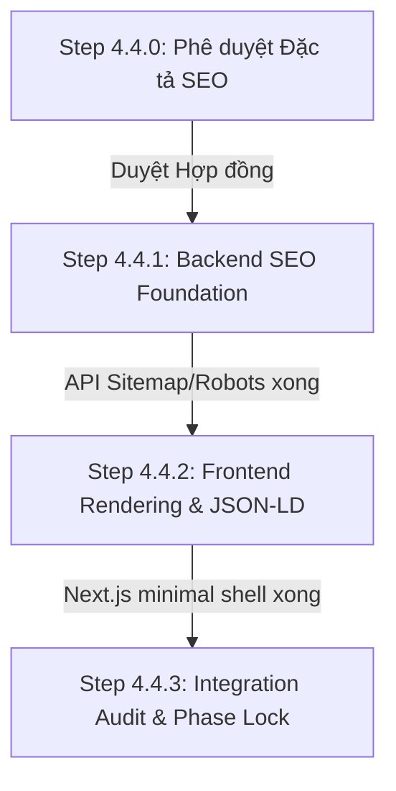

# ĐẶC TẢ SEO, HỢP ĐỒNG CANONICAL VÀ RENDERING OWNERSHIP
## PHASE 4.4 — STEP 4.4.0 (BẢN V0.4)

> **Tài liệu:** `04.04.00-seo-specification-canonical-rendering-contract.md`
> **Trạng thái tài liệu:** `APPROVED — STEP 4.4.0 LOCKED FOR IMPLEMENTATION`
> **Ngày cập nhật:** 2026-07-17
> **Phiên bản:** v0.4 (Đã sửa đổi theo phản hồi review nghiêm ngặt lần 3)
> **Tác giả:** AI Agent Antigravity (Google DeepMind)

---

## 1. DOCUMENT STATUS

Bản đặc tả v0.4 đã được người dùng phê duyệt chính thức ngày 2026-07-17. Step 4.4.0 được khóa làm implementation contract cho Step 4.4.1–4.4.3.

> [!IMPORTANT]
> Approval Checklist và Approval Record đã được đóng. Step 4.4.1 được phép bắt đầu theo đúng contract này.
> **TUYỆT ĐỐI KHÔNG** tự thay đổi contract đã duyệt, sửa module LOCKED khi chưa có controlled unlock, hoặc bắt đầu Step 4.4.2 trước khi Step 4.4.1 được người dùng review/phê duyệt.

---

## 2. EXECUTIVE SUMMARY

Tài liệu này xác lập các hợp đồng kỹ thuật (technical contracts) cho Phase 4.4 SEO của dự án "Cổng thông tin Du lịch Hoàng Su Phì". Phiên bản v0.4 hợp nhất các quyết định còn mâu thuẫn, bổ sung public SEO projection contract, chuẩn hóa policy robots/indexability, làm rõ mapping dữ liệu có thể kiểm chứng và bổ sung acceptance evidence cho cold-build lẫn warm-cache.

---

## 3. SCOPE

* Định nghĩa cấu hình môi trường, cơ chế validate `PUBLIC_SITE_URL` cùng các API/Internal URL.
* Quy tắc chuẩn hóa URL (normalisation) trên toàn hệ thống và trách nhiệm redirect 308.
* URL Manifest và tiêu chuẩn hợp lệ (eligibility rules) cho 10 route templates MVP: 8 route lấy dữ liệu động và 2 route shell/cấu hình (`/`, `/cam-nang`).
* Ma trận Indexability cho các trường hợp query parameter, pagination, và môi trường staging/production.
* Đặc tả API cho `/sitemap.xml` và `/robots.txt` trên backend Hono.
* Hợp đồng cấu trúc dữ liệu Metadata, OpenGraph, Twitter Card và JSON-LD.
* Quy tắc sinh Breadcrumb đồng nhất giữa UI hiển thị và Structured Data.
* Phân chia vai trò Backend/Frontend và định vị thư mục Next.js minimal shell.
* Chính sách cache ETag, xử lý lỗi (fail-closed) và an toàn bảo mật SEO.

---

## 4. NON-GOALS

* **Không** triển khai hệ thống Redirect Management động (để lại cho Phase 4.6).
* **Không** triển khai đa ngôn ngữ (`translations` table, locale routes hoặc thẻ `hreflang`). Dự án ở MVP chỉ hỗ trợ ngôn ngữ duy nhất là Tiếng Việt (`vi-VN`).
* **Không** tạo các bảng dữ liệu SEO CMS mới như `seo_metadata` hay `sitemap_entries`.
* **Không** tích hợp các công cụ bên thứ ba, hàng đợi (queue, cron job, BullMQ) hay Typesense cho tác vụ SEO.
* **Không** render XML sitemap phụ (Image/Video sitemap) do contract liên kết media ở Phase 4.3 chưa hỗ trợ trang chi tiết media riêng biệt.

---

## 5. SOURCES OF TRUTH

Tài liệu này kế thừa thông tin từ các nguồn bắt buộc sau:
1. `project-context.md` - Quy định về coding standards, module locking và single source of truth.
2. `project-roadmap.md` - Lộ trình thực hiện và điều kiện khóa phase.
3. `backend/docs/04.04.00-seo-readiness-report.md` - Báo cáo readiness audit lịch sử; phần roadmap/decision cũ đã được đánh dấu superseded bởi đặc tả này.
4. `PRD_IA_HoangSuPhi.md` - Cấu trúc cây sitemap, ví dụ URL và JSON-LD.
5. `02_database_design.md` - Thiết kế cơ sở dữ liệu V5.
6. Schema nguồn của Backend: `articles.ts`, `tags.ts`, `regions.ts`, `businesses.ts`, `attractions.ts`, `faqs.ts`, `media.ts`, `reviews.ts`.

---

## 6. CURRENT ARCHITECTURE AND CONSTRAINTS

* **Backend Hono REST API:** Chạy độc lập tại `/backend`. Toàn bộ logic nghiệp vụ cốt lõi (Phase 3) đã bị khóa (`LOCKED`), không được phép thay đổi.
* **Database Constraints (Thực tế Schema):**
  * Bảng `media_links` polymorphic **không tồn tại** (tuân thủ D23). Mối quan hệ media được lưu trực tiếp qua `media.owner_type` và `media.owner_id`.
  * Bảng `regions` **không có** cột `thumbnail_id`.
  * Bảng `businesses` **không có** cột `phoneNumber` (hoặc `phone`).
  * Bảng `tags` chỉ liên kết với `articles` thông qua bảng `article_tags`. Không có bảng trung gian `business_tags` hay `attraction_tags`.
  * Review status lưu dạng Enum viết hoa: `'PENDING'`, `'APPROVED'`, `'REJECTED'`.
  * FAQ & Top List status lưu dạng Enum viết hoa: `'DRAFT'`, `'PUBLISHED'`, `'ARCHIVED'`.

---

## 7. APPROVED DECISIONS

Các quyết định sau đã được phê duyệt và không cần rà soát lại:
1. **Projection-first:** Trích xuất dữ liệu SEO động trực tiếp từ dữ liệu thực tế của các thực thể nghiệp vụ, không migrate CSDL để tạo các bảng metadata trung gian.
2. **Minimal Next.js SEO shell:** Triển khai một nhánh frontend Next.js 15 tối thiểu trong Phase 4.4 để kiểm định SSR/SSG HTML metadata.
3. **10 route templates MVP** (8 route lấy dữ liệu động và 2 route shell/cấu hình).
4. **Không thay đổi module đã khóa:** Giữ nguyên toàn vẹn mã nguồn Phase 3 và Phase 4.1-4.3.

---

## 8. APPROVED IMPLEMENTATION DECISIONS

Các quyết định kỹ thuật sau đã được người dùng phê duyệt cùng toàn bộ Approval Checklist ngày 2026-07-17:

### AD-SEO-001: Biến môi trường và Origin Canonical
* **Đề xuất:** Định nghĩa `PUBLIC_SITE_URL` bằng Zod validation trong cả backend và frontend. Production/Staging bắt buộc khai báo tường minh, không có default; Development/Test được phép fallback `http://localhost:3000`.
* **Lý do:** Đảm bảo toàn bộ hệ thống đều hướng về một Origin duy nhất, tránh lỗi trùng lặp nội dung.

### AD-SEO-002: Thư mục chứa Frontend Next.js Minimal Shell
* **Đề xuất:** Đặt thư mục frontend minimal shell tại `/frontend` ở root workspace (cùng cấp với `/backend`).
* **Lý do:** Giữ cấu trúc repository phẳng và ít gây xáo trộn nhất cho monorepo ở thời điểm hiện tại.

### AD-SEO-003: Cơ chế Cache và ETag cho Sitemap và Robots
* **Đề xuất:** Sitemap.xml và Robots.txt dùng duy nhất local in-process memory cache trong Backend Hono, TTL 1 giờ cho Sitemap và 24 giờ cho Robots. ETag là hash của response body chính xác và trả 304 khi `If-None-Match` khớp. Redis nằm ngoài phạm vi Phase 4.4.
* **Lý do:** Tiết kiệm tài nguyên CPU/Database cho backend Hono.

### AD-SEO-004: Chính sách Xử lý lỗi (Fail-Closed) cho SEO
* **Đề xuất:** Khi database gặp lỗi runtime, Sitemap API trả về lỗi `503 Service Unavailable` dạng RFC 7807 JSON. Khi thiếu cấu hình `PUBLIC_SITE_URL` ở môi trường Staging/Production khi startup, ứng dụng phải crash ngay lập tức (Fail-Fast).
* **Lý do:** Tránh việc Google Bot index các URL lỗi hoặc URL cục bộ.

---

## 9. CANONICAL ORIGIN CONTRACT

* **Production Canonical Origin:** `https://hoangsuphi.vn`.
* **Canonical Host:** Chỉ sử dụng duy nhất Apex Domain (`hoangsuphi.vn`), không sử dụng tiền tố `www`.
* **HTTP/HTTPS Policy:** Bắt buộc sử dụng giao thức bảo mật `https://` cho tất cả các môi trường Staging và Production. Môi trường Development/Test cục bộ được phép dùng `http://`.
* **Cấm Host header động:** Tuyệt đối không sử dụng giá trị từ `Host` header hoặc `X-Forwarded-Host` để dựng URL Canonical. Origin phải được lấy duy nhất từ biến môi trường `PUBLIC_SITE_URL`.

---

## 10. `PUBLIC_SITE_URL` CONTRACT

* **Tên biến môi trường:** `PUBLIC_SITE_URL`
* **Kiểu dữ liệu:** Chuỗi định dạng URL tuyệt đối (`z.string().url()`).
* **Quy tắc cấu hình:**
  * **Cấm đặt default value cho Production và Staging.** Biến này bắt buộc phải được khai báo trên môi trường thật.
  * Phải bắt đầu bằng `http://` hoặc `https://`.
  * Không chứa dấu gạch chéo ở cuối (`/`).
  * Không chứa path, query, fragment hoặc credentials.
* **Startup Validation (Fail-Fast):**
  * Trên môi trường `staging` và `production`, nếu biến `PUBLIC_SITE_URL` không được khai báo hoặc không hợp lệ, ứng dụng backend Hono và frontend Next.js **phải dừng hoạt động ngay lập tức (Fail-Fast)** với thông báo lỗi cụ thể ở log.
  * Môi trường `development` và `test` được phép tự động fallback về `http://localhost:3000` (Cổng chạy ứng dụng frontend) cho cả backend sitemap builder và frontend metadata.
* **Sự khác biệt với các biến Origin khác:**
  * `PUBLIC_SITE_URL`: Địa chỉ tên miền công khai của website frontend (ví dụ: `https://hoangsuphi.vn`). Đây là gốc của mọi link Canonical và Sitemap.
  * `CORS_ORIGINS`: Danh sách các domain được phép gọi API.
  * `INTERNAL_BACKEND_URL`: Địa chỉ nội bộ của backend API (ví dụ `http://localhost:3001` hoặc URL trong Docker bridge) để Next.js dùng cho rewrite và SSR fetch.
* **Môi trường Staging:**
  * Ở môi trường `staging`, `PUBLIC_SITE_URL` sẽ được cấu hình trỏ về tên miền staging của dự án (ví dụ `https://staging.hoangsuphi.vn`).
  * Canonical trên staging self-reference về staging origin để phục vụ kiểm thử HTML; không được phát sinh Production URL giả trên staging.
  * Nếu staging được public deploy, bắt buộc bảo vệ bằng access control ở edge/reverse proxy (Basic Auth, allowlist hoặc private network). Nếu Phase 4.4 chưa có staging deployment, phải có automated environment-policy test và runbook cấu hình cho Phase 10. `robots.txt: Disallow: /` và `noindex,nofollow` chỉ là defense-in-depth.

---

## 11. URL NORMALIZATION & REDIRECT RULES

Toàn bộ URL do Backend sinh ra (Sitemap) và Frontend render (Canonical) phải tuân thủ nghiêm ngặt các quy tắc chuẩn hóa sau:

1. **Không gạch chéo cuối (No Trailing Slash):** Toàn bộ URL của website, ngoại trừ trang chủ `/`, **không được phép** chứa dấu gạch chéo `/` ở cuối.
2. **Chữ thường (Lowercase):** Toàn bộ các ký tự trong đường dẫn (path) của URL phải là chữ thường.
3. **Chuẩn hóa Unicode & Ký tự đặc biệt:** Slug của các thực thể phải được chuyển đổi thành chuỗi ASCII lowercase, không dấu, các từ cách nhau bằng dấu gạch ngang `-`.
4. **Không chứa Query Parameters trong Sitemap:** Tất cả các URL được xuất bản trong `sitemap.xml` phải là URL sạch, không chứa tham số truy vấn.
5. **Trách nhiệm Chuyển hướng (Permanent Redirect 308):**
   * **Trailing slash:** Frontend Next.js (thông qua `next.config.ts` hoặc middleware) chịu trách nhiệm redirect 308 từ `/path/` về `/path`.
   * **Uppercase path:** Frontend Next.js chịu trách nhiệm redirect 308 từ `/PATH` về `/path`.
   * **HTTP sang HTTPS:** Cloudflare edge là owner duy nhất trên Production và trả permanent redirect 308 từ HTTP sang HTTPS trước khi request đến Next.js.
   * **www sang non-www:** Cloudflare edge là owner duy nhất trên Production và trả permanent redirect 308 từ `www.hoangsuphi.vn` về `hoangsuphi.vn`, giữ nguyên path/query.
   * **Không render metadata trên redirect:** Bốn loại response redirect ở trên không render HTML, canonical hoặc robots meta. Next.js chỉ render metadata sau khi request đã ở URL chuẩn.

---

## 12. CANONICAL URL MANIFEST

Dưới đây là đặc tả chi tiết đường dẫn Canonical cho 10 route templates MVP:

### 12.1. Homepage
* **Canonical Path Pattern:** `/`
* **Data Source:** Không có (Trang tĩnh)
* **Slug/Source Identifier:** Không có
* **Public Eligibility:** Luôn hiển thị.
* **Indexability:** `index,follow`
* **Sitemap Inclusion:** Có (Bắt buộc)
* **`lastmod` Source:** **Không sử dụng** (Loại bỏ khỏi sitemap theo khuyến nghị của Google đối với các trang tĩnh/trang chủ không thể xác định ngày thay đổi nội dung chắc chắn).
* **Metadata Source:** Cấu hình tĩnh được version-control trên Frontend; Phase 4.4 không có system-settings source.
* **Image Source:** Branded fallback image của website (`/images/og-homepage.jpg`).
* **JSON-LD Type:** `WebSite`, `Organization`.
* **Breadcrumb Pattern:** Không hiển thị breadcrumb trên trang chủ.
* **Query Parameter Behavior:** Cắt bỏ hoàn toàn query parameter để trỏ Canonical về `/`.
* **Empty/Not-found Behavior:** Không xảy ra lỗi trống nội dung.

### 12.2. Article List (Trang danh sách cẩm nang)
* **Canonical Path Pattern:** `/cam-nang`
* **Data Source:** Không có (Trang tĩnh chứa danh sách)
* **Slug/Source Identifier:** Không có
* **Public Eligibility:** Luôn hiển thị.
* **Indexability:** `index,follow`
* **Sitemap Inclusion:** Có
* **`lastmod` Source:** **Không sử dụng** (Loại bỏ khỏi sitemap theo Google guidelines).
* **Metadata Source:** Cấu hình tĩnh (Tiêu đề: "Cẩm nang du lịch Hoàng Su Phì").
* **Image Source:** Branded fallback image (`/images/og-blog.jpg`).
* **JSON-LD Type:** `CollectionPage` / `Blog`.
* **Breadcrumb Pattern:** `Trang chủ` (/) → `Cẩm nang` (/cam-nang)
* **Query Parameter Behavior:** Cắt bỏ mọi query parameter.
* **Empty/Not-found Behavior:** Nếu không có bài viết nào, vẫn render trang trống kèm theo thẻ `index,follow`.

### 12.3. Article Detail (Chi tiết bài viết)
* **Canonical Path Pattern:** `/cam-nang/:slug`
* **Data Source:** Bảng `articles`
* **Slug/Source Identifier:** `articles.slug`
* **Public Eligibility:** `status = 'published'` AND `deleted_at IS NULL` AND `published_at <= NOW()`.
* **Indexability:** `index,follow`
* **Sitemap Inclusion:** Có
* **`lastmod` Source:** `articles.updated_at` (Sử dụng timestamp ISO 8601 UTC).
* **Metadata Source:** `articles.title`, `articles.excerpt`
* **Image Source:** Truy vấn từ bảng `media` where `media.id = articles.thumbnail_id AND media.status = 'READY' AND media.deleted_at IS NULL`. Lấy variant ưu tiên (`large` → `medium` → `original`) trong `media_variants`, sau đó resolve URL qua `MediaStorageResolver` và port `IMediaStorage` theo `media.storage_provider`; SEO module không được import adapter Cloudinary/Local cụ thể. Nếu không tìm thấy ảnh hợp lệ, dùng branded fallback `/images/og-article-default.jpg` và resolve thành URL tuyệt đối bằng `PUBLIC_SITE_URL`.
* **JSON-LD Type:** `BlogPosting`
* **Breadcrumb Pattern:** `Trang chủ` (/) → `Cẩm nang` (/cam-nang) → `:article_title` (/cam-nang/:slug)
* **Query Parameter Behavior:** Bỏ qua toàn bộ query parameter.
* **Empty/Not-found Behavior:** Trả về lỗi HTTP 404 Not Found (Fail-closed). Giao diện trang lỗi 404 mặc định render tag `<meta name="robots" content="noindex,follow" />`.

### 12.4. Region Detail (Chi tiết vùng/xã)
* **Canonical Path Pattern:** `/khu-vuc/:slug`
* **Data Source:** Bảng `regions`
* **Slug/Source Identifier:** `regions.slug`
* **Page-render Eligibility:** `regions.deleted_at IS NULL` AND `regions.level IN (1, 2, 3, 4, 5)`.
* **Indexability:**
  * Cấp Tỉnh/Huyện/Xã (level 1, 2, 3): `index,follow`
  * Cấp Bản/Điểm (level 4, 5): `noindex,follow` (để tránh loãng index).
* **Sitemap Inclusion:** Có (Chỉ bao gồm level 1, 2, 3).
* **`lastmod` Source:** `regions.updated_at`
* **Metadata Source:** `regions.name`, `regions.description`
* **Image Source:** Do bảng `regions` không có cột thumbnail và không liên kết trực tiếp bảng media trong schema, hình ảnh đại diện của Region luôn sử dụng branded static fallback `/images/og-region-default.jpg` trên frontend.
* **JSON-LD Type:** `AdministrativeArea`
* **Breadcrumb Pattern:** Phụ thuộc vào `regions.path` (ltree):
  * Cấp tỉnh (Hà Giang): `Trang chủ` (/) → `Hà Giang` (/khu-vuc/ha-giang)
  * Cấp huyện (Hoàng Su Phì): `Trang chủ` (/) → `Hà Giang` (/khu-vuc/ha-giang) → `Hoàng Su Phì` (/khu-vuc/hoang-su-phi)
  * Cấp xã (Bản Phùng): `Trang chủ` (/) → `Hà Giang` (/khu-vuc/ha-giang) → `Hoàng Su Phì` (/khu-vuc/hoang-su-phi) → `Bản Phùng` (/khu-vuc/ban-phung)
* **Query Parameter Behavior:** Loại bỏ toàn bộ parameter.
* **Empty/Not-found Behavior:** Trả về HTTP 404 Not Found (không render canonical).

### 12.5. Tourist Place Detail (Chi tiết điểm du lịch chính)
* **Canonical Path Pattern:** `/dia-diem/:slug`
* **Data Source:** Bảng `tourist_places`
* **Slug/Source Identifier:** `tourist_places.slug`
* **Public Eligibility:** `tourist_places.status = 'active'` AND `tourist_places.deleted_at IS NULL` AND vùng cha `regions.deleted_at IS NULL` (Vùng cha liên kết qua `region_id` phải tồn tại và không bị soft-deleted).
* **Indexability:** `index,follow`
* **Sitemap Inclusion:** Có
* **`lastmod` Source:** `tourist_places.updated_at`
* **Metadata Source:** `tourist_places.name`, `tourist_places.description`
* **Image Source:** Ưu tiên `tourist_places.coverUrl` khi đạt HTTPS/extension allowlist tại mục 18. Nếu không hợp lệ/trống, truy vấn `media` theo owner `PLACE`, chọn variant `large` → `medium` → `original` và resolve qua `MediaStorageResolver`/`IMediaStorage`. Nếu vẫn trống, dùng fallback tuyệt đối từ `${PUBLIC_SITE_URL}/images/og-place-default.jpg`.
* **JSON-LD Type:** `TouristAttraction`
* **Breadcrumb Pattern:** `Trang chủ` (/) → Vùng cha (ví dụ `/khu-vuc/ban-phung`) → Tên địa điểm (`/dia-diem/:slug`)
* **Query Parameter Behavior:** Loại bỏ toàn bộ parameter.
* **Empty/Not-found Behavior:** Trả về HTTP 404 Not Found.

### 12.6. Business Detail (Chi tiết Homestay, nhà hàng)
* **Canonical Path Pattern:** `/co-so/:slug`
* **Data Source:** Bảng `businesses`
* **Slug/Source Identifier:** `businesses.slug`
* **Public Eligibility:**
  * `businesses.status = 'active'` AND `businesses.deleted_at IS NULL`.
  * Phụ thuộc: `business_types.is_active = true` AND vùng cha `regions.deleted_at IS NULL`.
* **Indexability:** `index,follow`
* **Sitemap Inclusion:** Có
* **`lastmod` Source:** `businesses.updated_at`
* **Metadata Source:** `businesses.name`, `businesses.description`
* **Image Source:** Ưu tiên `businesses.coverUrl` khi đạt HTTPS/extension allowlist tại mục 18. Nếu không hợp lệ/trống, truy vấn `media` theo owner `BUSINESS`, chọn variant ưu tiên và resolve qua `MediaStorageResolver`/`IMediaStorage`. Nếu vẫn trống, dùng fallback tuyệt đối từ `${PUBLIC_SITE_URL}/images/og-business-default.jpg`.
* **JSON-LD Type:** `LocalBusiness` (Hoặc subtype cụ thể như `BedAndBreakfast`, `LodgingBusiness`, `Restaurant`).
* **Breadcrumb Pattern:** `Trang chủ` (/) → Vùng của cơ sở (`/khu-vuc/:region_slug`) → Tên cơ sở (`/co-so/:slug`)
* **Query Parameter Behavior:** Loại bỏ toàn bộ parameter.
* **Empty/Not-found Behavior:** Trả về HTTP 404 Not Found.

### 12.7. Attraction Detail (Chi tiết trạm xăng, cột ATM, điểm tham quan phụ)
* **Canonical Path Pattern:** `/tien-ich/:slug` (Một route tiếng Việt ổn định cho toàn bộ attractions, không phụ thuộc `is_utility`; không tạo alias `/attraction/:slug` trong MVP).
* **Data Source:** Bảng `attractions`
* **Slug/Source Identifier:** `attractions.slug`
* **Public Eligibility:**
  * `attractions.status = 'active'` AND `attractions.deleted_at IS NULL`.
  * Phụ thuộc: vùng cha `regions.deleted_at IS NULL`.
* **Indexability:** `index,follow`
* **Sitemap Inclusion:** Có
* **`lastmod` Source:** `attractions.updated_at`
* **Metadata Source:** `attractions.name`, `attractions.description`
* **Image Source:** Ưu tiên `attractions.coverUrl` khi đạt HTTPS/extension allowlist tại mục 18. Nếu không hợp lệ/trống, truy vấn `media` theo owner `ATTRACTION`, chọn variant ưu tiên và resolve qua `MediaStorageResolver`/`IMediaStorage`. Nếu vẫn trống, dùng fallback tuyệt đối từ `${PUBLIC_SITE_URL}/images/og-attraction-default.jpg`.
* **JSON-LD Type:** `is_utility = false` → `TouristAttraction`; `is_utility = true` → `Place`. Thay đổi type không làm thay đổi canonical path.
* **Breadcrumb Pattern:** `Trang chủ` (/) → Vùng chứa (`/khu-vuc/:region-slug`) → Tên tiện ích (`/tien-ich/:slug`)
* **Query Parameter Behavior:** Loại bỏ toàn bộ parameter.
* **Empty/Not-found Behavior:** Trả về HTTP 404 Not Found.

### 12.8. Tag Archive (Trang tổng hợp theo thẻ Tag)
* **Canonical Path Pattern:** `/tag/:slug`
* **Data Source:** Bảng `tags`
* **Slug/Source Identifier:** `tags.slug`
* **Public Eligibility:** Do tags trong schema chỉ liên kết với bài viết qua bảng `article_tags`, Tag Archive chỉ hợp lệ khi: Có ít nhất 1 bài viết ở trạng thái public liên kết với tag này (`article_tags.articleId` có `status = 'published'`, `deleted_at IS NULL`, `published_at <= NOW()`). Nếu tag rỗng, trả về HTTP 404 (Fail-closed).
* **Indexability:** `index,follow`
* **Sitemap Inclusion:** Có
* **`lastmod` Source:** **Không sử dụng.** `article_tags` không có timestamp quan hệ và thao tác thêm/gỡ tag không bảo đảm cập nhật `articles.updated_at`; không được phát hành timestamp suy đoán.
* **Metadata Source:** `tags.name`, `tags.description`
* **Image Source:** Branded fallback image (`/images/og-tag.jpg`).
* **JSON-LD Type:** `CollectionPage`
* **Breadcrumb Pattern:** `Trang chủ` (/) → Thẻ tag (`/tag/:slug`)
* **Query Parameter Behavior:** Loại bỏ toàn bộ parameter.
* **Empty/Not-found Behavior:** Nếu tag không tồn tại hoặc không còn bài viết public liên kết, trả về HTTP 404 Not Found. Không kiểm tra `tags.deleted_at` vì schema hiện tại không có cột này.

### 12.9. Top List Detail (Trang bảng xếp hạng)
* **Canonical Path Pattern:** `/top/:slug`
* **Data Source:** Bảng `top_lists`
* **Slug/Source Identifier:** `top_lists.slug`
* **Public Eligibility:** `status = 'PUBLISHED'` AND `deleted_at IS NULL` AND **phải chứa ít nhất một item công khai** (liên kết qua `top_list_items`, nơi thực thể đích là Place/Business/Attraction đang ở trạng thái active/published và không bị soft-deleted).
* **Indexability:** `index,follow`
* **Sitemap Inclusion:** Có
* **`lastmod` Source:** Mốc lớn nhất (`MAX`) giữa `top_lists.updated_at`, `top_list_items.updated_at` và `updated_at` của các owner entity public thực sự được render.
* **Metadata Source:** `top_lists.title`, `top_lists.description`.
* **Image Source:** Lấy ảnh đại diện (coverUrl hoặc media) của thực thể đích đầu tiên trong danh sách (thực thể này phải active/published và không bị soft-deleted). Nếu không có, dùng branded fallback `/images/og-top-default.jpg`.
* **JSON-LD Type:** `ItemList`
* **Breadcrumb Pattern:** `Trang chủ` (/) → Bảng xếp hạng (`/top/:slug`)
* **Query Parameter Behavior:** Loại bỏ toàn bộ parameter.
* **Empty/Not-found Behavior:** Trả về HTTP 404 Not Found nếu danh sách rỗng hoặc bị gỡ bỏ.

### 12.10. FAQ Hub (Trang hỏi đáp)
* **Canonical Path Pattern:** `/hoi-dap`
* **Data Source:** Bảng `faqs`
* **Slug/Source Identifier:** Không có
* **Public Eligibility:** Phải có ít nhất 1 câu hỏi ở trạng thái `PUBLISHED` và `deleted_at IS NULL`.
* **Indexability:** `index,follow`
* **Sitemap Inclusion:** Có
* **`lastmod` Source:** **Không sử dụng.** FAQ Hub lấy dữ liệu từ DB nhưng không có một aggregate timestamp đủ tin cậy cho toàn trang trong MVP.
* **Metadata Source:** Cấu hình tĩnh (Tiêu đề: "Hỏi đáp du lịch Hoàng Su Phì").
* **Image Source:** Branded fallback image (`/images/og-faq.jpg`).
* **JSON-LD Type:** `FAQPage`.
* **Breadcrumb Pattern:** `Trang chủ` (/) → Hỏi đáp (`/hoi-dap`)
* **Query Parameter Behavior:** Loại bỏ toàn bộ parameter.
* **Empty/Not-found Behavior:** Nếu không có FAQ nào public, trả về HTTP 404 Not Found.

---

## 13. INDEXABILITY MATRIX

| Loại URL / Trường hợp | Index Policy (`robots` Meta) | Canonical Target | Sitemap Inclusion |
| :--- | :--- | :--- | :--- |
| **Canonical route instance đủ điều kiện index** | `index,follow` | Self-reference (Chính nó) | Có |
| **URL chứa Pagination** (Ví dụ `/cam-nang?page=2`) | `noindex,follow` | Self-reference chuẩn hóa (Ví dụ `/cam-nang?page=2`) | Không |
| **URL chứa Sort** (Ví dụ `/cam-nang?sort=views`) | `noindex,follow` | Self-reference chuẩn hóa (Ví dụ `/cam-nang?sort=views`) | Không |
| **URL chứa Filter** (Ví dụ `/cam-nang?category=guides`) | `noindex,follow` | Self-reference chuẩn hóa (Ví dụ `/cam-nang?category=guides`) | Không |
| **Search query page** (`/search?q=...`) | `noindex,follow` | **Không render thẻ canonical** | Không |
| **Nearby result page** (`/nearby?lat=...&lng=...`) | `noindex,follow` | **Không render thẻ canonical** | Không |
| **Tracking parameters** (Ví dụ `?utm_source=fb`) | `index,follow` | URL gốc đã loại bỏ UTM parameter | Không |
| **Preview/draft content** (Admin xem thử) | `noindex,nofollow` | Không sinh thẻ canonical | Không |
| **Môi trường Staging/Test** (Toàn trang) | `noindex,nofollow`; staging public còn phải có access control | Self-reference trên staging URL | Không |
| **Empty Tag Archive** (Không có bài viết) | Trả về 404 | Không sinh thẻ canonical | Không |
| **Duplicate Slug/Case variation** (Ví dụ `/CAM-NANG`) | HTTP 308; không render HTML/meta | Redirect đến URL lowercase (`/cam-nang`) | Không |
| **Trailing slash variation** (Ví dụ `/cam-nang/`) | HTTP 308; không render HTML/meta | Redirect đến URL không slash (`/cam-nang`) | Không |

---

## 14. QUERY PARAMETER POLICY

* **Self-Referencing cho Pagination, Sort, Filter:**
  * Các trang phân trang (như `/cam-nang?page=2`) hoặc lọc (như `/cam-nang?category=guides`) sẽ được cấu hình thẻ canonical trỏ về chính nó: `https://hoangsuphi.vn/cam-nang?page=2` (chuẩn hóa tham số page/filter).
  * Gán thẻ `noindex,follow` để tránh gây loãng chỉ mục của Google.
* **Search và Nearby:**
  * Gán thẻ `noindex,follow` trên các trang kết quả tìm kiếm và lân cận.
  * **Tuyệt đối không render thẻ canonical** trên các trang này để ngăn chặn semantic mismatch.
* **UTM & Gclid Parameters:** Các tham số theo dõi như `utm_source`, `utm_medium`, `utm_campaign`, `gclid`, `fbclid` được phép chạy trên trình duyệt, nhưng frontend Next.js khi sinh thẻ `<link rel="canonical">` bắt buộc phải lọc bỏ hoàn toàn các tham số này.

---

## 15. SITEMAP CONTRACT

### 15.1. Backend Endpoint
* **Path:** `GET /sitemap.xml` (API trả về XML).
* **Content-Type:** `application/xml; charset=utf-8`.
* **Cấu trúc XML chuẩn:**
  ```xml
  <?xml version="1.0" encoding="UTF-8"?>
  <urlset xmlns="http://www.sitemaps.org/schemas/sitemap/0.9">
    <url>
      <loc>https://hoangsuphi.vn/</loc>
    </url>
    <url>
      <loc>https://hoangsuphi.vn/cam-nang/kinh-nghiem-phuot</loc>
      <lastmod>2026-07-17T10:40:00Z</lastmod>
    </url>
  </urlset>
  ```

### 15.2. Nguyên tắc dữ liệu Sitemap
* **Quy tắc Eligibility nghiêm ngặt (Cascading Status Checks):**
  * Article: `status = 'published'` AND `deleted_at IS NULL` AND `published_at <= NOW()`.
  * Region: `deleted_at IS NULL` AND `level IN (1, 2, 3)`.
  * Tourist Place: `status = 'active'` AND `deleted_at IS NULL` AND vùng cha `regions.deleted_at IS NULL`.
  * Business: `status = 'active'` AND `deleted_at IS NULL` AND vùng cha `regions.deleted_at IS NULL` AND `business_types.is_active = true` (Đồng nhất trường `is_active` của business_types).
  * Attraction: `status = 'active'` AND `deleted_at IS NULL` AND vùng cha `regions.deleted_at IS NULL`.
  * Tag: Có ít nhất một Article public thỏa mãn điều kiện gắn tag.
  * Top List: `status = 'PUBLISHED'` AND `deleted_at IS NULL` AND phải chứa ít nhất một item công khai.
  * FAQ Hub: Có ít nhất một FAQ `status = 'PUBLISHED'` AND `deleted_at IS NULL`.
* **lastmod thật và có điều kiện:**
  * Xuất `<lastmod>` cho Article, Region, Tourist Place, Business và Attraction từ `updated_at` của entity.
  * Top List dùng `MAX(top_lists.updated_at, top_list_items.updated_at, public_owner.updated_at)` của dữ liệu thực sự render.
  * **Không xuất lastmod** cho `/`, `/cam-nang`, `/hoi-dap` và Tag Archive; không dùng thời gian request hoặc timestamp suy đoán.
* **Không fake priority/changefreq:** Sitemap MVP loại bỏ hoàn toàn các thẻ này.
* **XML Escaping:** Ký tự đặc biệt trong URL phải được escape chuẩn.

---

## 16. ROBOTS CONTRACT

### 16.1. Backend Endpoint
* **Path:** `GET /robots.txt`.
* **Content-Type:** `text/plain; charset=utf-8`.
* **Tính độc lập:** Robots.txt **không phụ thuộc** vào database. Nếu CSDL bị lỗi, endpoint `/robots.txt` vẫn phản hồi bình thường (HTTP 200) với nội dung text/plain chuẩn.

### 16.2. Cấu hình theo môi trường (Environment-aware)
* **Môi trường Production:**
  ```text
  User-agent: *
  Allow: /
  Disallow: /api/
  Disallow: /admin/
  Disallow: /auth/
  Disallow: /private/

  Sitemap: https://hoangsuphi.vn/sitemap.xml
  ```
* **Môi trường Staging / Test / Development:**
  ```text
  User-agent: *
  Disallow: /
  ```
  Staging phải có access control tại edge/reverse proxy. `Disallow: /` không được xem là cơ chế bảo mật hoặc bảo đảm de-index tuyệt đối. Search/Nearby trên Production **không bị Disallow**, để crawler có thể đọc `noindex,follow`; chúng vẫn bị loại khỏi sitemap.

---

## 17. METADATA CONTRACT

Frontend Next.js chịu trách nhiệm render HTML trang chi tiết:

* **Title Template:**
  * Trang chi tiết: `:entity_title | Cổng thông tin du lịch Hoàng Su Phì`
  * Trang danh sách/Trang chủ: `:custom_title | Du lịch Hoàng Su Phì`
  * Độ dài khuyến nghị: 50 - 60 ký tự.
* **Description Source:**
  * Lấy từ phần mô tả ngắn hoặc tóm tắt bài viết (`excerpt`, `description`).
  * Fallback mặc định: *"Khám phá vẻ đẹp kỳ vĩ của ruộng bậc thang, nét văn hóa độc đáo của các dân tộc Dao, Mông, Tày tại Hoàng Su Phì, Hà Giang."*
  * Độ dài khuyến nghị: 120 - 150 ký tự.
* **Cấm chế tác dữ liệu (No Fabrication):** Không tự ý ghép nối hoặc bịa ra các thông tin không có thực.
* **Xử lý dữ liệu nhạy cảm:** Không hiển thị trạng thái kiểm duyệt nội bộ (`status`, `version`), thông tin liên hệ nội bộ hoặc khóa lưu trữ ảnh ra ngoài thẻ mô tả.

---

## 18. OPENGRAPH VÀ TWITTER CONTRACT

* **Các thẻ bắt buộc trong HTML `<head>`:**
  * `og:title`, `og:description`, `og:url` (URL Canonical tuyệt đối), `og:type` (`website` hoặc `article`), `og:image`, `og:locale` (`vi_VN`).
  * `twitter:card` (`summary_large_image`), `twitter:title`, `twitter:description`, `twitter:image`.
* **Quy tắc trích xuất Ảnh chia sẻ (OG Image):**
  * Lấy từ `coverUrl` hoặc query từ bảng `media` where `media.status = 'READY' AND media.deleted_at IS NULL`.
  * **Cấm lộ mã lưu trữ nội bộ:** Không render giá trị `storageKey` hoặc Cloudinary public ID trực tiếp lên HTML. URL ảnh phải là URL HTTPS đầy đủ.
  * `coverUrl` chỉ được dùng khi là HTTPS và pathname có phần mở rộng allowlist `.jpg`, `.jpeg`, `.png`, `.webp` hoặc `.avif`; không bắt buộc WebP. URL HTTP, không hợp lệ hoặc ngoài allowlist phải bị bỏ qua để chuyển sang media/fallback.
  * Media URL phải được Backend resolve theo `media.storage_provider` qua `MediaStorageResolver`/`IMediaStorage`; Frontend không biết `storageKey` hay adapter cụ thể.
  * **Branded Fallback:** Nếu thực thể không có ảnh hợp lệ, dùng URL tuyệt đối `${PUBLIC_SITE_URL}/images/default-share.jpg` (lưu trữ tĩnh trên frontend).

---

## 19. JSON-LD MAPPING

Dữ liệu cấu trúc Schema.org JSON-LD được nhúng dưới dạng thẻ `<script type="application/ld+json">`.

**Hợp đồng chung:** Mọi root JSON-LD object bắt buộc có `"@context": "https://schema.org"`. Dữ liệu JSON-LD phải được lấy từ cùng SEO projection dùng để render nội dung nhìn thấy; không được bịa thêm địa chỉ, tác giả, rating hoặc hình ảnh không hiện hữu.

### 19.1. Định nghĩa thuộc tính cho từng Schema

#### A. Homepage (`WebSite` & `Organization`)
* **Bắt buộc (Required):** `@context`, `@type`, `url`, `name`, `logo`.
* **Tùy chọn (Optional):** `description`, `sameAs`.
* **Quy định:** Bỏ `sameAs` nếu không có cấu hình. **Loại bỏ hoàn toàn** `potentialAction` (Sitelinks Searchbox) do Google đã ngừng hỗ trợ.

#### B. Article (`BlogPosting`)
* **Bắt buộc (Required):** `@context`, `@type`, `headline`, `image`, `datePublished`, `dateModified`, `author`.
* **Tùy chọn (Optional):** `description` (excerpt), `publisher`.
* **Author Mapping:** Nếu tồn tại `userProfiles` có họ/tên public không rỗng, dùng `Person` và ghép `lastName + firstName`. Nếu không có profile public, dùng `Organization` với tên `Cổng thông tin du lịch Hoàng Su Phì` **chỉ khi cùng tên này được render làm byline nhìn thấy trên trang**. Không dùng email, username hoặc placeholder giả.

#### C. Business (`LocalBusiness` / Subtypes)
* **Subtype Mapping:** `homestay → BedAndBreakfast`; `bungalow|guesthouse → LodgingBusiness`; `resort → Resort`; `restaurant → Restaurant`; `cafe → CafeOrCoffeeShop`; `camping_site → Campground`; `guide_service|ev_charging|unknown → LocalBusiness`. Không cho phép type lấy trực tiếp từ input client.
* **Bắt buộc (Required):** `@context`, `@type`, `@id`, `url`, `name`, `address`.
* **Tùy chọn (Optional):** `description`, `geo`, `priceRange` (nếu `priceMin` và `priceMax` không null), `aggregateRating`.
* **Quy định mapping đặc biệt:**
  * **Địa chỉ (address):** Luôn là object `PostalAddress`. Resolve Region hiện tại và chuỗi tổ tiên từ `regions.path`; dùng vùng cụ thể nhất làm `addressLocality`, tỉnh thực tế trong hierarchy làm `addressRegion` khi tìm thấy, và `addressCountry: "VN"`. Omit `addressRegion`, `streetAddress` hoặc `postalCode` khi không có dữ liệu; không nối cứng chuỗi có thể trùng hoặc sai cấp hành chính. Cùng địa chỉ này phải hiển thị trên trang.
  * **Điện thoại (telephone):** Loại bỏ hoàn toàn trường này khỏi JSON-LD do schema database không hỗ trợ cột số điện thoại.
  * **Geo:** Omit geo nếu tọa độ vĩ độ/kinh độ của doanh nghiệp bị `NULL`.
  * **aggregateRating:** Chỉ tổng hợp review thỏa `owner_type = 'BUSINESS'`, `owner_id = businesses.id`, `status = 'APPROVED'`, `deleted_at IS NULL`; omit nếu `reviewCount = 0`. Rating/count phải được render nhìn thấy trên cùng trang.

#### D. Place / Tourist Place (`TouristAttraction` hoặc `Place`)
* **Bắt buộc (Required):** `@context`, `@type`, `name`.
* **Tùy chọn (Optional):** `description`, `image`, `geo`.
* **Quy định:** Omit `geo` nếu tọa độ `NULL`.

#### E. Region (`AdministrativeArea`)
* **Bắt buộc (Required):** `@context`, `@type`, `name`.
* **Tùy chọn (Optional):** `geo` (Omit geo nếu tọa độ vĩ độ/kinh độ của Region bị `NULL`), `description`.

#### F. FAQ Hub (`FAQPage`)
* **Bắt buộc (Required):** `@context`, `@type`, `mainEntity` (Question và Answer public từ CSDL, đồng thời hiển thị trên HTML).
* **Cam kết Rich Result:** **Không cam kết** FAQ rich result; Google hiện giới hạn mạnh tính năng này, chủ yếu cho website chính phủ/y tế có thẩm quyền. Giữ FAQPage khi nội dung hỏi–đáp thực sự hiển thị để phục vụ cấu trúc ngữ nghĩa.

#### G. Navigation (`BreadcrumbList`)
* **Bắt buộc (Required):** `@context`, `@type`, `itemListElement` (`ListItem` với `position` từ 1, `name`, `item` trỏ về link canonical tuyệt đối).

#### H. Tag Archive (`CollectionPage`)
* **Bắt buộc (Required):** `@context`, `@type`, `name`, `url`.
* **Tùy chọn (Optional):** `description`.

#### I. Top List (`ItemList`)
* **Bắt buộc (Required):** `@context`, `@type`, `name`, `itemListElement` (Danh sách `ListItem` chỉ chứa owner entity public và đang hiển thị).

---

## 20. BREADCRUMB CONTRACT

* **Tính đồng nhất tuyệt đối:** Breadcrumb hiển thị trên UI và Breadcrumb trong JSON-LD `BreadcrumbList` phải khớp nhau hoàn toàn về số lượng phần tử, tiêu đề hiển thị và liên kết URL.
* **Định dạng URL:** Toàn bộ link phải là URL tuyệt đối từ `PUBLIC_SITE_URL`; bắt buộc HTTPS trên Staging/Production, HTTP chỉ được phép ở Development/Test.
* **Cấm liên kết gãy:** Không tạo breadcrumb item trỏ về trang 404.
* **Không phụ thuộc Query State:** Breadcrumb được dựng thuần túy dựa trên vị trí thực thể trong cây phân cấp địa giới (ltree path), không thay đổi theo từ khóa tìm kiếm hay bộ lọc.

---

## 21. BACKEND/FRONTEND OWNERSHIP MATRIX

| Nhiệm vụ kỹ thuật | Backend Hono | Frontend Next.js |
| :--- | :---: | :---: |
| Đọc và validate biến môi trường `PUBLIC_SITE_URL` | **Có** (để dựng sitemap) | **Có** (để dựng canonical) |
| Cung cấp API Projection dữ liệu SEO chỉ đọc | **Có** | Không |
| Sinh và trả về XML cho `/sitemap.xml` | **Có** | Không (Chỉ proxy route) |
| Sinh và trả về Text cho `/robots.txt` | **Có** | Không |
| Xử lý Logic Caching và sinh ETag cho Sitemap/Robots | **Có** | Không |
| Nhận diện Page URL và sinh thẻ `<link rel="canonical">` | Không | **Có** (Tự xử lý qua Layout/Metadata) |
| Render thẻ `<meta>` OpenGraph và Twitter Cards | Không | **Có** |
| Nhúng Schema.org JSON-LD động vào mã nguồn HTML | Không | **Có** (Sử dụng typed builders) |

### 21.1. Public SEO Page Projection API Contract

Backend cung cấp projection riêng cho dữ liệu SEO/HTML public; Frontend **không** ghép nhiều DTO nghiệp vụ hiện tại để suy đoán author, region hierarchy, rating hoặc media.

* **Endpoints:**
  * `GET /api/v1/seo/pages/faq-hub`
  * `GET /api/v1/seo/pages/:pageGroup/:slug`, trong đó `pageGroup` là enum allowlist: `article | region | place | business | attraction | tag | top-list`.
  * Homepage và Article List dùng cấu hình tĩnh đã version-control trên Frontend, không gọi projection endpoint.
* **Slug input:** ASCII lowercase kebab-case; page group/slug không hợp lệ trả 404 chung, không tiết lộ sự tồn tại của draft/deleted entity.
* **Response 200:** `{ "data": SeoPageProjection }`, với DTO phân biệt theo `pageGroup`:

```ts
type SeoImageProjection = {
  url: string; // absolute HTTPS hoặc absolute local URL trong development/test
  alt: string;
  width: number | null;
  height: number | null;
  mimeType: string | null;
};

type SeoBreadcrumbProjection = {
  name: string;
  path: string; // canonical path, không chứa origin/query
};

type SeoPageProjection = {
  pageGroup: 'article' | 'region' | 'place' | 'business' | 'attraction' | 'tag' | 'top-list' | 'faq-hub';
  canonicalPath: string;
  robots: 'index,follow' | 'noindex,follow';
  title: string;
  description: string;
  image: SeoImageProjection;
  breadcrumbs: SeoBreadcrumbProjection[];
  lastModified: string | null; // ISO 8601 UTC; null khi contract cấm lastmod
  schema: SeoSchemaProjection; // discriminated union, không phải chuỗi JSON tùy ý
};
```

* **`SeoSchemaProjection` discriminated union:**

| `pageGroup` | `schema.kind` | Trường nguồn bắt buộc ngoài base DTO |
| :--- | :--- | :--- |
| `article` | `blog-posting` | `headline`, `datePublished`, `dateModified`, `author: { kind: 'person'|'organization', name }` |
| `region` | `administrative-area` | `name`, `description?`, `geo?` |
| `place` | `tourist-attraction` | `name`, `description?`, `geo?` |
| `business` | `local-business` | `idPath`, `name`, `businessTypeCode`, `address: { addressLocality, addressRegion?, addressCountry: 'VN' }`, `geo?`, `priceRange?`, `aggregateRating?` |
| `attraction` | `place` | `schemaType: 'TouristAttraction'|'Place'` theo `is_utility`, `name`, `description?`, `geo?` |
| `tag` | `collection-page` | `name`, `description?` |
| `top-list` | `item-list` | `name`, `items: { position, name, path, image? }[]` chỉ gồm owner public |
| `faq-hub` | `faq-page` | `items: { question, answer }[]` chỉ gồm FAQ public |

```ts
type SeoGeoProjection = { latitude: number; longitude: number };
type SeoAggregateRatingProjection = {
  ratingValue: number;
  reviewCount: number;
  bestRating: 5;
  worstRating: 1;
};

type SeoSchemaProjection =
  | { kind: 'blog-posting'; headline: string; datePublished: string; dateModified: string; author: { kind: 'person' | 'organization'; name: string } }
  | { kind: 'administrative-area'; name: string; description: string | null; geo: SeoGeoProjection | null }
  | { kind: 'tourist-attraction'; name: string; description: string | null; geo: SeoGeoProjection | null }
  | { kind: 'local-business'; idPath: string; name: string; businessTypeCode: string; address: { addressLocality: string; addressRegion: string | null; addressCountry: 'VN' }; geo: SeoGeoProjection | null; priceRange: string | null; aggregateRating: SeoAggregateRatingProjection | null }
  | { kind: 'place'; schemaType: 'TouristAttraction' | 'Place'; name: string; description: string | null; geo: SeoGeoProjection | null }
  | { kind: 'collection-page'; name: string; description: string | null }
  | { kind: 'item-list'; name: string; items: { position: number; name: string; path: string; image: SeoImageProjection | null }[] }
  | { kind: 'faq-page'; items: { question: string; answer: string }[] };
```

* **Status/error contract:**
  * `200`: projection public, đầy đủ và render được.
  * `404`: entity không tồn tại, không public, parent dependency không hợp lệ, tag/top-list/FAQ rỗng, hoặc slug/pageGroup sai. Response RFC 7807 chung; không phân biệt nguyên nhân visibility.
  * `503`: database/storage projection dependency lỗi; RFC 7807, không trả DTO chắp vá.
  * Projection endpoint trả `Cache-Control: no-store` trong MVP để tránh phục vụ eligibility cũ; cache riêng của sitemap không áp dụng cho endpoint này.
* **Rendering ownership:** Frontend dùng chính projection này cho visible heading/byline/address/rating/breadcrumb và typed JSON-LD builders. Frontend ghép origin bằng `PUBLIC_SITE_URL`, escape JSON an toàn và không tự gọi Cloudinary/Local adapter.

---

## 22. FRONTEND WORKSPACE DECISION & ROUTING PROXY

* **Frontend Workspace Location:** Thư mục frontend Next.js minimal shell sẽ được đặt tại `/frontend` ngay tại root của repository (cùng cấp với `/backend`). Thư mục này là một **package/ứng dụng Next.js độc lập**, không cấu hình Bun workspace cho nó tại root để tránh gây ảnh hưởng tới tiến trình build backend hiện tại.
* **Routing/Proxy Contract:**
  1. Frontend Next.js chịu trách nhiệm đón nhận toàn bộ request từ người dùng tại public origin (`PUBLIC_SITE_URL` = `https://hoangsuphi.vn`).
  2. Next.js cấu hình **Rewrite Rules** trong `next.config.ts` để proxy toàn bộ request `/sitemap.xml` và `/robots.txt` trực tiếp về backend thông qua biến môi trường `INTERNAL_BACKEND_URL`:
     * `/sitemap.xml` → `${INTERNAL_BACKEND_URL}/sitemap.xml`
     * `/robots.txt` → `${INTERNAL_BACKEND_URL}/robots.txt`
  3. Biến `INTERNAL_BACKEND_URL` được cấu hình cục bộ (ví dụ `http://localhost:3001` hoặc container alias `http://backend:3001` trong mạng Docker bridge).

---

## 23. CACHE, ETAG AND INVALIDATION POLICY

* **Thời gian Cache:**
  * Sitemap: Cache-Control: `public, max-age=3600` (1 giờ).
  * Robots.txt: Cache-Control: `public, max-age=86400` (24 giờ).
* **Cơ chế Bỏ qua DB Query (DB Query Invalidation Bypass):**
  * Backend Hono sử dụng một lớp **local in-process memory cache** (sử dụng một biến Map hoặc một in-memory cache helper đơn giản trong bộ nhớ của tiến trình backend Hono, ví dụ: LruCache / Simple Memory Cache) cho sitemap và robots.txt.
  * Internal TTL bằng đúng policy response: 3.600 giây cho sitemap, 86.400 giây cho robots. Cache là per-process; Phase 4.4 chấp nhận cache khác nhau ngắn hạn giữa nhiều instance và không thêm Redis.
  * ETag là strong SHA-256 hash của exact response bytes, định dạng quoted string. Khi cache entry còn hạn, so khớp `If-None-Match`; nếu trùng trả HTTP 304, body rỗng và không truy cập DB.
  * Cache miss/hết hạn mới thực hiện set-based SELECT, dựng toàn bộ XML, validate, sinh ETag rồi thay entry atomically. Không publish XML một phần.
  * Nếu DB lỗi nhưng cache entry **còn hạn**, được phục vụ entry hợp lệ hiện có; nếu cache đã hết hạn/miss thì trả 503, không phục vụ stale vô thời hạn.
  * Robots không phụ thuộc DB; nội dung/ETag được tạo từ environment policy và `PUBLIC_SITE_URL` đã validate.

---

## 24. ERROR AND FAIL-CLOSED POLICY

* **Lỗi Startup (Startup Config Failure):** Trên Staging/Production, thiếu `PUBLIC_SITE_URL` hoặc URL sai contract làm đúng ứng dụng đang boot (Backend hoặc Frontend) fail-fast. Development/Test được dùng fallback `http://localhost:3000`; `INTERNAL_BACKEND_URL` chỉ bắt buộc cho Frontend khi SSR/rewrite thực sự được bật.
* **Lỗi Runtime (Database Query Failure):** `/sitemap.xml` và SEO projection trả `503 Service Unavailable` RFC 7807 khi không thể hoàn tất projection và không có cache còn hạn; không trả XML/JSON chắp vá.
* **Invalid Slug/Data Row:** Request trang chi tiết với slug sai hoặc entity không public trả 404 chung. Khi build sitemap, row không hợp lệ bị loại khỏi output và ghi structured warning đã sanitize (`entityType`, opaque id, reason code); nếu lỗi làm mất tính toàn vẹn của toàn query/build thì fail toàn response bằng 503.

---

## 25. SECURITY REQUIREMENTS

* **Independent Read-Only Projection:** Các class service/repository phục vụ SEO chỉ thực thi lệnh `SELECT`. Tuyệt đối không import hay gọi đến các Service/Repository có chức năng ghi (`write`) thuộc Phase 3.
* **SQL Injection Prevention:** Mọi câu lệnh SQL trích xuất dữ liệu dựa trên slug do người dùng truyền vào phải sử dụng Parameterized Query (an toàn tuyệt đối thông qua Drizzle ORM).
* **HTML & Script Breakout Escaping:** Frontend Next.js khi chèn chuỗi JSON-LD vào thẻ `<script>` phải thực hiện escape các ký tự đặc biệt (nhất là dấu `</script>`) để chặn đứng lỗ hổng Cross-Site Scripting (XSS).
* **Không leak Storage Key:** altText và image URL hiển thị ra client không được chứa storage key, provider public ID hoặc đường dẫn lưu trữ nội bộ của bất kỳ storage provider nào.

---

## 26. PERFORMANCE REQUIREMENTS

* **Không N+1:** Cold sitemap build dùng số query bị chặn trên cố định, tối đa **12 SQL statements** cho toàn bộ 10 route templates, không tăng theo số entity. Cấm SELECT trong vòng lặp; media, region hierarchy, reviews và Top List owners phải JOIN hoặc batch.
* **Cold-build gate:** p95 < **2.000ms** qua tối thiểu 20 lần xóa cache rồi build lại trên PostgreSQL test, với tối thiểu 500 articles, 1.000 businesses và fixture đại diện cho các page group còn lại. Lưu raw timings và số SQL statements.
* **Warm-cache gate:** p95 < **200ms** qua tối thiểu 100 requests; kiểm riêng response body 200 và conditional request 304. Warm-cache benchmark không được dùng để chứng minh query/N+1 gate.

---

## 27. TEST STRATEGY

Hệ thống sẽ được kiểm thử tự động toàn diện qua 3 lớp:

1. **Unit Tests (Backend & Frontend):**
   * Kiểm thử tính hợp lệ của hàm chuẩn hóa URL.
   * Kiểm thử hàm parse và validate biến `PUBLIC_SITE_URL`.
   * Kiểm thử discriminated SEO projection DTO và typed JSON-LD builders, gồm author fallback, PostalAddress, rating visibility và `@context`.
2. **PostgreSQL Integration Tests:**
   * Kiểm tra eligibility cascading, 404 không leak, Tag không `lastmod`, Top List owner visibility, review filter và query-count ceiling trên DB test thật.
3. **Integration & E2E Validation (Audit Evidence):**
   * Sử dụng công cụ validate XML Schema để kiểm tra tính hợp lệ của sitemap.
   * Chạy script giả lập Crawler tải trang HTML từ Next.js SSR để bóc tách và so khớp sự tồn tại của link canonical, thẻ metadata và thẻ script JSON-LD.
   * Kiểm tra 308 cho HTTP/www/uppercase/trailing slash theo đúng owner; redirect response không chứa HTML metadata.
   * Kiểm tra Production Search/Nearby có `noindex,follow` và không bị robots.txt chặn; nếu staging public deploy thì kiểm tra access control, nếu chưa deploy thì kiểm automated policy/runbook; staging URL không xuất hiện trong Production sitemap.

---

## 28. PHASE 4.4 ACCEPTANCE CRITERIA

Phase 4.4 chỉ được xem là hoàn thành và đủ điều kiện khóa (`LOCKED`) khi thỏa mãn toàn bộ danh sách điều kiện sau:

### 28.1. Cấu hình & Môi trường
- [ ] `PUBLIC_SITE_URL` không có default trên Staging/Production, fail-fast đúng từng app; Development/Test fallback hoạt động.
- [ ] Production canonical origin là `https://hoangsuphi.vn`; staging self-canonical staging; staging public (nếu có) được access-control, nếu chưa có thì environment-policy test/runbook đạt.
- [ ] Uppercase/trailing-slash variants có test 308 trên Next.js; HTTP/www có versioned Cloudflare configuration/runbook ở Phase 4.4 và live verification được lặp lại tại Phase 10; redirect response không render metadata.

### 28.2. Sitemap & Robots
- [ ] `/sitemap.xml` phản hồi chuẩn XML, chứa đúng danh sách URL canonical của 10 route templates MVP.
- [ ] Không có bất kỳ link nháp (draft), bị xóa (deleted), hay bài viết tương lai nào lọt vào sitemap.
- [ ] `lastmod` chỉ xuất từ nguồn timestamp đã chốt; Tag/FAQ/static/list không có `lastmod`; không lấy giờ request.
- [ ] Cache TTL, strong ETag, `If-None-Match` 304 và cache-hit không truy cập DB đều có test.
- [ ] Production robots cho phép crawl Search/Nearby để đọc `noindex`; không chứa `Disallow: /search` hoặc `/nearby`.
- [ ] SEO projection endpoints/DTO đúng discriminated contract; 404 cho invalid/ineligible và 503 cho dependency failure.

### 28.3. HTML Metadata & JSON-LD
- [ ] Trên Production, canonical dùng absolute Production URL; trên staging, canonical self-reference staging; Search/Nearby không có canonical.
- [ ] OpenGraph/Twitter render ảnh HTTPS hợp lệ từ cover/media/fallback; không bắt buộc WebP và không lộ storage key/provider ID.
- [ ] JSON-LD có `@context`, mapping đúng typed contract, dữ liệu khớp visible HTML và không bị script breakout.
- [ ] LocalBusiness dùng `PostalAddress`; aggregateRating chỉ gồm approved, non-deleted reviews đúng owner và hiển thị trên trang.
- [ ] Article có Person author từ profile public hoặc Organization fallback khớp visible byline.
- [ ] BreadcrumbList khớp 100% với giao diện hiển thị.
- [ ] `/tien-ich/:slug` là canonical duy nhất cho Attraction; không sinh `/attraction/:slug`.

### 28.4. Chất lượng & Hiệu năng
- [ ] Kiểm tra compile TypeScript strict, lint (Biome) và build hệ thống đạt 100% không lỗi.
- [ ] Cold sitemap build không N+1, tối đa 12 SQL statements và p95 < 2.000ms trên dataset chuẩn.
- [ ] Warm sitemap 200/304 p95 < 200ms; raw timings và query-count evidence được lưu.
- [ ] Regression xác nhận slug của mọi entity đã public không thể thay đổi; nếu module LOCKED hiện tại vi phạm thì phải xin controlled unlock riêng trước khi LOCK Phase 4.4.
- [ ] Toàn bộ bộ test (unit + integration + regression) chạy pass 100%.

---

## 29. IMPLEMENTATION MAPPING

Lộ trình chi tiết thực hiện Phase 4.4 sau khi tài liệu đặc tả này được duyệt:



### 29.1. Step 4.4.1 — Backend SEO Foundation
* **Công việc:**
  1. Thêm validate `PUBLIC_SITE_URL` vào backend; ghi rõ contract `INTERNAL_BACKEND_URL` để Step 4.4.2 cấu hình frontend.
  2. Tạo module SEO (`modules/seo/`) gồm Router, Service và Projection Repository chỉ đọc.
  3. Triển khai public SEO page projection endpoints/DTO, `/sitemap.xml` và `/robots.txt`; media chỉ qua `MediaStorageResolver`/`IMediaStorage`.
  4. Triển khai local in-process cache/ETag và cold/warm/query-count integration evidence trên DB test thực tế.

### 29.2. Step 4.4.2 — Frontend Rendering & Structured Data
* **Công việc:**
  1. Khởi tạo minimal Next.js 15 App Router shell tại thư mục `/frontend`.
  2. Tạo cấu trúc metadata API và layout dùng chung.
  3. Gọi SEO projection contract và render visible content, Canonical, OpenGraph/Twitter cho 10 route templates từ cùng nguồn dữ liệu.
  4. Xây dựng các typed builder sinh Schema.org JSON-LD và Breadcrumb.
  5. Viết HTML parser smoke test để verify kết quả SSR.

### 29.3. Step 4.4.3 — Integration Audit & Phase Lock
* **Công việc:**
  1. Chạy audit chéo: quét sitemap khớp link Next.js SSR.
  2. Đo đạc hiệu năng sitemap và kiểm tra lỗi N+1.
  3. Chạy regression test suite cho toàn bộ backend để bảo đảm các module LOCKED (Search, Nearby, Media) không bị ảnh hưởng.
  4. Lập báo cáo closeout và tiến hành Khóa Phase 4.4.

---

## 30. RISKS AND DEFERRED SCOPE

* **Rủi ro xung đột Slug giữa các Module:**
  * *Vấn đề:* Do các entity có tiền tố URL khác nhau nên không sợ xung đột trực tiếp trên URL.
  * *Giải pháp:* Module Phase 3 đã khóa cơ chế chống trùng slug bằng conflict check (báo lỗi 409).
* **Slug Immutability trước Redirect Manager:** `project-context.md` quy định slug không thay đổi sau khi entity được publish/public. Phase 4.4 không chấp nhận 404 canonical do đổi slug. Article đã có guard; Region/Place/Business/Attraction phải có regression evidence tương đương trước khi LOCK. Nếu code LOCKED hiện tại chưa enforce, dừng implementation và xin controlled unlock riêng; Step 4.4.0 không tự mở khóa hoặc sửa module Phase 3.
* **Redirect Management:** Redirect storage/CRUD và lịch sử slug vẫn để Phase 4.6. Điều này không tạo ngoại lệ cho phép đổi slug public ở Phase 4.4.

---

## 31. APPROVAL CHECKLIST

Người dùng đã phê duyệt đầy đủ 20 quyết định thiết kế dưới đây ngày 2026-07-17:

### Nhóm 1: Biến môi trường & Tên miền
* [x] **Quyết định 1 (PUBLIC_SITE_URL):** Phê duyệt biến `PUBLIC_SITE_URL` làm gốc Canonical, không dùng giá trị mặc định cho Production/Staging, bắt buộc dùng HTTPS, Host không www?
* [x] **Quyết định 2 (Development/Test Fallback):** Phê duyệt fallback về `http://localhost:3000` (Website origin) cho cả frontend và backend sitemap builder?
* [x] **Quyết định 3 (Internal API URL):** Phê duyệt biến `INTERNAL_BACKEND_URL` dành riêng cho Next.js gọi SSR và thực hiện routing rewrite?

### Nhóm 2: Cấu trúc thư mục & Định tuyến
* [x] **Quyết định 4 (Frontend Workspace):** Phê duyệt đặt Next.js minimal shell tại thư mục `/frontend` ở root workspace (dưới dạng package độc lập, không cấu hình bun workspace) để không xáo trộn cấu trúc `/backend`?
* [x] **Quyết định 5 (Routing Proxy Contract):** Phê duyệt Next.js quản lý việc rewrite/proxy các request `/sitemap.xml` và `/robots.txt` đến Backend?
* [x] **Quyết định 6 (Đường dẫn Canonical cho Attraction):** Phê duyệt `/tien-ich/:slug` là canonical duy nhất cho toàn bộ attractions, không tạo alias `/attraction/:slug` trong MVP?

### Nhóm 3: Chuẩn hóa URL & Indexability
* [x] **Quyết định 7 (Unicode & Normalisation):** Phê duyệt quy tắc lowercase, ASCII không dấu, phân cách bằng `-`, không trailing slash (trừ `/`)?
* [x] **Quyết định 8 (Pagination Policy):** Phê duyệt self-referencing canonical trỏ về chính nó kèm theo thẻ `noindex,follow` cho các trang phân trang, sort, và filter?
* [x] **Quyết định 9 (Search & Nearby Canonical):** Phê duyệt gán thẻ `noindex,follow` và không render bất kỳ thẻ canonical nào trên các trang tìm kiếm/lân cận?
* [x] **Quyết định 10 (Region Indexability):** Phê duyệt render level 1–5, chỉ index/sitemap level 1–3 và gán `noindex,follow` cho level 4–5?
* [x] **Quyết định 11 (Loại bỏ noarchive):** Đồng ý loại bỏ `noarchive` khỏi tất cả các robots directives?

### Nhóm 4: Sitemap & Robots
* [x] **Quyết định 12 (Sitemap XML API):** Phê duyệt sitemap chạy trên backend Hono trả XML và gán content-type `application/xml`?
* [x] **Quyết định 13 (Robots.txt API):** Phê duyệt robots.txt chạy trên Hono, phân biệt Allow/Disallow theo môi trường?
* [x] **Quyết định 14 (Chính sách lastmod):** Phê duyệt chỉ xuất lastmod từ nguồn timestamp đáng tin cậy; không xuất cho Homepage, Article List, FAQ Hub và Tag Archive?

### Nhóm 5: Structured Data (JSON-LD)
* [x] **Quyết định 15 (Loại bỏ Searchbox):** Phê duyệt loại bỏ `potentialAction` (Sitelinks Searchbox) khỏi Schema WebSite?
* [x] **Quyết định 16 (FAQ Page Policy):** Phê duyệt giữ Schema FAQPage khi nội dung hỏi–đáp hiển thị thật, nhưng không cam kết Google cấp FAQ rich result?
* [x] **Quyết định 17 (Article Author Mapping):** Phê duyệt dùng Person từ `userProfiles.lastName + firstName` khi có profile public; nếu thiếu thì chỉ dùng Organization fallback khi cùng byline được hiển thị, không dùng placeholder/email/username?
* [x] **Quyết định 18 (Tag & Top List Mappings):** Phê duyệt Schema CollectionPage cho Tag Archive (chỉ lấy tag gắn với published articles) và ItemList cho Top List detail (phải chứa ít nhất 1 item public)?

### Nhóm 6: Projection & Canonical Stability
* [x] **Quyết định 19 (SEO Projection API):** Phê duyệt public SEO projection endpoints và discriminated DTO tại mục 21.1 là nguồn dữ liệu duy nhất cho visible HTML/metadata/JSON-LD động?
* [x] **Quyết định 20 (Slug Immutability):** Phê duyệt bắt buộc regression evidence rằng slug của mọi entity public là immutable; nếu thất bại phải xin controlled unlock riêng trước khi LOCK Phase 4.4?

---

## 32. APPROVAL RECORD

* **Người phê duyệt:** Người dùng / Chủ dự án (phê duyệt trực tiếp trong phiên Codex)
* **Đại diện kỹ thuật:** AI Agent Antigravity
* **Ngày phê duyệt:** 2026-07-17
* **Phạm vi phê duyệt:** Toàn bộ đặc tả v0.4 và 20 quyết định tại mục 31; cho phép bắt đầu Step 4.4.1, không cho phép tự động bắt đầu Step 4.4.2.

---

## 33. CHANGE LOG

* **Phiên bản 0.1 (2026-07-17):** Khởi tạo bản thảo đặc tả SEO đầu tiên.
* **Phiên bản 0.2 (2026-07-17):** Sửa đổi 11 lỗi High/Medium từ review lần 1 (khớp schema CSDL, D23, Google guidelines cho pagination/sitemap/robots/JSON-LD, bổ sung FAQ Hub và hoàn thiện Approval Checklist gồm 18 quyết định).
* **Phiên bản 0.3 (2026-07-17):** Sửa đổi 11 lỗi High/Medium từ review lần 2 (đồng bộ `PUBLIC_SITE_URL` và fallbacks, chốt Region cover qua frontend fallback, sửa users schema mapping, businesses address mapping, regions geo nullable, Attraction route stability `/attraction/:slug`, chốt local in-process memory cache, error/index policies nhất quán, Top List projection, đồng bộ context/roadmap).
* **Phiên bản 0.4 (2026-07-17):** Sửa review lần 3: bổ sung public SEO projection API/DTO; hợp nhất env/cache/fail-fast; sửa robots/noindex, redirects, Region eligibility và staging protection; chốt `/tien-ich/:slug`; dùng Media interface/resolver; sửa JSON-LD author/PostalAddress/rating/`@context`; loại lastmod suy đoán; tách cold/warm performance gate; bổ sung canonical slug stability và acceptance evidence.
* **Approval record (2026-07-17):** Người dùng phê duyệt toàn bộ v0.4 và 20 decisions; Step 4.4.0 LOCKED, Step 4.4.1 được phép bắt đầu.
