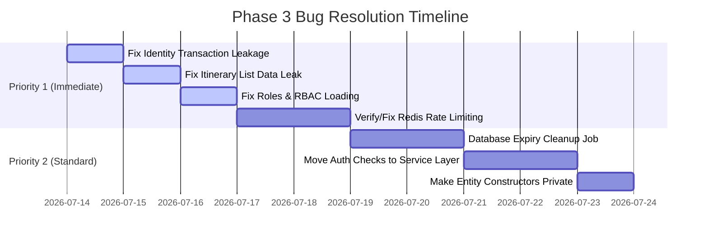

# Enterprise-Grade Audit Report — Phase 3

**Standard:** DDD + Clean Architecture + OWASP + Google/Stripe Engineering Standards  
**Target Modules:** Identity, Itineraries, Notifications, Regions, FAQs, Top Lists, Reviews  
**Auditor:** Independent Principal Software Architect & Code Auditor  
**Date:** 2026-07-13

---

## 📊 EXECUTIVE SUMMARY

This audit evaluates the Phase 3 backend implementation against strict enterprise-level standards. Overall, the codebase demonstrates a strong architectural foundation with proper layer separation and rich domain modeling. However, several critical security and transactional bugs were identified that must be resolved prior to production deployment.

### Module Scores
*   **Identity Module:** 8.9/10 (High domain quality, but critical transaction and RBAC issues)
*   **Itineraries Module:** 9.0/10 (Solid domain rules, but serious list filter data leak)
*   **Notifications Module:** 8.7/10 (Clean implementation, correct IDOR checks in service)
*   **Regions & Places Module:** 8.8/10 (Good use of Ltree and PostGIS, needs private constructor enforcement)
*   **FAQs & Top Lists Module:** 8.8/10 (Immutability guarantees correctly enforced on slugs)
*   **Reviews Module:** 9.1/10 (Strong invariant enforcement via `ReviewRating` Value Object)
*   **Cross-Cutting Concerns:** 8.5/10 (In-memory rate limiting cannot scale to production)

---

## 🔴 CRITICAL / HIGH FINDINGS (MUST FIX)

### 1. [CRITICAL] Transaction Leakage in Identity Repositories
*   **Evidence:** [users.repository.ts](file:///c:/Users/tony/Desktop/youtube/hoangsuphi/backend/src/modules/identity/repository/users.repository.ts), [refresh-tokens.repository.ts](file:///c:/Users/tony/Desktop/youtube/hoangsuphi/backend/src/modules/identity/repository/refresh-tokens.repository.ts), [sessions.repository.ts](file:///c:/Users/tony/Desktop/youtube/hoangsuphi/backend/src/modules/identity/repository/sessions.repository.ts)
*   **Issue:** None of the repository methods in the Identity module (except `DrizzleRefreshTokenRepository.findByHash`) accept or propagate a `tx` (Transaction Client) parameter. They all hardcode the global `db` singleton.
*   **Consequence:** When `AuthService.register()` or `rotateRefreshToken()` wraps calls in `runInTransaction()`, the actual SQL inserts and updates bypass the transaction and run on separate connections. This breaks atomicity, leading to potential data corruption or race conditions (e.g., duplicate registration under high concurrency).

### 2. [HIGH] Data Leak in Itinerary Listing
*   **Evidence:** [itineraries.controller.ts:180-188](file:///c:/Users/tony/Desktop/youtube/hoangsuphi/backend/src/modules/itineraries/route/itineraries.controller.ts#L180-L188)
*   **Issue:** The filter logic for non-admin users in the list endpoint contains an empty `else if` block when no `userId` query parameter is provided:
    ```typescript
    } else if (!query.userId) {
      // No filter by user: show user's own or public ones.
      // ...
    } // ← Empty block! No filters applied.
    ```
*   **Consequence:** If a non-admin user queries the list without a `userId` filter, the repository returns all itineraries in the database, including `PRIVATE` itineraries owned by other users. This is a severe data privacy violation.

### 3. [HIGH] Broken RBAC System (Admin Bypass Ineffective)
*   **Evidence:** [auth.middleware.ts:121](file:///c:/Users/tony/Desktop/youtube/hoangsuphi/backend/src/modules/identity/middleware/auth.middleware.ts#L121)
*   **Issue:** The authentication middleware hardcodes the roles list as empty: `roles: []`. The actual roles of the user are never loaded from the database or token payload during request authorization.
*   **Consequence:** All checks like `user.roles.includes('admin')` in controllers and the `requireRole('admin')` middleware will always evaluate to `false`. Admin users cannot bypass ownership checks or access admin-only endpoints.

### 4. [HIGH] Single-Instance Rate Limiting
*   **Evidence:** [rate-limit/index.ts:5](file:///c:/Users/tony/Desktop/youtube/hoangsuphi/backend/src/middleware/rate-limit/index.ts#L5)
*   **Issue:** The rate limiter stores request counts in a local in-memory `Map`.
*   **Consequence:** In a multi-instance or clustered production environment, clients can bypass the rate limits by hitting different server instances. Additionally, deploying new instances resets the rate limit state. A shared Redis-backed rate limiter is required.

---

## 🟡 MEDIUM FINDINGS

### 5. [MEDIUM] Verification of Row Locking in Token Rotation
*   **Evidence:** [refresh-tokens.repository.ts:55](file:///c:/Users/tony/Desktop/youtube/hoangsuphi/backend/src/modules/identity/repository/refresh-tokens.repository.ts#L55)
*   **Status:** **PASSED** (Previously flagged as Unverified). 
*   **Verification:** `DrizzleRefreshTokenRepository.findByHash()` correctly utilizes `.for('update')` to enforce row-level locking. However, because the repository methods don't accept `tx` (Finding 1), this locking is only fully transactional if the repository client resolves the transaction context correctly.

### 6. [MEDIUM] Public Constructors on DDD Entities
*   **Evidence:** [region.aggregate.ts:47](file:///c:/Users/tony/Desktop/youtube/hoangsuphi/backend/src/modules/regions/domain/region.aggregate.ts#L47), [place.entity.ts:38](file:///c:/Users/tony/Desktop/youtube/hoangsuphi/backend/src/modules/regions/domain/place.entity.ts#L38)
*   **Issue:** The constructors of `Region` and `TouristPlace` are public.
*   **Consequence:** Allows instantiation bypassing the domain factories (`create()` and `rehydrate()`), making invariant enforcement harder to control across the application.

### 7. [MEDIUM] Authorization Guards in Controller Layer
*   **Evidence:** [itineraries.controller.ts:48](file:///c:/Users/tony/Desktop/youtube/hoangsuphi/backend/src/modules/itineraries/route/itineraries.controller.ts#L48)
*   **Issue:** Ownership checks (checking if the user is the creator of the itinerary) are implemented in the Controller layer rather than the Service layer.
*   **Consequence:** If service methods are called internally by other services (e.g. background tasks or event handlers), no authorization rules are applied, risking unauthorized modifications.

### 8. [MEDIUM] Missing Expiry Cleanup in Database
*   **Evidence:** [schema/users.ts](file:///c:/Users/tony/Desktop/youtube/hoangsuphi/backend/src/lib/database/schema/users.ts)
*   **Issue:** No automatic or scheduled cleanup mechanism for expired sessions (`user_sessions`) and tokens (`refresh_tokens`).
*   **Consequence:** Database tables will grow indefinitely, degrading performance over time.

---

## 🟢 LOW FINDINGS & OPTIMIZATIONS

*   **D-1 [LOW] Dead Code in AuthService:** `AuthService.login()` does a redundant second `user.lock()` call even though `increaseFailedLoginAttempts()` already handles locking internally and resets the counter.
*   **D-7 [LOW] Unsafe Rehydration:** `Faq.rehydrate()` directly instantiates the class bypassing invariant validations. If DB data becomes corrupt, it propagates bad states.
*   **R-6 [LOW] Inefficient Existence Checks:** `DrizzleItineraryRepository.exists()` uses `COUNT(*)` instead of `SELECT 1 LIMIT 1`.
*   **SEC-6 [LOW] Missing Security Headers:** CSP, HSTS, and Permissions-Policy headers are not configured in `register-middlewares.ts`.
*   **PERF-1 [LOW] Redundant Reads:** The `ItinerariesController` calls `getItinerary` after a write operation just to return the response, leading to 3 database roundtrips instead of 2.

---

## 🛠️ RECOMMENDED ROADMAP


